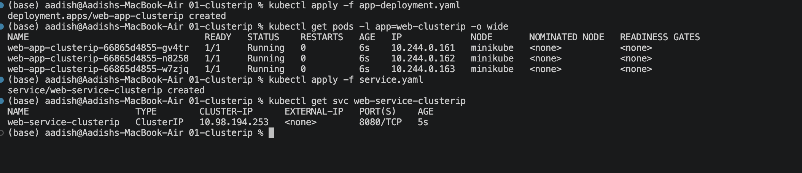
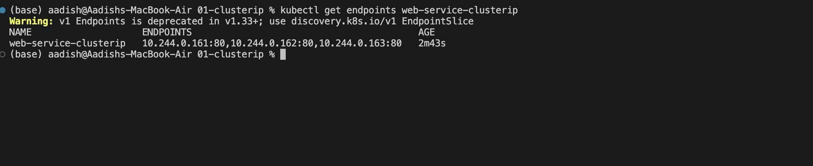
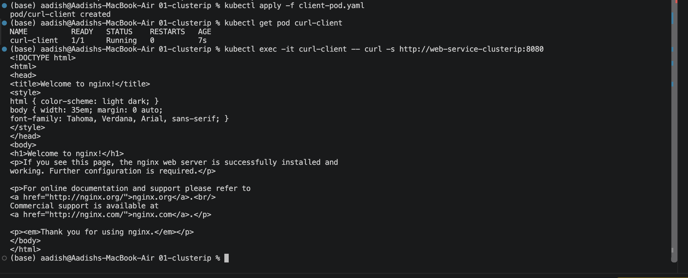

# ClusterIP Service — Internal Microservice Communication

## Objective

Implemented a Kubernetes **ClusterIP Service** to provide stable internal communication between applications inside the cluster.

The setup consists of:

- 3 Nginx backend Pods
- A ClusterIP Service
- Kubernetes DNS-based service discovery
- Internal traffic routing to the backend Pods

---

## 1. Deploy the Web Application

Deploy the backend:

```bash
kubectl apply -f app-deployment.yaml
```

Verify the Pods:

```bash
kubectl get pods -l app=web-clusterip -o wide
```

Three Nginx Pods should be running.

Then create the Service:

```bash
kubectl apply -f service.yaml
```

Verify the Service:

```bash
kubectl get svc web-service-clusterip
```

The Service should have type `ClusterIP` and expose port `8080`.

### Screenshot 1 — Pods and ClusterIP Service



---

## 2. Verify Service Endpoints

Check which Pods are connected to the Service:

```bash
kubectl get endpoints web-service-clusterip
```

The output should contain the IP addresses of the three backend Pods.

```text
web-service-clusterip   <pod-ip>:80,<pod-ip>:80,<pod-ip>:80
```

This confirms that the Service selector successfully discovered the backend Pods.

### Screenshot 2 — Service Endpoints



---

## 3. Test Internal Communication

Since a **ClusterIP is accessible only inside the Kubernetes cluster**, create the test client:

```bash
kubectl apply -f client-pod.yaml
```

Verify it is running:

```bash
kubectl get pod curl-client
```

Test communication using the Service name:

```bash
kubectl exec -it curl-client -- curl -s http://web-service-clusterip:8080
```

The request should return the default Nginx welcome page.

You can also test using the Service's ClusterIP:

```bash
kubectl exec -it curl-client -- curl -s http://<CLUSTER-IP>:8080
```

### Screenshot 3 — Internal Service Communication



---

## Key Concept

A **ClusterIP Service** provides a stable internal endpoint for a group of Pods.

```text
Client Pod
    |
    | http://web-service-clusterip:8080
    ↓
ClusterIP Service
    |
    +--------+--------+
    ↓        ↓        ↓
  Pod 1    Pod 2    Pod 3
```

The client does not need to know the individual Pod IP addresses.

Kubernetes DNS allows applications to access the Service using:

```text
web-service-clusterip
```

---

## Service Configuration

```yaml
type: ClusterIP
```

```yaml
port: 8080
targetPort: 80
```

This means:

```text
Client
  ↓
Service :8080
  ↓
Nginx Pod :80
```

---

## Result

- Deployed 3 Nginx backend Pods.
- Created a ClusterIP Service.
- Verified the Service's ClusterIP.
- Verified that all 3 Pods became Service endpoints.
- Successfully accessed Nginx from another Pod inside the cluster.
- Demonstrated Kubernetes internal DNS-based service discovery.

---

## Cleanup

```bash
kubectl delete -f client-pod.yaml
kubectl delete -f service.yaml
kubectl delete -f app-deployment.yaml
```

---

