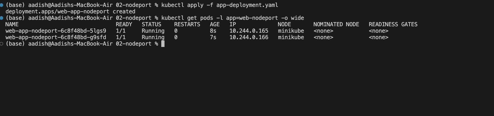
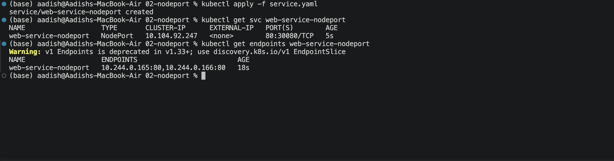
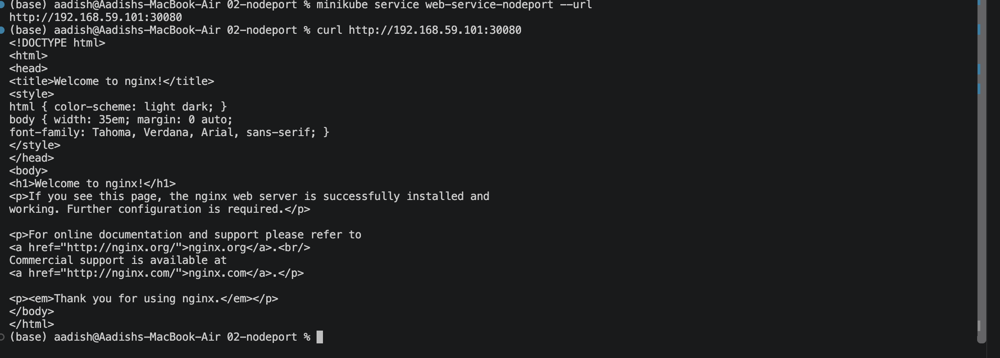

# NodePort Service — External Cluster Access

## Objective

Implemented a Kubernetes **NodePort Service** to expose an Nginx application outside the cluster through a dedicated port on the Kubernetes node.

The setup consists of:

- 2 Nginx Pods
- NodePort Service
- Internal Service port `80`
- External NodePort `30080`

---

## 1. Deploy the Web Application

Apply the Deployment:

```bash
kubectl apply -f app-deployment.yaml
```

Verify the Pods:

```bash
kubectl get pods -l app=web-nodeport -o wide
```

Two Nginx Pods should be running.

### Screenshot 1 — Backend Pods



---

## 2. Create the NodePort Service

Apply the Service:

```bash
kubectl apply -f service.yaml
```

Verify the Service:

```bash
kubectl get svc web-service-nodeport
```

Expected port mapping:

```text
80:30080/TCP
```

Where:

```text
80     → Internal Service Port
30080  → External NodePort
```

You can also verify the Service endpoints:

```bash
kubectl get endpoints web-service-nodeport
```

### Screenshot 2 — NodePort Service



---

## 3. Access the Application

With Minikube, get the Service URL:

```bash
minikube service web-service-nodeport --url
```

Then test the returned URL:

```bash
curl <service-url>
```

Alternatively, try:

```bash
curl http://$(minikube ip):30080
```

The request should return the default Nginx welcome page.

### Screenshot 3 — External Access



---

## Key Concept

A **NodePort Service** exposes an application through a port on the Kubernetes nodes.

```text
External Client
      |
      | :30080
      ↓
Kubernetes Node
      |
      ↓
NodePort Service
      |
      | :80
      ↓
+-------------+-------------+
|             |             |
Pod 1       Pod 2
:80         :80
```

The NodePort provides an external entry point while the Service distributes traffic to the matching Pods.

---

## Important Ports

```text
NodePort     → 30080
Service Port → 80
Target Port  → 80
```

Traffic flow:

```text
Client :30080
      ↓
NodePort :30080
      ↓
Service :80
      ↓
Pod :80
```

---

## Result

- Deployed 2 Nginx backend Pods.
- Created a NodePort Service.
- Exposed the application on NodePort `30080`.
- Verified the Service and its endpoints.
- Successfully accessed the Nginx application externally.

---

## Cleanup

```bash
kubectl delete -f service.yaml
kubectl delete -f app-deployment.yaml
```

---
