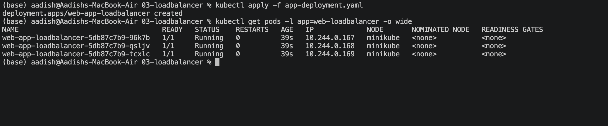
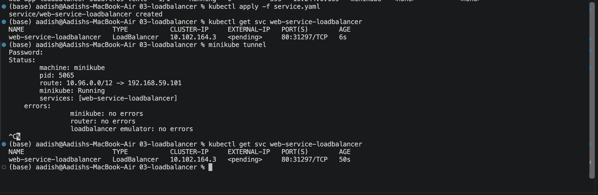
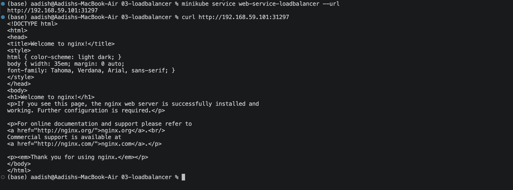

# LoadBalancer Service — Public Application Access

## Objective

Implemented a Kubernetes **LoadBalancer Service** to expose an Nginx application externally.

The setup consists of:

- 3 Nginx backend Pods
- A LoadBalancer Service
- Port `80` exposed externally
- Traffic routed to the backend Pods

---

## 1. Deploy the Web Application

Apply the Deployment:

```bash
kubectl apply -f app-deployment.yaml
```

Verify the Pods:

```bash id="4f8x2k"
kubectl get pods -l app=web-loadbalancer -o wide
```

Three Nginx Pods should be running.

### Screenshot 1 — Backend Pods



---

## 2. Create the LoadBalancer Service

Apply the Service:

```bash id="6s0v9p"
kubectl apply -f service.yaml
```

Verify the Service:

```bash
kubectl get svc web-service-loadbalancer
```

The Service should appear as:

```text
TYPE           LoadBalancer
PORT(S)        80:xxxxx/TCP
EXTERNAL-IP    <pending>
```

### Local Minikube

Since Minikube does not have a real cloud provider, the external IP may remain `<pending>`.

Start the Minikube tunnel in a separate terminal:

```bash
minikube tunnel
```

Then check again:

```bash
kubectl get svc web-service-loadbalancer
```

### Screenshot 2 — LoadBalancer Service



---

## 3. Access the Application

For Minikube, the easiest way to access the LoadBalancer Service is:

```bash
minikube service web-service-loadbalancer --url
```

Use the returned URL:

```bash
curl <service-url>
```

Alternatively:

```bash
minikube service web-service-loadbalancer
```

The request should return the default Nginx welcome page.

### Screenshot 3 — External Application Access



---

## Key Concept

A **LoadBalancer Service** provides an external entry point for applications.

```text
External Client
      |
      ↓
Cloud Load Balancer
      |
      ↓
LoadBalancer Service
      |
      +---------+---------+
      ↓         ↓         ↓
    Pod 1     Pod 2     Pod 3
```

In cloud environments, the cloud provider typically provisions the external load balancer automatically.

In Minikube, `minikube tunnel` can be used to simulate this behavior locally.

---

## Service Configuration

```yaml
type: LoadBalancer
```

```yaml
port: 80
targetPort: 80
```

Traffic flow:

```text
External :80
    ↓
LoadBalancer
    ↓
Service :80
    ↓
Nginx Pod :80
```

---

## LoadBalancer vs NodePort

| Feature | NodePort | LoadBalancer |
|---|---|---|
| External access | Yes | Yes |
| Default port | 30000–32767 | Standard ports such as 80/443 |
| Cloud Load Balancer | No | Yes |
| Typical use | Development / simple exposure | Public cloud applications |
| External IP | Node IP | Cloud-provided IP/DNS |

---

## Result

- Deployed 3 Nginx backend Pods.
- Created a LoadBalancer Service.
- Exposed the application on port `80`.
- Verified the Service configuration.
- Accessed the application externally using Minikube.
- Demonstrated LoadBalancer-based application exposure.

---

## Cleanup

```bash
kubectl delete -f service.yaml
kubectl delete -f app-deployment.yaml
```

If `minikube tunnel` is running, stop it with:

```bash
Ctrl+C
```

---

