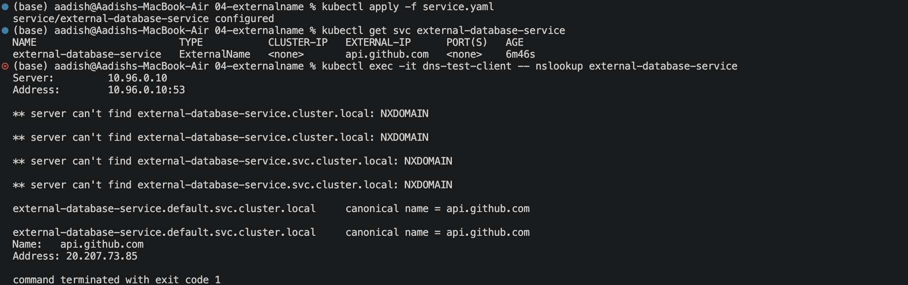
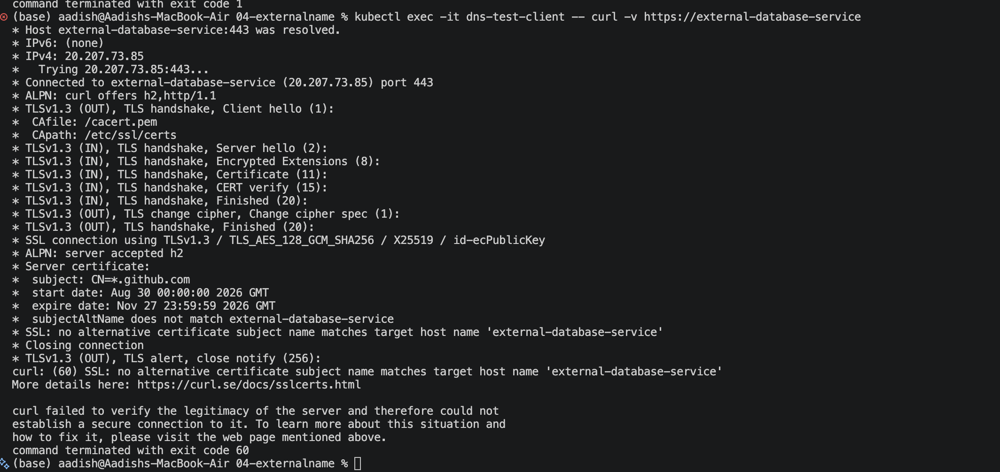

# ExternalName Service — External DNS Integration

## Objective

Implemented a Kubernetes **ExternalName Service** to provide an internal DNS alias for an external service.

Unlike other Service types, ExternalName:

- Does not create a ClusterIP
- Does not use Pod selectors
- Does not route traffic through kube-proxy
- Uses CoreDNS to return a DNS CNAME
- Provides a stable internal name for an external service

---

## 1. Create the ExternalName Service

Apply the Service:

```bash
kubectl apply -f service.yaml
```

Verify the Service:

```bash
kubectl get svc external-database-service
```

Expected:

```text
NAME                        TYPE           CLUSTER-IP   EXTERNAL-IP
external-database-service   ExternalName   <none>       api.github.com
```

The Service has no ClusterIP because it acts as a DNS alias rather than a network proxy.

### Screenshot 1 — ExternalName Service


---

## 2. Verify DNS Resolution

Deploy the DNS test Pod:

```bash
kubectl apply -f client-pod.yaml
```

Verify that it is running:

```bash
kubectl get pod dns-test-client
```

Test DNS resolution:

```bash
kubectl exec -it dns-test-client -- nslookup external-database-service
```

The result should show that the Kubernetes Service resolves to the external hostname:

```text
external-database-service.default.svc.cluster.local
    canonical name = api.github.com
```

This demonstrates that **CoreDNS returns a CNAME for the ExternalName Service**.

### Screenshot 2 — DNS CNAME Resolution



---

## 3. Test External Service Access

Test the external service from inside the cluster:

```bash
kubectl exec -it dns-test-client -- curl -s -H "Host: api.github.com" https://external-database-service
```

The request should return a response from the external GitHub API.

This demonstrates that an application inside Kubernetes can use the internal Service name while reaching an external service.

### Screenshot 3 — External Service Response



---

## Key Concept

An **ExternalName Service** acts as a DNS alias.

```text
Application Pod
      |
      | external-database-service
      ↓
    CoreDNS
      |
      | CNAME
      ↓
 api.github.com
      |
      ↓
External Service
```

There are no backend Pods associated with the ExternalName Service.

---

## Important Configuration

```yaml
type: ExternalName
externalName: api.github.com
```

The application can use:

```text
external-database-service
```

while Kubernetes DNS resolves it to:

```text
api.github.com
```

---

## ExternalName vs ClusterIP

| Feature | ClusterIP | ExternalName |
|---|---|---|
| ClusterIP | Yes | No |
| Pod selector | Yes | No |
| Backend Pods | Yes | No |
| kube-proxy routing | Yes | No |
| DNS alias | Yes | Yes |
| External service | Not directly | Yes |

---

## Result

- Created an ExternalName Service.
- Verified that no ClusterIP was assigned.
- Created a DNS test Pod.
- Verified CNAME resolution through CoreDNS.
- Successfully accessed the external service from inside the cluster.
- Demonstrated Kubernetes DNS-based integration with external infrastructure.

---

## Cleanup

```bash
kubectl delete -f client-pod.yaml
kubectl delete -f service.yaml
```

---
