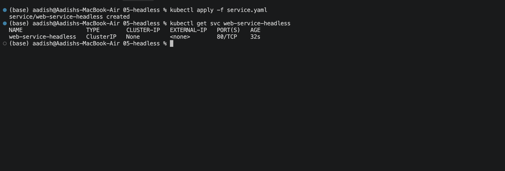
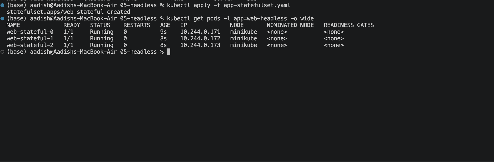
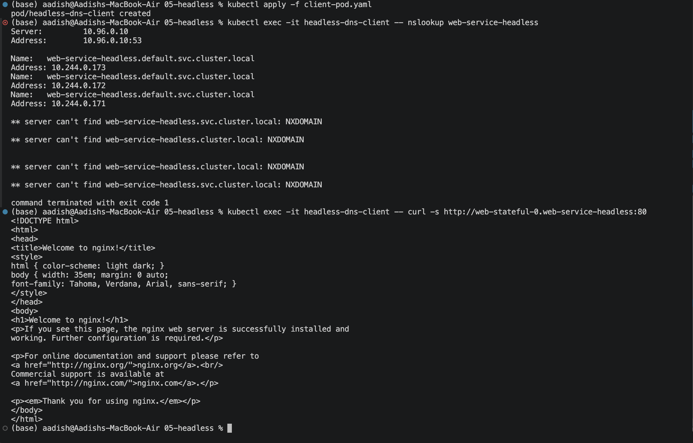

# Headless Service — Direct Pod Discovery

## Objective

Implemented a Kubernetes **Headless Service** using `clusterIP: None` with a StatefulSet.

The setup demonstrates:

- No virtual ClusterIP
- Direct Pod IP discovery through DNS
- StatefulSet-generated Pod hostnames
- Direct communication with an individual Pod

---

## 1. Create the Headless Service

Apply the Service:

```bash
kubectl apply -f service.yaml
```

Verify the Service:

```bash
kubectl get svc web-service-headless
```

The Service should show:

```text
NAME                   TYPE        CLUSTER-IP   EXTERNAL-IP   PORT(S)
web-service-headless   ClusterIP   None         <none>        80/TCP
```

The `None` value confirms that this is a **Headless Service**.

### Screenshot 1 — Headless Service



---

## 2. Deploy the StatefulSet

Apply the StatefulSet:

```bash
kubectl apply -f app-statefulset.yaml
```

Verify the Pods:

```bash
kubectl get pods -l app=web-headless -o wide
```

Three Pods should be created with predictable names:

```text
web-stateful-0
web-stateful-1
web-stateful-2
```

The Pods should be in the `Running` state.

### Screenshot 2 — StatefulSet Pods



---

## 3. Verify Direct Pod DNS Discovery

Deploy the test client:

```bash
kubectl apply -f client-pod.yaml
```

Verify DNS resolution for the Headless Service:

```bash
kubectl exec -it headless-dns-client -- nslookup web-service-headless
```

Unlike a normal ClusterIP Service, DNS returns the IP addresses of the individual Pods.

Example:

```text
Name:      web-service-headless.default.svc.cluster.local
Address:   10.244.0.30
Address:   10.244.0.31
Address:   10.244.0.32
```

You can also resolve a specific StatefulSet Pod:

```bash
kubectl exec -it headless-dns-client -- nslookup web-stateful-0.web-service-headless.default.svc.cluster.local
```

Then access that Pod directly:

```bash
kubectl exec -it headless-dns-client -- curl -s http://web-stateful-0.web-service-headless:80
```

The request should return the Nginx welcome page.

### Screenshot 3 — Direct Pod DNS Discovery



---

## Key Concept

A Headless Service does not provide a virtual IP.

```text
Normal ClusterIP

Client
  ↓
ClusterIP
  ↓
Pod 1 / Pod 2 / Pod 3
```

With a Headless Service:

```text
Client
  ↓
CoreDNS
  ↓
Pod 1 IP
Pod 2 IP
Pod 3 IP
```

The client can discover and communicate with individual Pods directly.

---

## StatefulSet DNS

The StatefulSet provides stable Pod names:

```text
web-stateful-0
web-stateful-1
web-stateful-2
```

Combined with the Headless Service, each Pod gets a predictable DNS name:

```text
web-stateful-0.web-service-headless.default.svc.cluster.local
web-stateful-1.web-service-headless.default.svc.cluster.local
web-stateful-2.web-service-headless.default.svc.cluster.local
```

This is particularly useful for distributed stateful systems where individual Pod identity matters.

---

## Result

- Created a Headless Service using `clusterIP: None`.
- Verified that no ClusterIP was assigned.
- Deployed a 3-replica StatefulSet.
- Verified stable StatefulSet Pod names.
- Used CoreDNS to discover individual Pod IP addresses.
- Successfully accessed a specific Pod using its DNS hostname.

---

## Headless vs ClusterIP

| Feature | ClusterIP | Headless |
|---|---|---|
| Virtual IP | Yes | No |
| Pod IPs returned by DNS | No | Yes |
| Load balancing by Service | Yes | No |
| StatefulSet friendly | Sometimes | Yes |
| Direct Pod discovery | No | Yes |

---

## Cleanup

```bash
kubectl delete -f client-pod.yaml
kubectl delete -f app-statefulset.yaml
kubectl delete -f service.yaml
```

---

