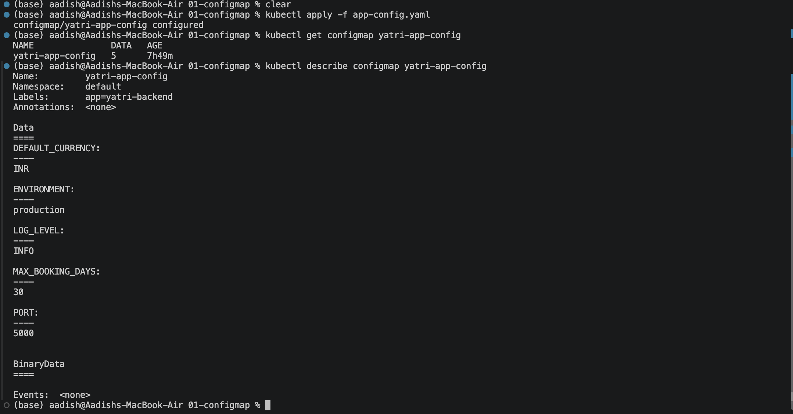
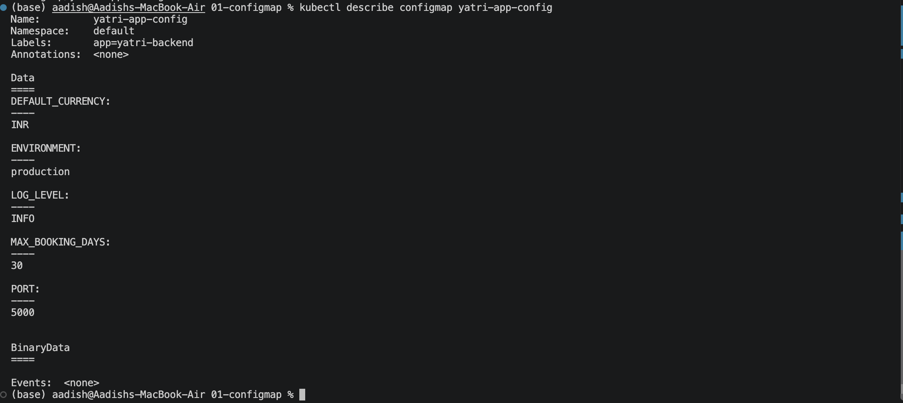

# ConfigMap — Decoupling Configuration from Container Images

## Objective

Create a Kubernetes ConfigMap to store non-sensitive application configuration outside the container image and consume the configuration inside a Pod.

---

## 1. Create ConfigMap

Apply the ConfigMap:

```bash
kubectl apply -f configmap/app-config.yaml
```

Verify it:

```bash
kubectl get configmap yatri-app-config
kubectl describe configmap yatri-app-config
```

Expected configuration:

```text
ENVIRONMENT:       production
LOG_LEVEL:         INFO
PORT:              5000
DEFAULT_CURRENCY:  INR
MAX_BOOKING_DAYS:  30
```

### Screenshot



---

## 2. Read ConfigMap Value

Retrieve the `LOG_LEVEL` value:

```bash
kubectl get configmap yatri-app-config \
  -o jsonpath='{.data.LOG_LEVEL}'
```

Expected output:

```text
INFO
```

### Screenshot


---

## 3. Consume ConfigMap as Environment Variables

Create a test Pod that loads all ConfigMap values:

```yaml
apiVersion: v1
kind: Pod
metadata:
  name: configmap-test-pod
spec:
  containers:
    - name: app
      image: busybox:1.36
      command: ["sh", "-c", "env && sleep 3600"]
      envFrom:
        - configMapRef:
            name: yatri-app-config
```

Apply it:

```bash
kubectl apply -f configmap-test-pod.yaml
```

Check the Pod:

```bash
kubectl get pod configmap-test-pod
```

Verify the ConfigMap values inside the container:

```bash
kubectl exec configmap-test-pod -- env | grep -E 'ENVIRONMENT|LOG_LEVEL|PORT|DEFAULT_CURRENCY|MAX_BOOKING_DAYS'
```

Expected output:

```text
ENVIRONMENT=production
LOG_LEVEL=INFO
PORT=5000
DEFAULT_CURRENCY=INR
MAX_BOOKING_DAYS=30
```

### Screenshot



---

## Key Concepts

### Configuration is separated from the image

The application image can remain unchanged while configuration differs between environments.

```text
Container Image
      |
      +---- ConfigMap
              |
              +---- ENVIRONMENT
              +---- LOG_LEVEL
              +---- PORT
              +---- DEFAULT_CURRENCY
              +---- MAX_BOOKING_DAYS
```

### ConfigMap Consumption

ConfigMaps can be consumed as:

- Environment variables using `env` / `envFrom`
- Files using ConfigMap volumes

### Important

ConfigMaps are intended for **non-sensitive configuration**.

Do not store:

- Passwords
- API keys
- Access tokens
- Private certificates

Use Kubernetes **Secrets** for sensitive data.

Also, changing a ConfigMap does not automatically restart Pods or refresh environment-variable values already loaded into a running container.

---

## Cleanup

```bash
kubectl delete pod configmap-test-pod
kubectl delete configmap yatri-app-config
```

## Result

Successfully created a Kubernetes ConfigMap, inspected its configuration, retrieved individual values, and consumed the ConfigMap as environment variables inside a Pod.
