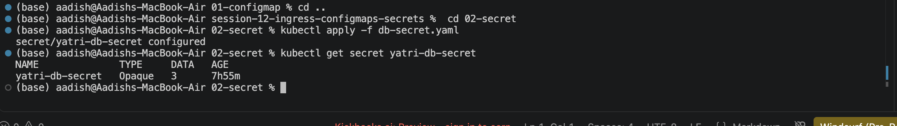
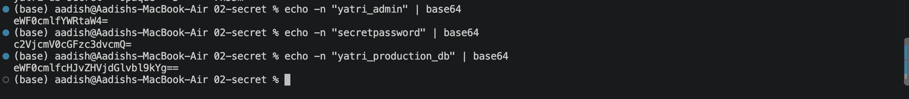

# Secret — Protecting Sensitive Credentials in Kubernetes

## Objective

Create and manage a Kubernetes Secret to securely store sensitive database credentials and understand how Secret values are encoded and decoded.

---

## 1. Create the Secret

The Secret stores:

- `POSTGRES_USER`
- `POSTGRES_PASSWORD`
- `POSTGRES_DB`

Apply the Secret:

```bash
kubectl apply -f secret/db-secret.yaml
```

Verify it:

```bash
kubectl get secret yatri-db-secret
```

Expected output:

```text
NAME               TYPE     DATA   AGE
yatri-db-secret    Opaque   3      5s
```

### Screenshot



---

## 2. Generate Base64 Values

Generate Base64 values using:

```bash
echo -n "yatri_admin" | base64
```

```bash
echo -n "secretpassword" | base64
```

```bash
echo -n "yatri_production_db" | base64
```

Base64 is an **encoding mechanism, not encryption**.

### Screenshot



---

## 3. Decode a Secret Value

Retrieve and decode the PostgreSQL password:

```bash
kubectl get secret yatri-db-secret \
  -o jsonpath='{.data.POSTGRES_PASSWORD}' | base64 --decode
```

Expected output:

```text
secretpassword
```

### Screenshot


---

## Key Concepts

- Kubernetes **Secrets** are designed for sensitive data.
- Secret values in the YAML `data` field are **Base64-encoded**.
- **Base64 is NOT encryption.**
- Access to Secrets should be controlled using **RBAC**.
- Kubernetes stores Secrets in `etcd`; production clusters should use **encryption at rest**.
- Secrets can be consumed as environment variables or mounted as files.
- Production systems commonly use external secret managers such as Vault or cloud secret-management services.

### ConfigMap vs Secret

| ConfigMap | Secret |
|---|---|
| Non-sensitive configuration | Sensitive credentials |
| Log levels, ports, feature flags | Passwords, API keys, certificates |
| Plain configuration data | Base64-encoded data |
| Not intended for credentials | Designed for sensitive values |

---

## Cleanup

```bash
kubectl delete secret yatri-db-secret
```

## Result

Successfully created a Kubernetes Secret, generated Base64-encoded values, retrieved a Secret value, and decoded it for debugging.
