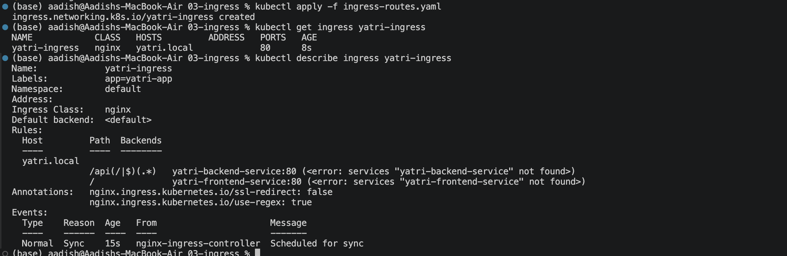
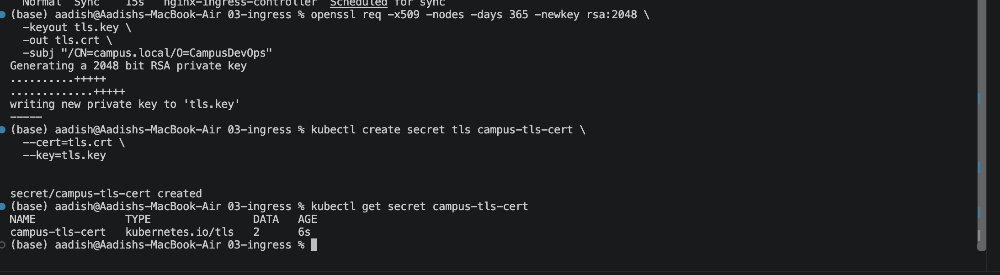
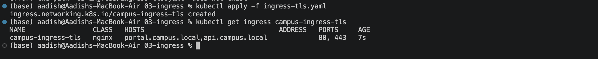
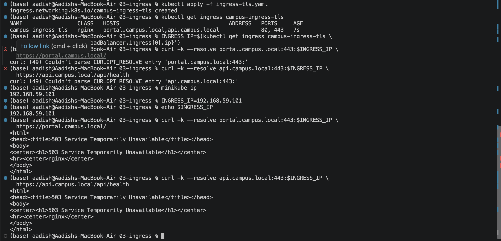

# Ingress — One Entry Point for All Your Microservices

## Objective

Configure Kubernetes Ingress to provide a single entry point for multiple services and demonstrate HTTP routing, host-based routing, and TLS/HTTPS termination.

---

## 1. Enable Ingress Controller

Enable the NGINX Ingress Controller in Minikube:

```bash
minikube addons enable ingress
```

Verify:

```bash
kubectl get pods -n ingress-nginx
```

### Screenshot


---

## 2. Create Ingress Routes

Apply the Ingress configuration:

```bash
kubectl apply -f 03-ingress/ingress-routes.yaml
```

Verify:

```bash
kubectl get ingress yatri-ingress
kubectl describe ingress yatri-ingress
```

Expected:

```text
NAME            CLASS   HOSTS        ADDRESS        PORTS
yatri-ingress   nginx   yatri.local  192.168.49.2   80
```

The routing rules are:

```text
yatri.local/       → yatri-frontend-service
yatri.local/api/* → yatri-backend-service
```

### Screenshot



---

## 3. Generate TLS Certificate

Create a self-signed certificate:

```bash
openssl req -x509 -nodes -days 365 -newkey rsa:2048 \
  -keyout tls.key \
  -out tls.crt \
  -subj "/CN=campus.local/O=CampusDevOps"
```

This creates:

```text
tls.key
tls.crt
```

---

## 4. Create TLS Secret

Create the Kubernetes TLS Secret:

```bash
kubectl create secret tls campus-tls-cert \
  --cert=tls.crt \
  --key=tls.key
```

Verify:

```bash
kubectl get secret campus-tls-cert
```

Expected:

```text
NAME              TYPE                DATA   AGE
campus-tls-cert   kubernetes.io/tls   2      ...
```

### Screenshot



---

## 5. Apply TLS Ingress

Apply the provided TLS Ingress configuration:

```bash
kubectl apply -f 03-ingress/ingress-tls.yaml
```

Verify:

```bash
kubectl get ingress campus-ingress-tls
```

Expected:

```text
NAME                 CLASS   HOSTS                                  ADDRESS        PORTS
campus-ingress-tls   nginx   portal.campus.local,api.campus.local  192.168.49.2   80,443
```

The Ingress provides:

```text
portal.campus.local → Portal / Frontend
api.campus.local    → API Backend
```

### Screenshot



---

## 6. Test HTTPS Host-Based Routing

Get the Ingress IP:

```bash
INGRESS_IP=$(kubectl get ingress campus-ingress-tls \
  -o jsonpath='{.status.loadBalancer.ingress[0].ip}')
```

Test the portal:

```bash
curl -k --resolve portal.campus.local:443:$INGRESS_IP \
  https://portal.campus.local/
```

Test the API:

```bash
curl -k --resolve api.campus.local:443:$INGRESS_IP \
  https://api.campus.local/api/health
```

The `-k` option allows curl to accept the self-signed certificate.

### Screenshot



---

## Key Concepts

- **Ingress** defines HTTP/HTTPS routing rules.
- **Ingress Controller** processes those rules and handles incoming traffic.
- Ingress operates at **Layer 7**.
- **Host-based routing** routes different domains to different services.
- **Path-based routing** routes different URL paths to different services.
- TLS can be terminated at the Ingress Controller.
- Backend services can remain internal `ClusterIP` services.

---

## Cleanup

```bash
kubectl delete ingress yatri-ingress
kubectl delete ingress campus-ingress-tls
kubectl delete secret campus-tls-cert

rm -f tls.key tls.crt
```

## Result

Successfully configured an NGINX Ingress Controller, created HTTP routing rules, configured TLS termination, and tested host-based HTTPS routing.

