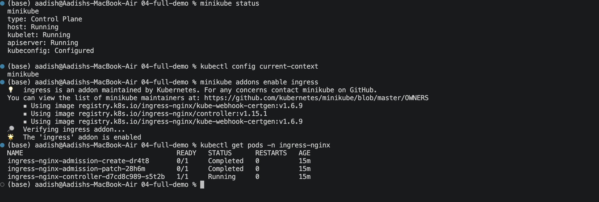
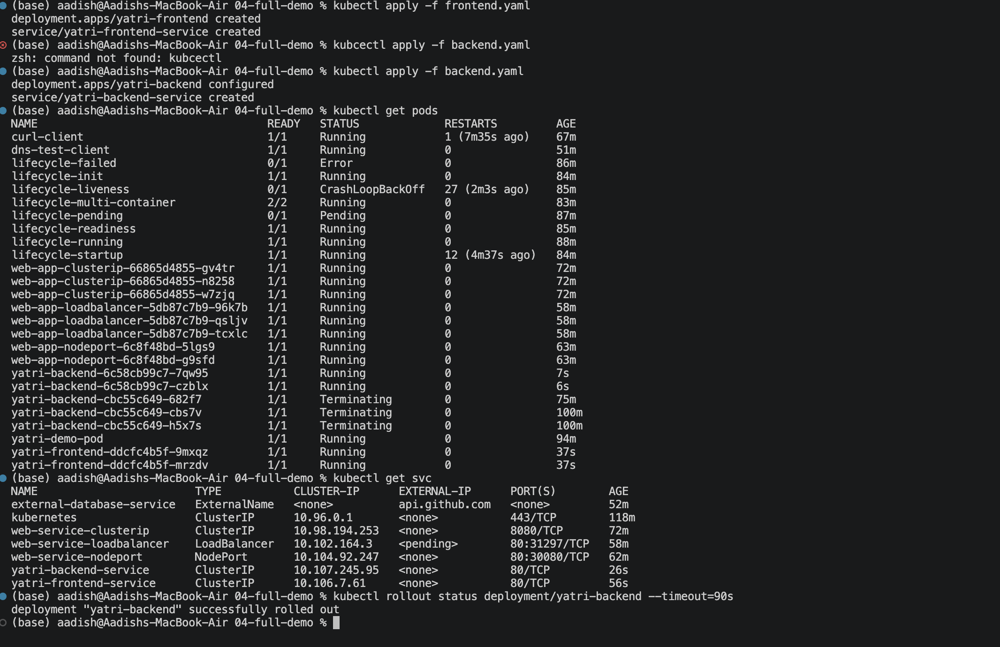
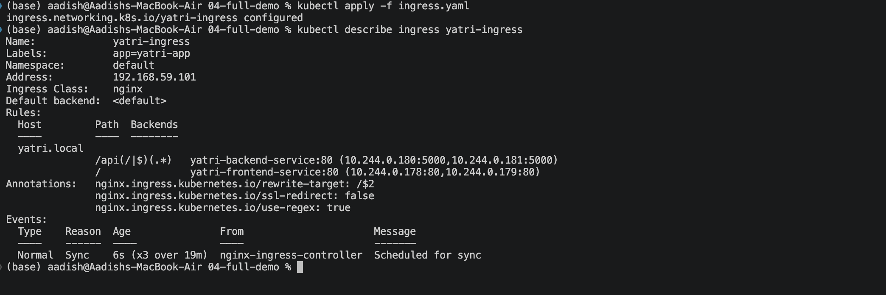
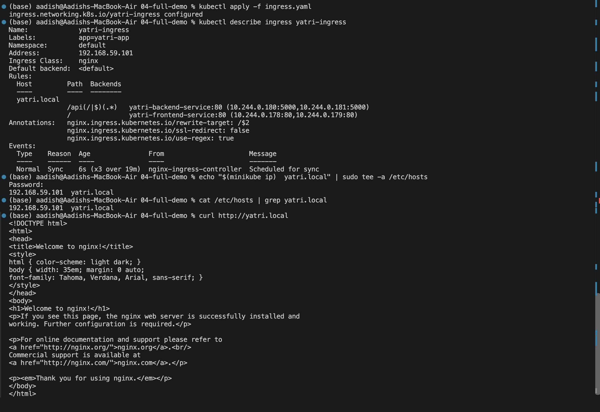
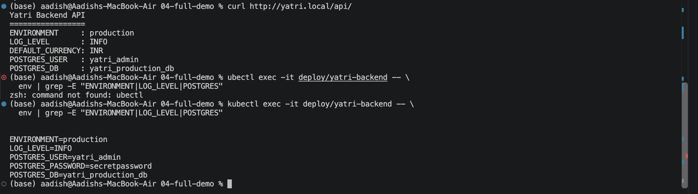

# Full Demo — ConfigMap + Secret + Ingress Working Together

## Objective

Deploy a frontend and backend microservice on Minikube using:

- ConfigMap for non-sensitive configuration
- Secret for database credentials
- ClusterIP Services for internal communication
- NGINX Ingress for path-based routing

---

## Architecture

```text
                     Browser
                        |
                 http://yatri.local
                        |
              NGINX Ingress Controller
                   /            \
                  /              \
                 /api/*           /
                /                 \
               v                   v
      Backend ClusterIP       Frontend ClusterIP
               |                   |
          Python API              Nginx
               |
       ConfigMap + Secret
```

---

## 1. Verify Prerequisites

Check Minikube:

```bash
minikube status
```

Check the current Kubernetes context:

```bash
kubectl config current-context
```

Expected:

```text
minikube
```

---

## 2. Enable NGINX Ingress

Enable the Minikube Ingress addon:

```bash
minikube addons enable ingress
```

Wait for the controller:

```bash
kubectl wait --namespace ingress-nginx \
  --for=condition=ready pod \
  --selector=app.kubernetes.io/component=controller \
  --timeout=120s
```

Verify:

```bash
kubectl get pods -n ingress-nginx
```

### Screenshot



---

## 3. Deploy ConfigMap and Secret

Apply the ConfigMap:

```bash
kubectl apply -f 04-full-demo/configmap.yaml
```

Verify:

```bash
kubectl describe configmap yatri-app-config
```

Apply the Secret:

```bash
kubectl apply -f 04-full-demo/secret.yaml
```

Verify:

```bash
kubectl describe secret yatri-db-secret
```

The ConfigMap contains non-sensitive configuration, while the Secret contains database credentials.

---

## 4. Deploy Frontend and Backend

Deploy the frontend:

```bash
kubectl apply -f 04-full-demo/frontend.yaml
```

Deploy the backend:

```bash
kubectl apply -f 04-full-demo/backend.yaml
```

Check the Pods:

```bash
kubectl get pods
```

Check the Services:

```bash
kubectl get svc
```

Wait for the backend:

```bash
kubectl rollout status deployment/yatri-backend --timeout=90s
```

### Screenshot



---

## 5. Apply Ingress

Apply the Ingress:

```bash
kubectl apply -f 04-full-demo/ingress.yaml
```

Inspect the routing rules:

```bash
kubectl describe ingress yatri-ingress
```

Expected routing:

```text
yatri.local
    /api/*  → yatri-backend-service:80
    /       → yatri-frontend-service:80
```

### Screenshot



---

## 6. Configure Local Hostname

Map `yatri.local` to the Minikube IP:

```bash
echo "$(minikube ip)  yatri.local" | sudo tee -a /etc/hosts
```

Verify:

```bash
cat /etc/hosts | grep yatri.local
```

Expected:

```text
192.168.49.2  yatri.local
```

---

## 7. Test Frontend

Access the frontend:

```bash
curl http://yatri.local
```

The request should be routed through the NGINX Ingress to:

```text
yatri-frontend-service
```

The Nginx default HTML page should be returned.

---

## 8. Test Backend API

Access the backend:

```bash
curl http://yatri.local/api/
```

Expected output includes:

```text
Yatri Backend API
=================
ENVIRONMENT     : production
LOG_LEVEL       : INFO
DEFAULT_CURRENCY: INR
POSTGRES_USER   : yatri_admin
POSTGRES_DB     : yatri_production_db
```

This demonstrates that the backend receives configuration from both the **ConfigMap** and **Secret**.

---

## 9. Verify Environment Variables

Check the variables injected into the backend:

```bash
kubectl exec -it deploy/yatri-backend -- \
  env | grep -E "ENVIRONMENT|LOG_LEVEL|POSTGRES"
```

Expected:

```text
ENVIRONMENT=production
LOG_LEVEL=INFO
POSTGRES_USER=yatri_admin
POSTGRES_PASSWORD=secretpassword
POSTGRES_DB=yatri_production_db
```

### Screenshot




---

## 10. Decode Secret Password

For classroom demonstration, decode the stored password:

```bash
kubectl get secret yatri-db-secret \
  -o jsonpath='{.data.POSTGRES_PASSWORD}' | base64 --decode
```

Expected:

```text
secretpassword
```

> Base64 is encoding, not encryption.

---

## Key Concepts

### ConfigMap

Used for non-sensitive configuration such as:

```text
ENVIRONMENT
LOG_LEVEL
DEFAULT_CURRENCY
MAX_BOOKING_DAYS
APP_PORT
```

### Secret

Used for sensitive values such as:

```text
POSTGRES_USER
POSTGRES_PASSWORD
POSTGRES_DB
```

### Ingress

Provides a single entry point and routes traffic based on the URL path:

```text
/api/* → Backend
/      → Frontend
```

### Complete Flow

```text
Browser
   |
   v
yatri.local
   |
   v
NGINX Ingress
   |
   +------ / ------> Frontend Service
   |
   +-- /api/* -----> Backend Service
                         |
                  +------+------+
                  |             |
              ConfigMap       Secret
                  |             |
              App Config    DB Credentials
```

---

## Automated Deployment

The complete demo can also be deployed using:

```bash
bash 04-full-demo/run-demo.sh
```

The script:

1. Enables the Ingress addon.
2. Applies ConfigMap and Secret.
3. Deploys frontend and backend.
4. Applies the Ingress.
5. Waits for the Pods.
6. Configures `yatri.local`.

---

## Cleanup

Using the provided cleanup script:

```bash
bash 04-full-demo/cleanup.sh
```

Or manually:

```bash
kubectl delete -f 04-full-demo/ingress.yaml
kubectl delete -f 04-full-demo/backend.yaml
kubectl delete -f 04-full-demo/frontend.yaml
kubectl delete -f 04-full-demo/secret.yaml
kubectl delete -f 04-full-demo/configmap.yaml
```

## Result

Successfully deployed a complete Kubernetes application where **ConfigMap, Secret, Services, and Ingress work together** to provide configuration management, credential management, service discovery, and external HTTP routing.

