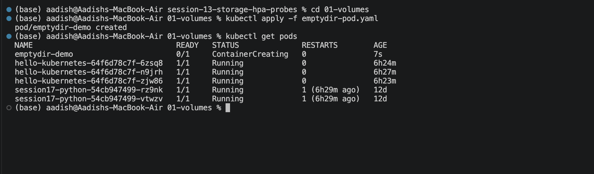
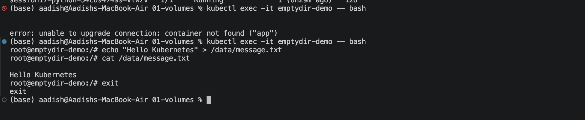
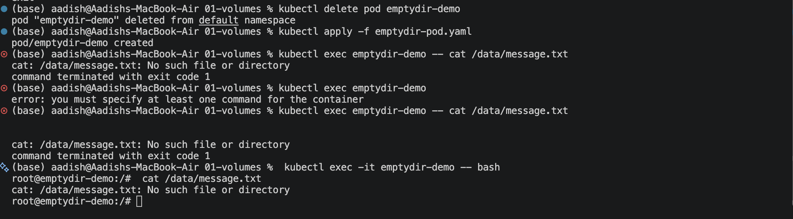

# Kubernetes Volumes

## Objective

Learn the basics of Kubernetes Volumes, `emptyDir`, storage behavior when Pods restart, and `hostPath`.

---

## 1. What is a Kubernetes Volume?

A Kubernetes Volume provides storage that can be accessed by containers inside a Pod.

Without a volume, data written inside a container's filesystem can be lost when the container or Pod is removed.

---

## 2. `emptyDir`

`emptyDir` creates an empty directory when a Pod starts.

- It can be shared by containers within the same Pod.
- Its lifetime is linked to the Pod.
- When the Pod is deleted, the `emptyDir` data is deleted.
- A newly created Pod gets a new empty directory.

---

## 3. Run the `emptyDir` Example

Apply the Pod configuration:

```bash
kubectl apply -f emptydir-pod.yaml
```

Verify the Pod:

```bash
kubectl get pods
```

### Screenshot 1



---

## 4. Create and Read Data

Enter the container:

```bash
kubectl exec -it emptydir-demo -- bash
```

Create a file inside the volume:

```bash
echo "Hello Kubernetes" > /data/message.txt
```

Read the file:

```bash
cat /data/message.txt
```

Expected output:

```text
Hello Kubernetes
```

Exit the container:

```bash
exit
```

### Screenshot 2



---

## 5. Test `emptyDir` Data Loss

Delete the Pod:

```bash
kubectl delete pod emptydir-demo
```

Create it again:

```bash
kubectl apply -f emptydir-pod.yaml
```

Try to read the previous file:

```bash
kubectl exec emptydir-demo -- cat /data/message.txt
```

Expected result:

```text
cat: /data/message.txt: No such file or directory
```

This demonstrates that `emptyDir` storage does not survive Pod deletion.

### Screenshot 3



---

## 6. `hostPath`

`hostPath` mounts a directory from the Kubernetes node into a Pod.

Example:

```yaml
volumes:
  - name: storage
    hostPath:
      path: /tmp/student-data
```

`hostPath` is mainly useful for learning, local testing, and specific node-level use cases. It is generally not the preferred choice for persistent application storage in production.

---

## Useful Commands

```bash
kubectl get pods
kubectl describe pod emptydir-demo
kubectl exec -it emptydir-demo -- bash
kubectl delete pod emptydir-demo
```

---

## Key Learning

```text
Volume
  └── Provides storage to containers

emptyDir
  ├── Temporary storage
  └── Exists only while the Pod exists

hostPath
  └── Mounts storage from the Kubernetes node
```

---

## Reference

[Kubernetes Volumes](https://kubernetes.io/docs/concepts/storage/volumes/)