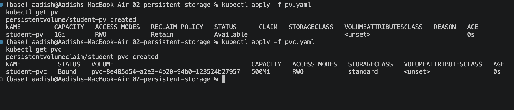
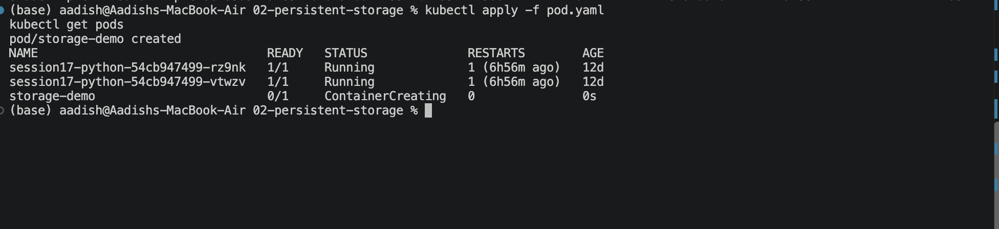
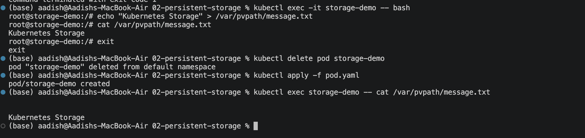

# Kubernetes Persistent Storage Homework 


## 1. PersistentVolume & PersistentVolumeClaim

A **PersistentVolume (PV)** is storage available to the Kubernetes cluster.

A **PersistentVolumeClaim (PVC)** is a request for storage made by an application.

Create the PV and PVC:

```bash
kubectl apply -f pv.yaml
kubectl apply -f pvc.yaml
```

Verify:

```bash
kubectl get pv
kubectl get pvc
```

A `Bound` PVC means it has successfully connected to a suitable PV.

### 📸 Screenshot 1 — PV & PVC



---

## 2. Create the Pod

The Pod uses the PVC and mounts the persistent storage at:

```text
/var/pvpath
```

Create the Pod:

```bash
kubectl apply -f pod.yaml
kubectl get pods
```

### 📸 Screenshot 2 — Pod Running



---

## 3. Write Data to Persistent Storage

Enter the Pod:

```bash
kubectl exec -it storage-demo -- bash
```

The PVC is mounted at `/var/pvpath`.

Create a file:

```bash
echo "Kubernetes Storage" > /var/pvpath/message.txt
```

Read the file:

```bash
cat /var/pvpath/message.txt
```

Expected output:

```text
Kubernetes Storage
```

Exit:

```bash
exit
```

---

## 4. Verify Persistent Storage

Delete the Pod:

```bash
kubectl delete pod storage-demo
```

Recreate it:

```bash
kubectl apply -f pod.yaml
```

Check the previously created file:

```bash
kubectl exec storage-demo -- cat /var/pvpath/message.txt
```

Expected output:

```text
Kubernetes Storage
```

The data remains available even after the Pod is deleted because it is stored through the **PVC → PV → persistent storage**.

### 📸 Screenshot 3 — Persistent Data



---

## 5. Storage Architecture

```text
Pod
 │
 ▼
PVC
 │
 ▼
PV
 │
 ▼
Persistent Storage
```

The Pod uses the PVC, while the PVC is bound to the PV.

---

## 6. Access Modes

| Access Mode | Code | Description |
|---|---|---|
| ReadWriteOnce | `RWO` | Read/write by one node |
| ReadOnlyMany | `ROX` | Read-only by many nodes |
| ReadWriteMany | `RWX` | Read/write by many nodes |
| ReadWriteOncePod | `RWOP` | Read/write by a single Pod |

---

## 7. Useful Commands

```bash
kubectl get pv
kubectl get pvc
kubectl describe pv student-pv
kubectl describe pvc student-pvc
kubectl get pods
kubectl describe pod storage-demo
```

### 📸 Screenshot 4 — Final Status


---

## 🎯 Key Learning

- **PV** = Storage available in the cluster
- **PVC** = Request for storage
- **Pod** = Uses the PVC
- Persistent storage can survive Pod deletion.
- The PVC in this exercise is mounted at `/var/pvpath`.

