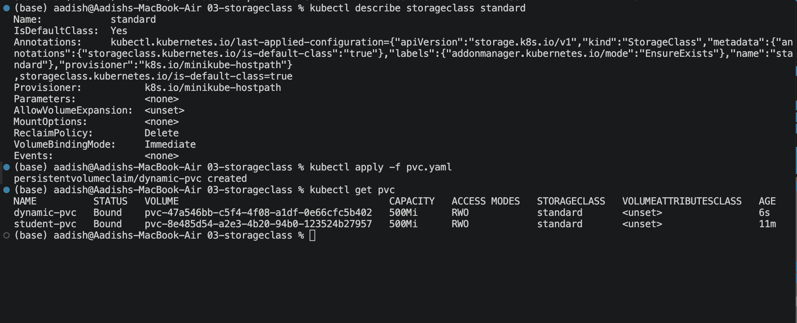
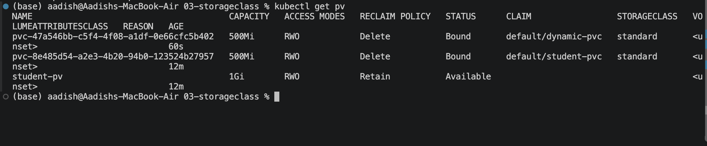
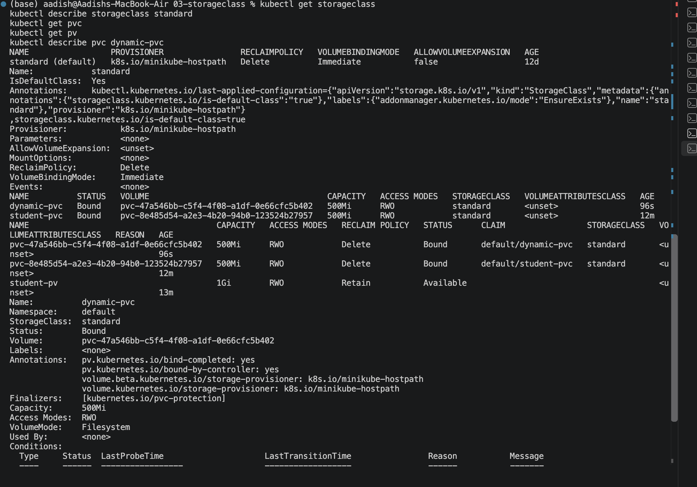

# Kubernetes StorageClass Homework


## 1. What is StorageClass?

A **StorageClass** defines a type of storage that Kubernetes can dynamically provision when a PVC requests it.

```text
PVC
 │
 ▼
StorageClass
 │
 ▼
Dynamic Provisioning
 │
 ▼
PV
```

This removes the need for an administrator to manually create a PV for every storage request.

---

## 2. Check Existing StorageClasses

Run:

```bash id="hjh2k7"
kubectl get storageclass
```

On Minikube, you will typically see a `standard` StorageClass marked as the default.

### Screenshot 1 — StorageClass


---

## 3. Inspect the StorageClass

Run:

```bash id="9x0kw5"
kubectl describe storageclass standard
```

This shows information such as:

- Provisioner
- Reclaim Policy
- Volume Binding Mode
- Default status

---

## 4. Create a Dynamic PVC

The PVC requests `500Mi` of storage from the `standard` StorageClass.

Apply it:

```bash id="c9p9ol"
kubectl apply -f pvc.yaml
```

Check the PVC:

```bash id="45f3ti"
kubectl get pvc
```

A `Bound` status means the PVC has successfully received storage.

### Screenshot 2 — PVC Bound



---

## 5. Check the Dynamically Created PV

Run:

```bash id="5r9c9y"
kubectl get pv
```

Kubernetes automatically creates a PV for the PVC.

No PV was manually created.

### Screenshot 3 — Dynamic PV



---

## 6. What Happened?

The storage was created using **dynamic provisioning**:

```text
PVC
 │
 ▼
StorageClass
 │
 ▼
Provisioner
 │
 ▼
PV
```

The StorageClass tells Kubernetes how to provision the requested storage.

---

## 7. Default StorageClass

Check the default StorageClass:

```bash id="1k3v9w"
kubectl get storageclass
```

A StorageClass marked as `(default)` can be automatically selected when a PVC does not specify `storageClassName`.

---

## 8. Useful Commands

```bash id="uj9m5a"
kubectl get storageclass
kubectl describe storageclass standard
kubectl get pvc
kubectl get pv
kubectl describe pvc dynamic-pvc
```

### Screenshot 4 — Final Storage Status



---

## 🎯 Key Learning

- **PV** = Storage available in the cluster
- **PVC** = Request for storage
- **StorageClass** = Enables dynamic provisioning
- Dynamic provisioning automatically creates storage when required.

