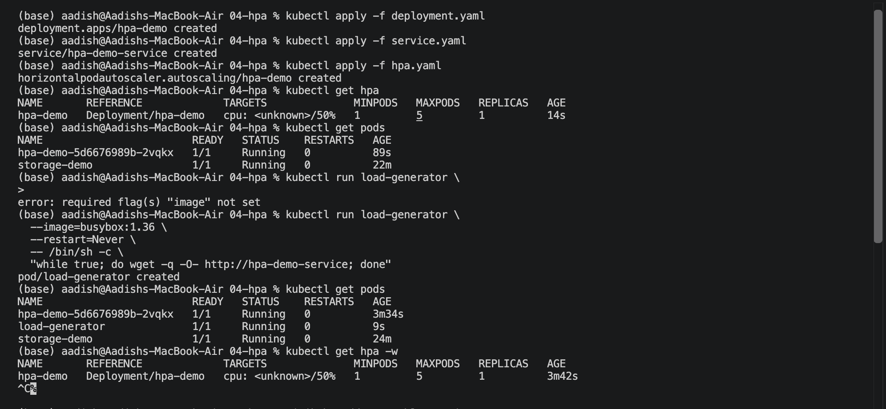
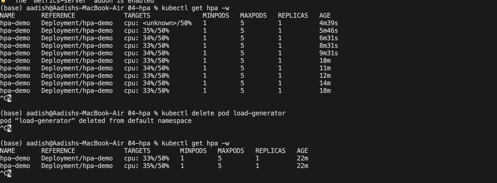
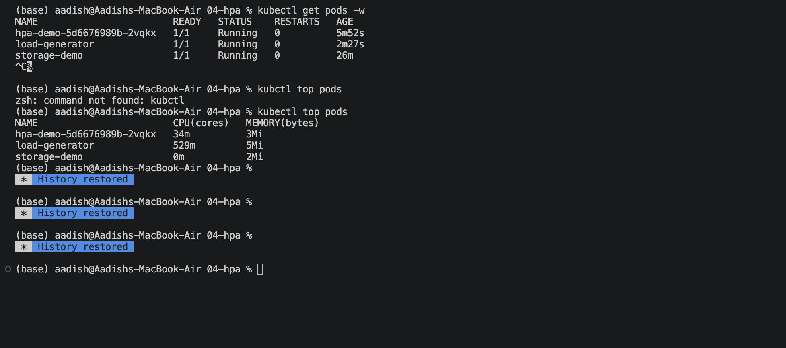
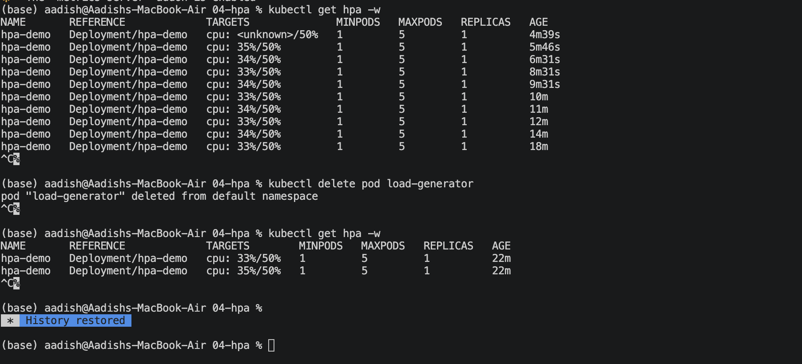

# Kubernetes HPA


## 1. What is HPA?

**HPA (Horizontal Pod Autoscaler)** automatically changes the number of Pod replicas based on resource usage.

```text
High CPU  →  More Pods
Low CPU   →  Fewer Pods
```

Unlike vertical scaling, HPA increases or decreases the **number of Pods**.

---

## 2. Create Deployment, Service & HPA

The Kubernetes resources were created using:

```bash
kubectl apply -f deployment.yaml
kubectl apply -f service.yaml
kubectl apply -f hpa.yaml
```

The HPA was configured with:

- Minimum replicas: `1`
- Maximum replicas: `5`
- Target CPU utilization: `50%`

The resources were verified using:

```bash
kubectl get hpa
kubectl get pods
```

### 📸 Screenshot 1 — Deployment, Service & HPA



---

## 3. Enable Metrics Server

HPA requires CPU metrics to make scaling decisions.

Metrics Server was enabled in Minikube:

```bash
minikube addons enable metrics-server
```

After enabling it, the HPA began receiving CPU metrics.

```bash
kubectl get hpa
```

The HPA showed CPU utilization such as:

```text
cpu: 35%/50%
```

### 📸 Screenshot 2 — Metrics & HPA



---

## 4. Generate Load

A BusyBox Pod was used to continuously send requests to the application:

```bash
kubectl run load-generator \
  --image=busybox:1.36 \
  --restart=Never \
  -- /bin/sh -c \
  "while true; do wget -q -O- http://hpa-demo-service; done"
```

The load generator was verified using:

```bash
kubectl get pods
```

CPU usage was checked using:

```bash
kubectl top pods
```

Example observed output:

```text
NAME                        CPU(cores)   MEMORY(bytes)
hpa-demo-...                34m          3Mi
load-generator              529m         5Mi
storage-demo                0m           2Mi
```

### 📸 Screenshot 3 — CPU Usage



---

## 5. Observe HPA

The HPA was monitored using:

```bash
kubectl get hpa -w
```

The observed CPU utilization reached approximately:

```text
33% - 35% / 50%
```

The deployment remained at one replica because the observed CPU utilization did not exceed the configured `50%` target.

After testing, the load generator was removed:

```bash
kubectl delete pod load-generator
```

### 📸 Screenshot 4 — HPA Monitoring



---

## 6. HPA Flow

```text
Application
     │
     ▼
 CPU Usage
     │
     ▼
Metrics Server
     │
     ▼
    HPA
     │
     ▼
Deployment
     │
     ▼
More / Fewer Pods
```

---

## 7. Important HPA Fields

| Field | Purpose |
|---|---|
| `scaleTargetRef` | Deployment controlled by HPA |
| `minReplicas` | Minimum number of Pods |
| `maxReplicas` | Maximum number of Pods |
| `metrics` | Resource used for scaling |

---

## 🎯 Key Learning

- **HPA** automatically adjusts Pod count.
- HPA requires resource metrics such as CPU usage.
- **Metrics Server** provides the metrics used by HPA.
- High CPU utilization can cause HPA to increase replicas.
- Lower CPU utilization can allow HPA to reduce replicas.
- In this experiment, CPU usage remained below the `50%` target, so the replica count remained at `1`.

---
