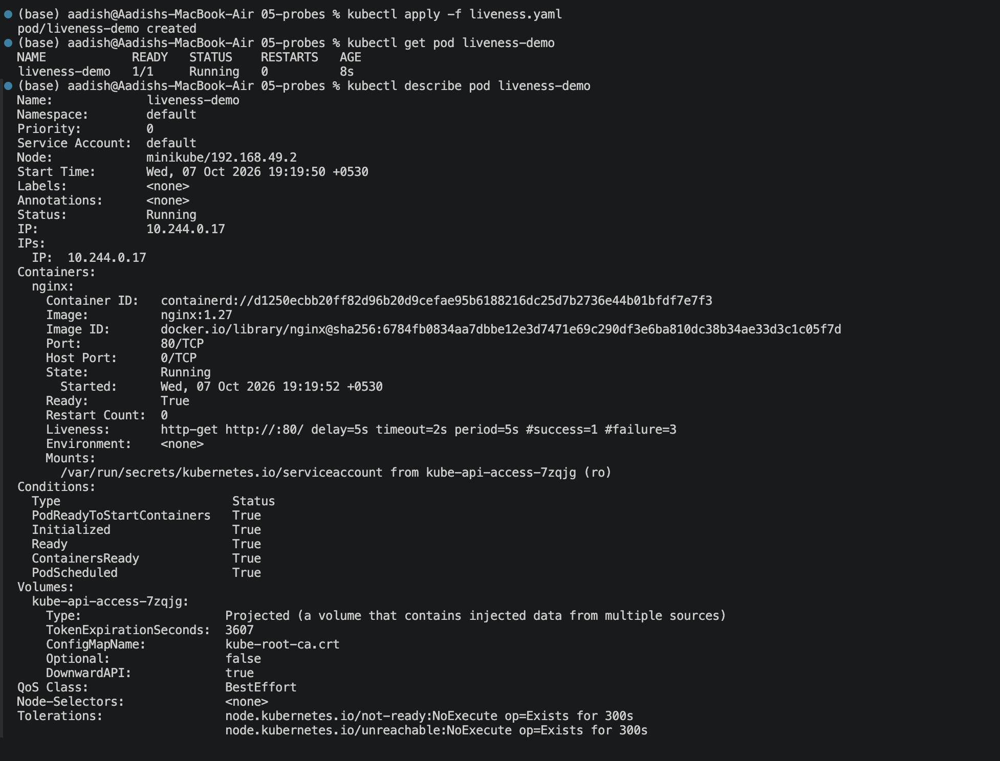
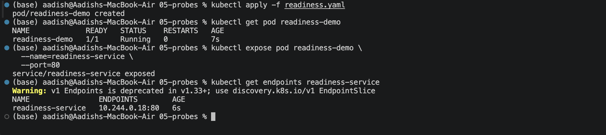
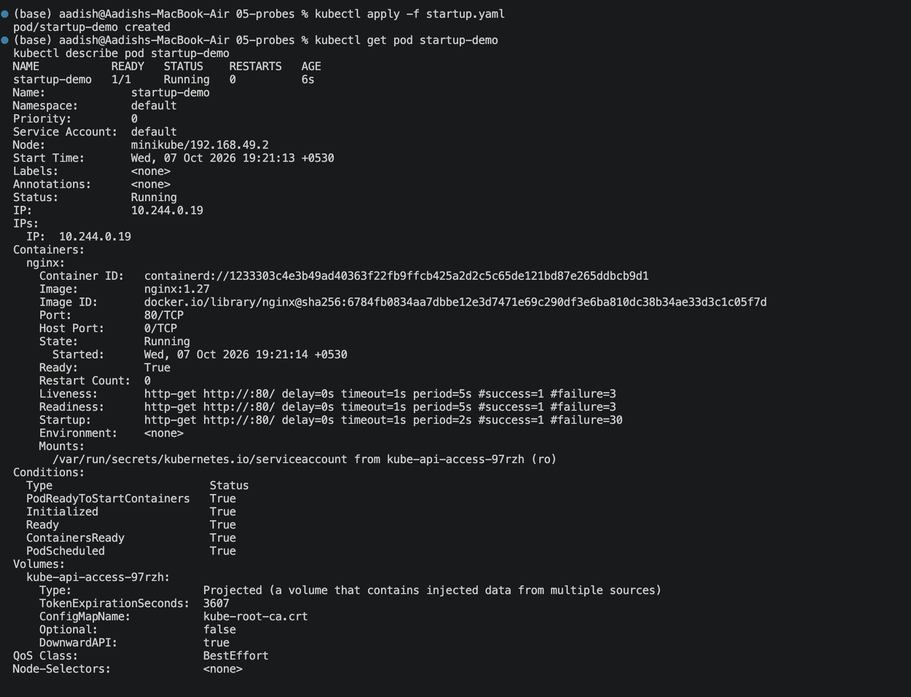
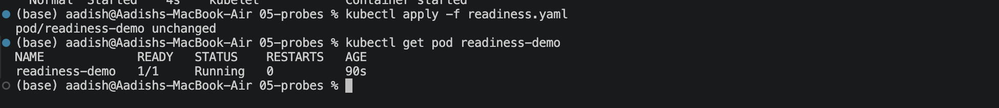

# Kubernetes Probes


## 1. Liveness Probe

A **liveness probe** checks whether an application is still healthy.

If the liveness check continuously fails, Kubernetes can restart the container.

Apply the configuration:

```bash id="d7r8x0"
kubectl apply -f liveness.yaml
```

Check the Pod:

```bash id="g0yyr8"
kubectl get pod liveness-demo
```

Inspect the probe:

```bash id="o4m5kz"
kubectl describe pod liveness-demo
```

### 📸 Screenshot 1 — Liveness Probe



---

## 2. Readiness Probe

A **readiness probe** checks whether an application is ready to receive traffic.

If readiness fails:

- The Pod can remain `Running`.
- The Pod becomes `NotReady`.
- Kubernetes removes it from normal Service endpoints.

Apply:

```bash id="9kcrr7"
kubectl apply -f readiness.yaml
```

Check:

```bash id="p3x9k8"
kubectl get pod readiness-demo
```

Create the Service:

```bash id="e7r5f1"
kubectl expose pod readiness-demo \
  --name=readiness-service \
  --port=80
```

Check endpoints:

```bash id="v9gq0n"
kubectl get endpoints readiness-service
```

### 📸 Screenshot 2 — Readiness Probe



---

## 3. Startup Probe

A **startup probe** checks whether an application has finished starting.

It is useful for applications that require a long startup time.

Apply:

```bash id="g7p3dm"
kubectl apply -f startup.yaml
```

Check the Pod:

```bash id="0c0cqi"
kubectl get pod startup-demo
kubectl describe pod startup-demo
```

### 📸 Screenshot 3 — Startup Probe



---

## 4. Test a Failed Probe

To understand the difference between probes, the readiness path can be changed from:

```yaml id="z8h4t1"
path: /
```

to:

```yaml id="6avv1g"
path: /wrong-path
```

Apply the updated configuration:

```bash id="v4wq7b"
kubectl apply -f readiness.yaml
```

Check the Pod:

```bash id="y8g0qx"
kubectl get pod readiness-demo
```

The Pod can remain:

```text
STATUS: Running
READY: 0/1
```

This demonstrates that a **readiness failure does not normally restart the container**.

### 📸 Screenshot 4 — Failed Readiness Probe



---

## 5. Probe Comparison

| Probe | Main Question | Failure Result |
|---|---|---|
| **Startup** | Has the application started? | Protects startup period; failure can restart container |
| **Readiness** | Can it receive traffic? | Pod becomes `NotReady` |
| **Liveness** | Is it still healthy? | Container can be restarted |

### Easy way to remember

```text
STARTUP
└── "Have you started?"

READINESS
└── "Can I send users to you?"

LIVENESS
└── "Are you still alive?"
```

---

## 6. Probe Types

Kubernetes supports:

- HTTP
- TCP
- Exec
- gRPC

The examples in this exercise use HTTP probes.

---

## 7. Useful Commands

```bash id="l6z8ax"
kubectl get pods
kubectl describe pod <pod-name>
kubectl logs <pod-name>
kubectl get events --sort-by=.lastTimestamp
kubectl exec -it <pod-name> -- sh
```

---

## 🎯 Key Learning

- **Liveness** → checks whether the application is healthy.
- **Readiness** → checks whether the application can receive traffic.
- **Startup** → checks whether the application has finished starting.
- A **readiness failure does not normally restart the container**.
- A persistent **liveness failure can restart the container**.

