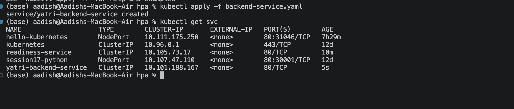
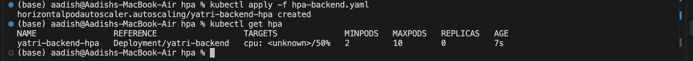
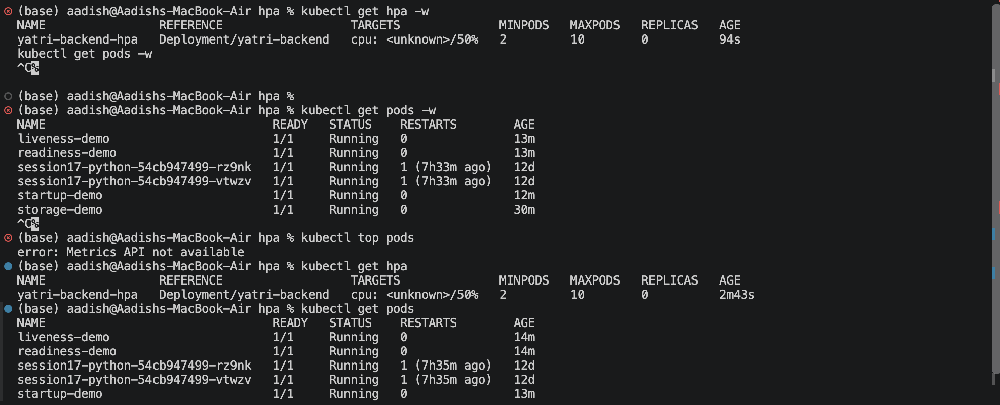
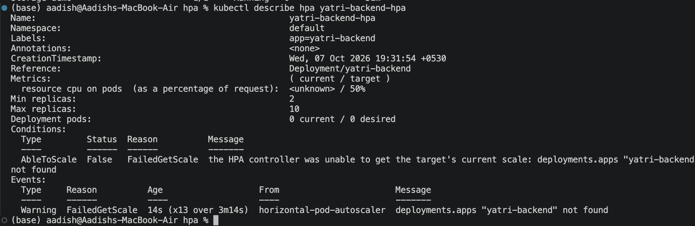

# Task 2: HPA Hands-on

## 📁 Project Structure

```text
hpa/
├── backend-service.yaml
├── hpa-backend.yaml
└── load_generator.sh
```

---

## 1. Deploy the Service

Apply the provided Service configuration:

```bash
kubectl apply -f backend-service.yaml
```

Verify:

```bash
kubectl get svc
```

The Service uses `ClusterIP` and forwards traffic to port `5000` of the Yatri backend.

### 📸 Screenshot 1 — Service



---

## 2. Configure HPA

Apply the HPA configuration:

```bash
kubectl apply -f hpa-backend.yaml
```

The HPA configuration uses:

- **Minimum replicas:** `2`
- **Maximum replicas:** `10`
- **CPU target:** `50%`
- **Target Deployment:** `yatri-backend`

Verify:

```bash
kubectl get hpa
```

Get detailed information:

```bash
kubectl describe hpa yatri-backend-hpa
```

### 📸 Screenshot 2 — HPA Configuration



---

## 3. Check CPU Utilization

Check the resource usage of the Pods:

```bash
kubectl top pods
```

This displays the current CPU and memory usage.

---

## 4. Generate Load

Make the load generator executable:

```bash
chmod +x load_generator.sh
```

Run it:

```bash
./load_generator.sh
```

The script generates continuous requests to the Yatri backend using multiple parallel workers.

---

## 5. Observe HPA Scaling

Open another terminal and monitor the HPA:

```bash
kubectl get hpa -w
```

Monitor the Pods:

```bash
kubectl get pods -w
```

Monitor CPU usage:

```bash
kubectl top pods
```

As CPU utilization increases, HPA can increase the number of `yatri-backend` Pods.

### 📸 Screenshot 3 — CPU & HPA



---

## 6. Verify Pod Scaling

Check the current HPA:

```bash
kubectl get hpa
```

Check the Pods:

```bash
kubectl get pods
```

Detailed HPA information:

```bash
kubectl describe hpa yatri-backend-hpa
```

### 📸 Screenshot 4 — Pod Scaling



---

## 7. Stop Load Generation

Stop the load generator using:

```text
Ctrl + C
```

After the CPU usage decreases, HPA can scale the Deployment back toward its minimum replica count.

---

## 🔄 HPA Flow

```text
Traffic
   │
   ▼
Yatri Backend
   │
   ▼
CPU Usage
   │
   ▼
Metrics Server
   │
   ▼
HPA
   │
   ▼
2 ──────── 10 Pods
```

---

## 🎯 Key Learning

- **HPA** automatically adjusts the number of Pods.
- Minimum replicas are set to **2**.
- Maximum replicas are set to **10**.
- The CPU utilization target is **50%**.
- `kubectl top pods` shows CPU usage.
- `kubectl get hpa` shows HPA status.
- High CPU usage can trigger additional Pods.

---

## 📋 Useful Commands

```bash
kubectl get hpa
kubectl get pods
kubectl top pods
kubectl describe hpa yatri-backend-hpa
kubectl get svc
kubectl get pods -w
kubectl get hpa -w
```

