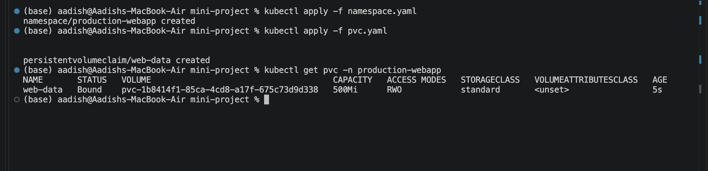
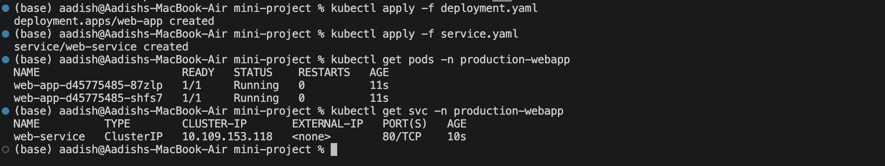
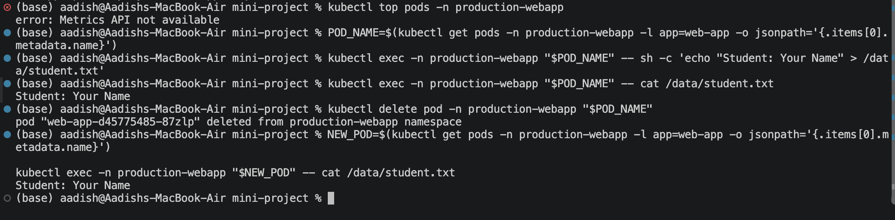
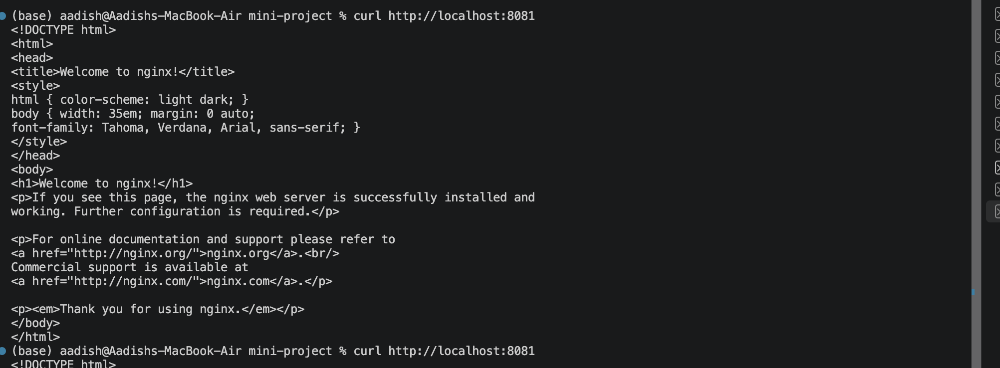
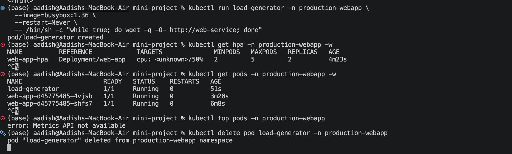

# 🚀 Mini Project


## 📁 Project Structure

```text
mini-project/
├── namespace.yaml
├── pvc.yaml
├── deployment.yaml
├── service.yaml
├── hpa.yaml
└── README.md
```

---

## 1. Create Namespace & Persistent Storage

Create the dedicated namespace:

```bash
kubectl apply -f namespace.yaml
```

Create the PersistentVolumeClaim:

```bash
kubectl apply -f pvc.yaml
```

Verify:

```bash
kubectl get pvc -n production-webapp
```

The PVC requests:

- Storage: `500Mi`
- Access Mode: `ReadWriteOnce`
- StorageClass: `standard`

### 📸 Screenshot 1 — Namespace & PVC



---

## 2. Deploy Application & Service

Deploy the application:

```bash
kubectl apply -f deployment.yaml
```

Create the Service:

```bash
kubectl apply -f service.yaml
```

Verify the Pods:

```bash
kubectl get pods -n production-webapp
```

Check the Service:

```bash
kubectl get svc -n production-webapp
```

The application runs with **2 initial replicas**.

### 📸 Screenshot 2 — Pods, Service & HPA



---

## 3. Configure HPA

Apply the Horizontal Pod Autoscaler:

```bash
kubectl apply -f hpa.yaml
```

Check:

```bash
kubectl get hpa -n production-webapp
```

The HPA configuration is:

- Minimum replicas: `2`
- Maximum replicas: `5`
- CPU target: `50%`

Check CPU metrics:

```bash
kubectl top pods -n production-webapp
```

---

## 4. Verify Persistent Storage

Select a running Pod:

```bash
POD_NAME=$(kubectl get pods -n production-webapp -l app=web-app -o jsonpath='{.items[0].metadata.name}')
```

Create data inside `/data`:

```bash
kubectl exec -n production-webapp "$POD_NAME" -- sh -c 'echo "Student: Your Name" > /data/student.txt'
```

Verify:

```bash
kubectl exec -n production-webapp "$POD_NAME" -- cat /data/student.txt
```

Delete the Pod:

```bash
kubectl delete pod -n production-webapp "$POD_NAME"
```

After the replacement Pod is running, check the file again:

```bash
NEW_POD=$(kubectl get pods -n production-webapp -l app=web-app -o jsonpath='{.items[0].metadata.name}')

kubectl exec -n production-webapp "$NEW_POD" -- cat /data/student.txt
```

The data should still be available because it is stored using the PVC.

### 📸 Screenshot 3 — Persistent Storage



---

## 5. Verify Application Service

Forward the Service to the local machine:

```bash
kubectl port-forward -n production-webapp svc/web-service 8080:80
```

In another terminal:

```bash
curl http://localhost:8080
```

The application should return the NGINX response.

### 📸 Screenshot 4 — Application Service



---

## 6. Test HPA Scaling

Create a load generator:

```bash
kubectl run load-generator -n production-webapp \
  --image=busybox:1.36 \
  --restart=Never \
  -- /bin/sh -c "while true; do wget -q -O- http://web-service; done"
```

Monitor HPA:

```bash
kubectl get hpa -n production-webapp -w
```

Monitor Pods:

```bash
kubectl get pods -n production-webapp -w
```

Check CPU:

```bash
kubectl top pods -n production-webapp
```

When CPU utilization increases, HPA can scale the application from **2 up to 5 Pods**.

Stop the load:

```bash
kubectl delete pod load-generator -n production-webapp
```

### 📸 Screenshot 5 — HPA Scaling



---

## 7. Application Health Probes

The Deployment uses three Kubernetes probes:

| Probe | Purpose | Failure Result |
|---|---|---|
| **Startup** | Checks whether the application has started | Can restart the container |
| **Readiness** | Checks whether the Pod can receive traffic | Pod becomes `NotReady` |
| **Liveness** | Checks whether the application is healthy | Can restart the container |

These probes allow Kubernetes to automatically detect unhealthy application states.

---

## 8. Architecture

```text
                 Service
                    │
          ┌─────────┼─────────┐
          ▼         ▼         ▼
        Pod       Pod       Pod
         │         │         │
      Probes     Probes    Probes
         │         │         │
         └─────────┼─────────┘
                   │
                  HPA
                   │
             Metrics Server

Pod
 │
 └── /data
      │
      ▼
     PVC
      │
      ▼
 Persistent Storage
```

---

## 🎯 Key Learning

This project demonstrated three important Kubernetes capabilities:

- **Persistence** — PVC keeps application data available beyond Pod deletion.
- **Elastic Scaling** — HPA automatically adjusts the number of Pods based on CPU usage.
- **Health Management** — Startup, Readiness and Liveness probes allow Kubernetes to monitor application health.

