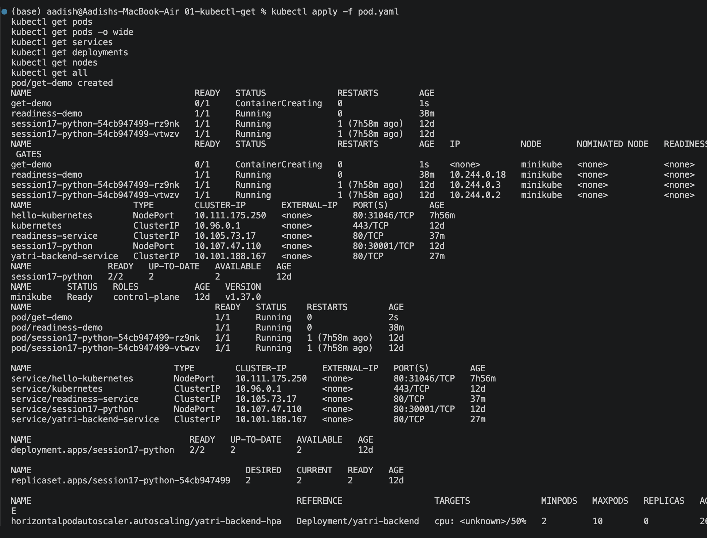

# `kubectl get`

## Objective

Learn how to use `kubectl get` to view the current state of Kubernetes resources.

## Commands

Run all commands together:

```bash
kubectl apply -f pod.yaml
kubectl get pods
kubectl get pods -o wide
kubectl get services
kubectl get deployments
kubectl get nodes
kubectl get all
```

## Screenshot



## Key Learning

`kubectl get` shows the current state of Kubernetes resources.

Useful examples:

```bash
kubectl get pods
kubectl get pods -o wide
kubectl get services
kubectl get deployments
kubectl get nodes
kubectl get all
```

## Reference

[Kubernetes kubectl Documentation](https://kubernetes.io/docs/reference/kubectl/)