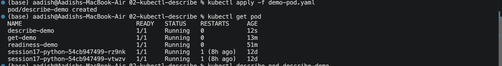
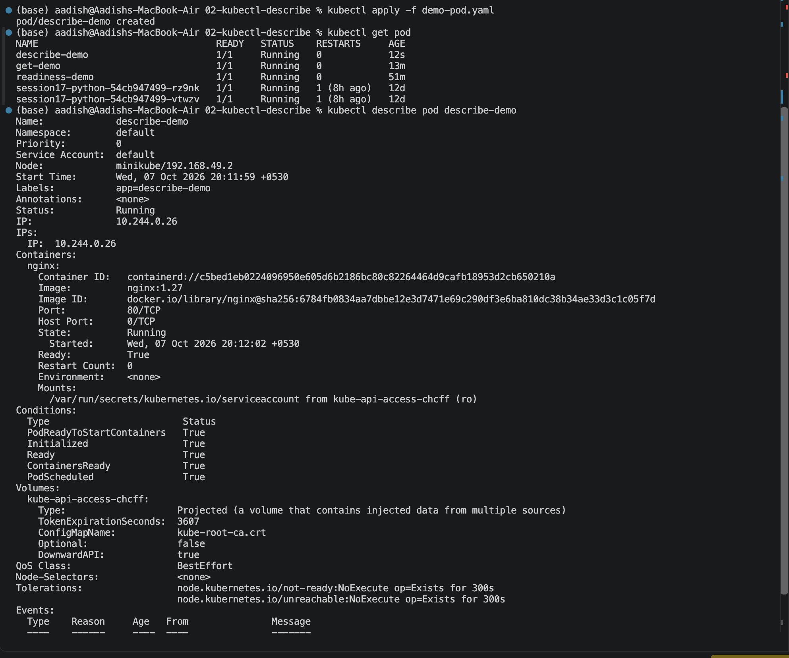

```markdown
# `kubectl describe`

## Objective

Learn how to use `kubectl describe` to get detailed information about Kubernetes resources and troubleshoot issues.

## 1. Create and Check the Pod

```bash
kubectl apply -f pod.yaml
kubectl get pod
```

### Screenshot 1



## 2. Describe the Pod

```bash
kubectl describe pod describe-demo
```

This shows:

- Pod status
- Container information
- Conditions
- Events

### Screenshot 2



## Key Learning

```text
kubectl get       → Quick overview
kubectl describe  → Detailed investigation
```

The **Events** section is especially useful for troubleshooting Pod issues.
