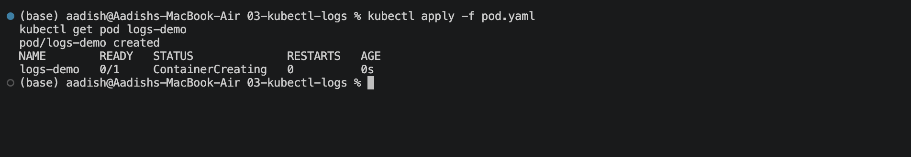
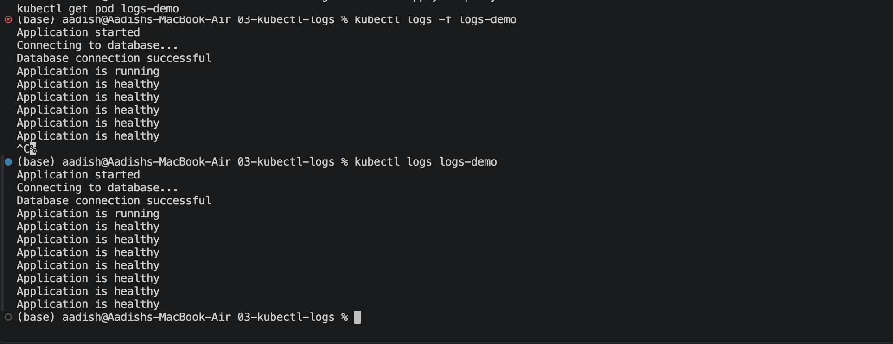

# `kubectl logs`

## Objective

Learn how to use `kubectl logs` to view application output and troubleshoot container issues.

## 1. Create and Check the Pod

```bash
kubectl apply -f pod.yaml
kubectl get pod logs-demo


### Screenshot 1



## 2. View Pod Logs

```bash
kubectl logs logs-demo
```

This displays the output generated by the application.

### Screenshot 2



## 3. Follow Logs

```bash
kubectl logs -f logs-demo
```

`-f` means **follow**. It continuously displays new logs.

Press `Ctrl + C` to stop.

## 4. Useful Commands

```bash
kubectl logs logs-demo
kubectl logs -f logs-demo
kubectl logs logs-demo --previous
kubectl logs logs-demo -c <container-name>
```

`--previous` is useful when a container has crashed and restarted.

## Key Learning

```text
kubectl logs
     ↓
"What is the application saying?"
```

Logs are one of the first places to check when an application is crashing or behaving unexpectedly.

