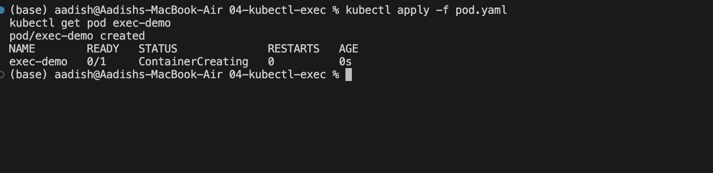
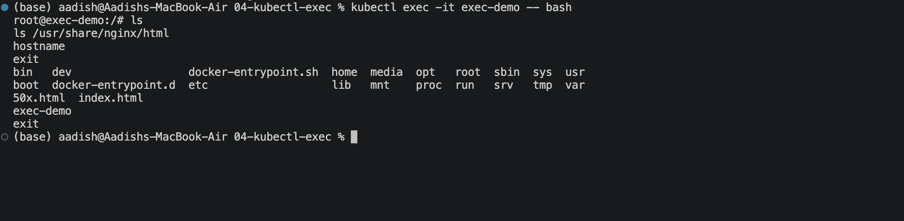

# `kubectl exec`

## Objective

Learn how to use `kubectl exec` to run commands and access a running container.

## 1. Create and Check the Pod

```bash
kubectl apply -f pod.yaml
kubectl get pod exec-demo
```

### Screenshot 1



## 2. Enter the Container

```bash
kubectl exec -it exec-demo -- bash
```

Inside the container, run:

```bash
ls
ls /usr/share/nginx/html
hostname
exit
```

### Screenshot 2



## 3. Run Commands Without Opening a Shell

```bash
kubectl exec exec-demo -- hostname
kubectl exec exec-demo -- ls /usr/share/nginx/html
kubectl exec exec-demo -- cat /etc/hosts
```

## Useful Commands

```bash
kubectl exec -it exec-demo -- bash
kubectl exec exec-demo -- hostname
kubectl exec exec-demo -- ls
kubectl exec exec-demo -- cat /etc/hosts
```

## Key Learning

```text
kubectl exec
     ↓
"Let me check from INSIDE the container."
```

`kubectl exec` is useful for debugging a running container and checking its files, processes, configuration, and network connectivity.


