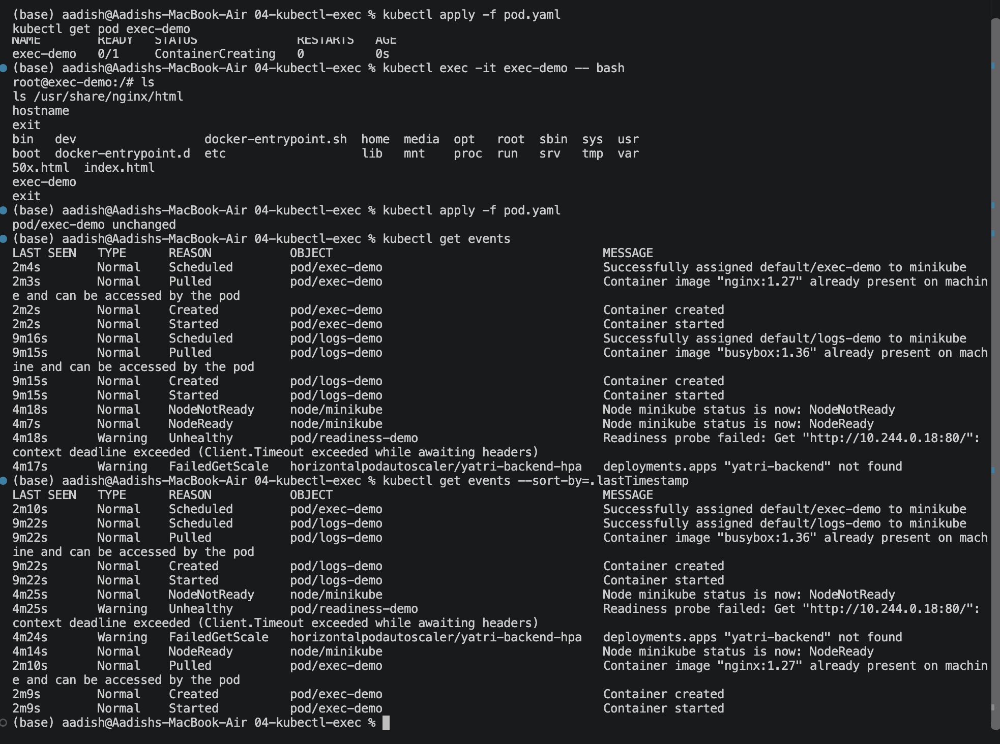
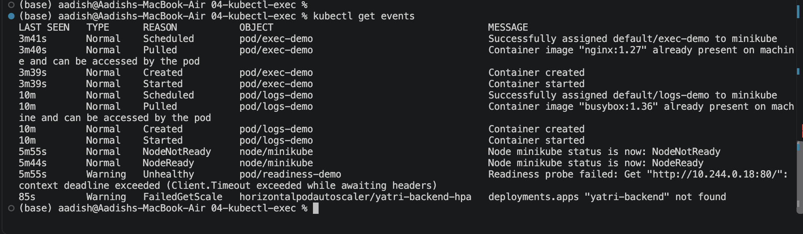

# Kubernetes Events

## Objective

Learn how to use Kubernetes Events to understand what Kubernetes is doing with resources and troubleshoot issues.

## 1. Create and Check Events

```bash
kubectl apply -f pod.yaml
kubectl get events
kubectl get events --sort-by=.lastTimestamp
```

### Screenshot 1



## 2. Check Events for a Specific Pod

```bash
kubectl describe pod events-demo
```

Look at the **Events** section at the bottom of the output.

### Screenshot 2



## Useful Commands

```bash
kubectl get events
kubectl get events --sort-by=.lastTimestamp
kubectl events
kubectl events --watch
kubectl events --for pod/events-demo
kubectl get events --field-selector type=Warning
```

## Key Learning

```text
kubectl get       → Current status
kubectl describe  → Detailed information
Events            → What Kubernetes tried to do and what happened
```

Events are especially useful for problems such as:

- `Pending`
- `FailedScheduling`
- `Failed`
- `Failed to pull image`

