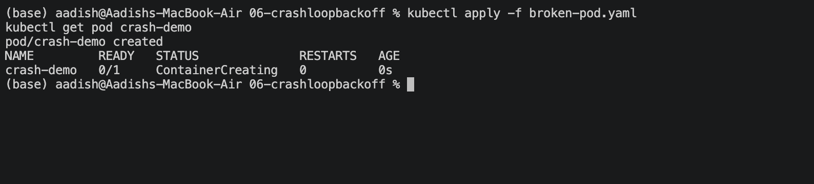
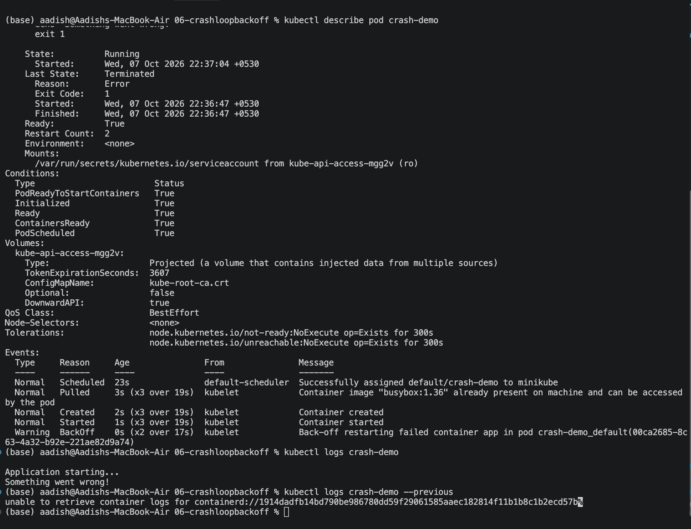

# `CrashLoopBackOff`

## Objective

Learn how to identify, troubleshoot, and fix a Pod stuck in `CrashLoopBackOff`.

## 1. Create the Broken Pod

```bash
kubectl apply -f broken-pod.yaml
kubectl get pod crash-demo
```

### Screenshot 1



## 2. Investigate the Problem

```bash
kubectl describe pod crash-demo
kubectl logs crash-demo
kubectl logs crash-demo --previous
```

Check the **State**, **Last State**, **Restart Count**, **Events**, and application logs.

### Screenshot 2



## 3. Fix the Pod

The original Pod exits with an error (`exit 1`), causing the repeated crashes.

Apply the fixed configuration:

```bash
kubectl delete pod crash-demo
kubectl apply -f fixed-pod.yaml
kubectl get pod crash-demo
kubectl logs crash-demo
```

### Screenshot 3


## Troubleshooting Flow

```text
kubectl get pod
      ↓
CrashLoopBackOff
      ↓
kubectl describe pod
      ↓
kubectl logs
      ↓
kubectl logs --previous
      ↓
Find root cause
      ↓
Fix
      ↓
Verify
```

## Key Learning

`CrashLoopBackOff` is a **symptom**, not the root cause.

Common causes include:

- Application errors
- Wrong commands
- Missing environment variables
- Configuration problems
- Failed dependencies
- Bad probes
- Permission issues

