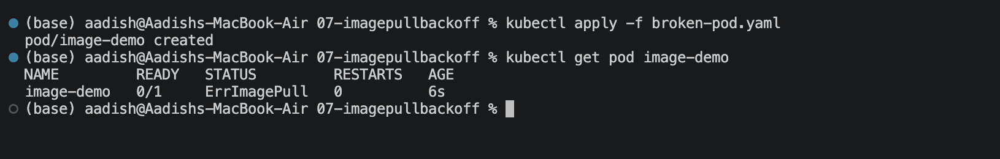
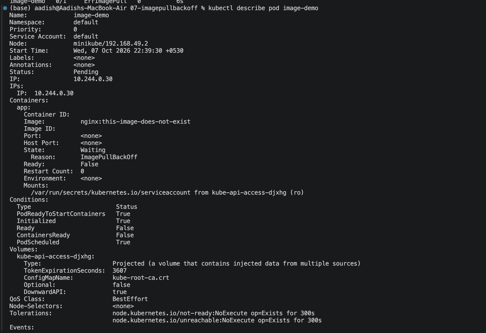
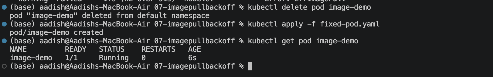

# `ImagePullBackOff`

## Objective

Learn how to identify, troubleshoot, and fix a Pod stuck in `ImagePullBackOff`.

## 1. Create the Broken Pod

```bash
kubectl apply -f broken-pod.yaml
kubectl get pod image-demo
```

Wait a few seconds and check again if needed.

### Screenshot 1



## 2. Investigate the Problem

```bash
kubectl describe pod image-demo
```

Check the **Events** section for messages such as `Failed to pull image`.

The problem is caused by an invalid image tag:

```yaml
image: nginx:this-image-does-not-exist
```

### Screenshot 2



## 3. Fix and Verify

```bash
kubectl delete pod image-demo
kubectl apply -f fixed-pod.yaml
kubectl get pod image-demo
```

### Screenshot 3



## Common Causes

- Wrong image name
- Wrong image tag
- Private registry authentication
- Registry unavailable
- Network problems
- Image does not exist

## Key Learning

```text
CrashLoopBackOff  → Container starts but keeps failing
ImagePullBackOff  → Kubernetes cannot pull the container image
```

## Troubleshooting Flow

```text
ImagePullBackOff
      ↓
kubectl describe pod
      ↓
Check Events
      ↓
Check image name/tag
      ↓
Check registry access
      ↓
Fix and verify
```
