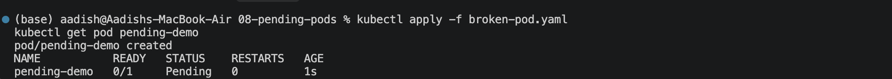
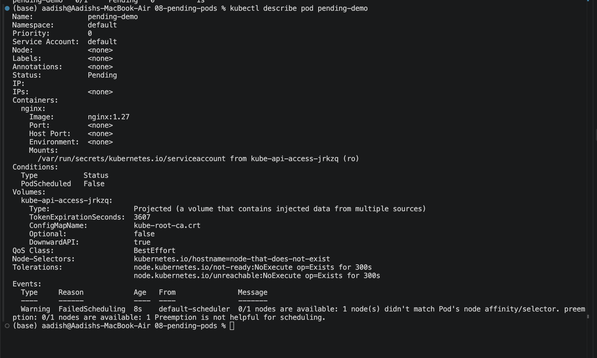
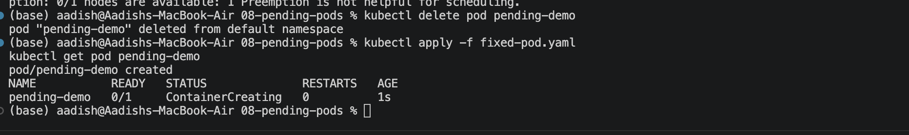

# `Pending` Pods

## Objective

Learn how to identify why a Pod is stuck in `Pending` and how to fix it.

## 1. Create the Broken Pod

```bash
kubectl apply -f broken-pod.yaml
kubectl get pod pending-demo
```

### Screenshot 1



## 2. Find the Reason

```bash
kubectl describe pod pending-demo
kubectl get nodes
```

Check the **Events** section. The Pod uses:

```yaml
nodeSelector:
  kubernetes.io/hostname: node-that-does-not-exist
```

Since no matching node exists, the scheduler cannot place the Pod.

### Screenshot 2



## 3. Fix and Verify

```bash
kubectl delete pod pending-demo
kubectl apply -f fixed-pod.yaml
kubectl get pod pending-demo
```

### Screenshot 3



## Common Causes

- Insufficient CPU or memory
- Node selector mismatch
- Affinity rules
- Taints and tolerations
- PVC not available
- Scheduling constraints

## Troubleshooting Flow

```text
Pending
   ↓
kubectl describe pod
   ↓
Check Events
   ↓
Check Nodes / Resources
   ↓
Check Selectors / Affinity / PVC
   ↓
Fix
   ↓
Verify
```

## Key Learning

`Pending` means the Pod has not been successfully scheduled and started.

The first command to investigate is:

```bash
kubectl describe pod <pod-name>
```

Pay special attention to `FailedScheduling` events.

