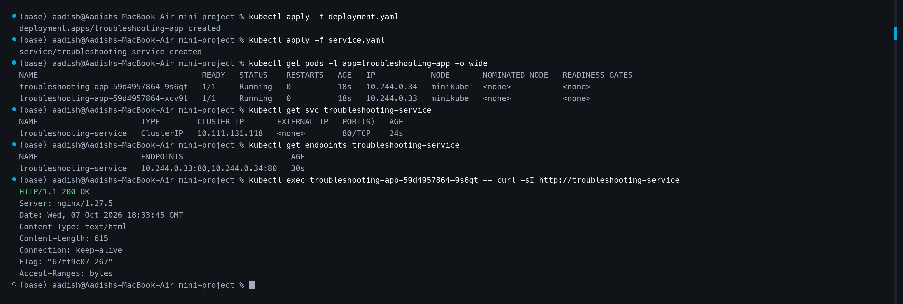
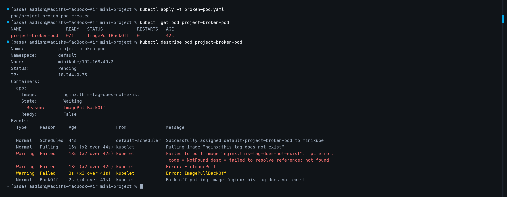
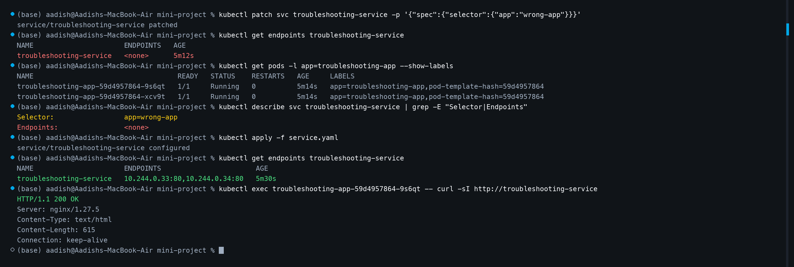

# 🚀 Mini-Project: Kubernetes Troubleshooting Challenge

## 📌 Project Overview

In this project, we apply a structured, repeatable troubleshooting methodology to a live Kubernetes cluster:

```text
  GET  ──►  DESCRIBE  ──►  EVENTS  ──►  LOGS  ──►  EXEC  ──►  TEST  ──►  FIX  ──►  VERIFY
```

We deploy an Nginx application behind a ClusterIP Service, verify its healthy baseline, diagnose and resolve an invalid container image pull failure, simulate a Service selector misconfiguration, and restore end-to-end traffic routing.

---

## 📁 Project Structure

```text
mini-project/
├── deployment.yaml         # Healthy Nginx Deployment (2 replicas)
├── service.yaml            # ClusterIP Service pointing to app: troubleshooting-app
├── broken-pod.yaml         # Broken Pod spec with invalid image tag
├── Homework.md             # Complete step-by-step documentation & incident report
├── render_screenshots.py   # Automated high-res terminal screenshot generator
├── 1.png                   # Healthy Deployment & Service verification
├── 2.png                   # ImagePullBackOff diagnosis & Events investigation
└── 3.png                   # Selector mismatch diagnosis & endpoint recovery
```

---

## 🛠️ Step-by-Step Walkthrough

### Step 1: Deploy & Baseline Application Health

Deploy the Deployment and Service manifests:

```bash
kubectl apply -f deployment.yaml
kubectl apply -f service.yaml
```

Verify Pod readiness and Service endpoints:

```bash
kubectl get pods -l app=troubleshooting-app -o wide
kubectl get svc troubleshooting-service
kubectl get endpoints troubleshooting-service
```

Test application connectivity inside the cluster:

```bash
POD=$(kubectl get pods -l app=troubleshooting-app -o jsonpath='{.items[0].metadata.name}')
kubectl exec "$POD" -- curl -sI http://troubleshooting-service
```

**Observation:**
- Both Deployment Pods are `1/1 Running`.
- `troubleshooting-service` is assigned ClusterIP `10.111.131.118:80`.
- Endpoints accurately list both Pod IPs: `10.244.0.33:80,10.244.0.34:80`.
- HTTP request returns `HTTP/1.1 200 OK`.

#### 📸 Screenshot 1: Healthy Deployment, Service Endpoints & Connectivity



---

### Step 2: Diagnose Broken Pod (`ImagePullBackOff`)

Deploy the unverified container manifest:

```bash
kubectl apply -f broken-pod.yaml
```

Inspect high-level status:

```bash
kubectl get pod project-broken-pod
```

```text
NAME                 READY   STATUS             RESTARTS   AGE
project-broken-pod   0/1     ImagePullBackOff   0          42s
```

Without modifying the manifest immediately, inspect the Pod events and container state:

```bash
kubectl describe pod project-broken-pod
```

Key evidence extracted from the `Events` log:

```text
Events:
  Type     Reason   From      Message
  ----     ------   ----      -------
  Normal   Pulling  kubelet   Pulling image "nginx:this-tag-does-not-exist"
  Warning  Failed   kubelet   Failed to pull image "nginx:this-tag-does-not-exist": rpc error: code = NotFound desc = failed to resolve reference: not found
  Warning  Failed   kubelet   Error: ErrImagePull
  Warning  Failed   kubelet   Error: ImagePullBackOff
  Normal   BackOff  kubelet   Back-off pulling image "nginx:this-tag-does-not-exist"
```

#### 📸 Screenshot 2: Broken Pod Status and Image-Pull Events



#### 🔍 Broken Pod Diagnostic Q&A

* **Question 1: What is the Pod status?**  
  **Answer:** `ImagePullBackOff` (with Pod phase `Pending` and ready condition `False`).
* **Question 2: What is the actual error?**  
  **Answer:** `Failed to pull image "nginx:this-tag-does-not-exist": rpc error: code = NotFound desc = failed to resolve reference "docker.io/library/nginx:this-tag-does-not-exist": not found`.
* **Question 3: Which command helped you find the reason?**  
  **Answer:** `kubectl describe pod project-broken-pod`, specifically the `Events` section and `Containers.app.State.Waiting.Reason`.
* **Question 4: What is wrong with the image?**  
  **Answer:** The image tag `this-tag-does-not-exist` does not exist in the official Docker Hub `nginx` repository.
* **Question 5: How would you fix it?**  
  **Answer:** Update `broken-pod.yaml` image specification to a verified tag (such as `nginx:1.27` or `nginx:alpine`) and apply the change:
  ```bash
  kubectl set image pod/project-broken-pod app=nginx:1.27
  # Or edit broken-pod.yaml and re-apply:
  # kubectl apply -f broken-pod.yaml
  ```

---

### Step 3: Service Selector Mismatch & Recovery

Simulate a common routing failure by modifying the Service label selector:

```bash
kubectl patch svc troubleshooting-service -p '{"spec":{"selector":{"app":"wrong-app"}}}'
```

Check the Service endpoints:

```bash
kubectl get endpoints troubleshooting-service
```

```text
NAME                      ENDPOINTS   AGE
troubleshooting-service   <none>      5m12s
```

Endpoints show `<none>`. Because the Service has no healthy backend targets, incoming cluster traffic receives connection timeouts or errors.

#### Root Cause Analysis:

Compare Pod labels against Service selector:

```bash
kubectl get pods -l app=troubleshooting-app --show-labels
kubectl describe svc troubleshooting-service | grep -E "Selector|Endpoints"
```

- **Pod Labels:** `app=troubleshooting-app`
- **Service Selector:** `app=wrong-app`
- **Root Cause:** A mismatch between the selector key/value and the Pod label prevents the Kubernetes Endpoint controller from attaching the Pod IPs.

#### Fix & Verification:

Restore the correct selector using `service.yaml`:

```bash
kubectl apply -f service.yaml
kubectl get endpoints troubleshooting-service
```

Verify that endpoints are populated and test HTTP traffic:

```bash
kubectl exec troubleshooting-app-59d4957864-9s6qt -- curl -sI http://troubleshooting-service
```

**Result:** Endpoints restored to `10.244.0.33:80,10.244.0.34:80` and curl returns `HTTP/1.1 200 OK`.

#### 📸 Screenshot 3: Empty Endpoints, Selector Correction & Traffic Recovery



---

## 📊 Incident Summaries (Symptom ➔ Evidence ➔ Root Cause ➔ Fix ➔ Verification)

### Incident 1: Invalid Container Image Tag

| Phase | Details |
| :--- | :--- |
| **Symptom** | Pod `project-broken-pod` never reaches `Running` state; container restarts count stays at 0 while status fluctuates between `ErrImagePull` and `ImagePullBackOff`. |
| **Evidence** | `kubectl describe pod project-broken-pod` shows event `Failed to pull image "nginx:this-tag-does-not-exist": rpc error: code = NotFound`. |
| **Root Cause** | Manifest `broken-pod.yaml` requested a non-existent image tag from the public Docker registry. |
| **Fix** | Correct image reference to a valid version (`nginx:1.27`). |
| **Verification** | `kubectl get pod project-broken-pod` transitions to `1/1 Running` and `kubectl logs project-broken-pod` displays Nginx initialization logs. |

### Incident 2: Service Selector Mismatch

| Phase | Details |
| :--- | :--- |
| **Symptom** | Internal services and client Pods fail to connect to `http://troubleshooting-service:80` (connection refused or timeout). |
| **Evidence** | `kubectl get endpoints troubleshooting-service` outputs `<none>`. `kubectl describe svc` displays `Selector: app=wrong-app`, whereas `kubectl get pods --show-labels` shows `app=troubleshooting-app`. |
| **Root Cause** | The Service selector does not match the labels assigned to the Pod template in the Deployment. |
| **Fix** | Update `spec.selector` in `service.yaml` to `app: troubleshooting-app` and execute `kubectl apply -f service.yaml`. |
| **Verification** | `kubectl get endpoints troubleshooting-service` shows `10.244.0.33:80,10.244.0.34:80` and `curl -sI http://troubleshooting-service` returns `HTTP/1.1 200 OK`. |

---

## 📋 Master Troubleshooting Reference Table

| Incident Target | Observed Symptom | Primary Command | Root Cause Identified | Remediation Action | Post-Fix Verification |
| :--- | :--- | :--- | :--- | :--- | :--- |
| **Broken Pod** | Pod stuck in `ImagePullBackOff` | `kubectl describe pod <name>` | Non-existent image tag requested on Docker Hub | Correct image tag in manifest to `nginx:1.27` | Pod reports `1/1 Running`, 0 restarts |
| **Service Routing** | Traffic dropped, Service unreachable | `kubectl get endpoints <svc>` | `spec.selector` mismatch against running Pod labels | Align Service selector with Pod label `app: troubleshooting-app` | Endpoints populated with Pod IPs; HTTP 200 OK |
| **Application Crash** | Pod repeatedly restarting (`CrashLoopBackOff`) | `kubectl logs <name> --previous` | Application runtime exception / exit code != 0 | Fix code, environment variables, or config mount | Container stays alive without restarts |

---

## 💡 Troubleshooting Concept Q&A

### 1. What does `kubectl get` tell us?
`kubectl get` lists the current high-level state of cluster resources (name, ready status, restart counts, age, IPs, nodes). It provides a quick snapshot to spot anomalous resource states.

### 2. What is the difference between `get` and `describe`?
- `kubectl get`: Provides high-level tabular summary data from the Kubernetes API.
- `kubectl describe`: Provides an exhaustive, formatted inspection of the resource including configuration details, container states, volumes, annotations, and critically, the chronological **Events** emitted by cluster controllers and the kubelet.

### 3. Why do we use `kubectl logs`?
`kubectl logs` retrieves `stdout` and `stderr` streams directly from the application container process. While Kubernetes events tell us why a container failed to start, container logs explain why an application failed while running (e.g., uncaught code errors, failed database connections, missing config files).

### 4. When would you use `kubectl exec`?
`kubectl exec` allows interactive command execution inside an active container. It is used to:
- Test network connectivity from inside the Pod network namespace (`curl`, `nc`, `ping`).
- Inspect filesystem state, mounted ConfigMaps, Secrets, or persistent volumes.
- Verify running container processes and internal socket listeners.

### 5. What does `CrashLoopBackOff` mean?
The container started successfully, but the containerized process terminated with an error (non-zero exit code). Kubernetes automatically restarts it according to its restart policy, but applies an exponential delay (back-off: 10s, 20s, 40s...) between restart attempts to prevent resource thrashing.

### 6. What does `ImagePullBackOff` mean?
The kubelet cannot fetch the requested container image (due to invalid image name/tag, private registry authentication failure, rate limiting, or network timeout). Kubelet backs off with an increasing delay before retrying the pull.

### 7. Why can a Pod remain `Pending`?
A Pod remains `Pending` if:
- **Scheduling failure:** Insufficient CPU/memory across all nodes, unsatisfied node selectors, taints/tolerations, or affinity rules.
- **Storage binding:** PersistentVolumeClaim has not bound to an available PersistentVolume.
- **Image pull in progress:** The container image is actively downloading before execution begins.

### 8. Why can a Service have no endpoints?
A Service displays `<none>` for endpoints when:
- The Service selector does not match any existing Pod labels.
- The matching Pods are not in a `Ready` condition (failing readiness probes).
- The Pods are in another namespace than the Service.
- All replicas are scaled down to 0.

### 9. What is the relationship between a Service selector and Pod labels?
Kubernetes uses loose coupling via key-value label matching. A Service defines `spec.selector` (`key: value`). The Endpoint / EndpointSlice controller constantly scans for Pods whose `metadata.labels` include matching key-value pairs and automatically registers their internal IP addresses as active Service backends.

### 10. What is Kubernetes DNS?
Kubernetes runs an internal cluster DNS service (CoreDNS). It registers DNS records for Services and Pods so workloads can discover each other using human-readable names (e.g., `troubleshooting-service.default.svc.cluster.local`) rather than dynamic Pod IP addresses.

---

## 🏛️ Final Architecture

```text
                             Kubernetes Cluster
                                     │
                     Incoming In-Cluster Client Pod
                                     │
                                     ▼
                        ┌─────────────────────────┐
                        │ troubleshooting-service │
                        │   (ClusterIP Service)   │
                        └────────────┬────────────┘
                                     │
                             Service Selector:
                        app: troubleshooting-app
                                     │
                    ┌────────────────┴────────────────┐
                    │                                 │
                    ▼                                 ▼
      ┌──────────────────────────┐      ┌──────────────────────────┐
      │          Pod 1           │      │          Pod 2           │
      │   troubleshooting-app    │      │   troubleshooting-app    │
      │       10.244.0.33        │      │       10.244.0.34        │
      │         (Port 80)        │      │         (Port 80)        │
      │        nginx:1.27        │      │        nginx:1.27        │
      └──────────────────────────┘      └──────────────────────────┘
```

---

## 🎯 Key Takeaways

1. **Systematic Triaging Beats Guessing:** Always follow the diagnostic ladder (`get` ➔ `describe` ➔ `events` ➔ `logs` ➔ `exec`).
2. **Events Are the Gold Mine:** For scheduling, pulling, and mounting errors, `kubectl describe ...` events expose the exact error message within seconds.
3. **Verify Endpoints on Service Failures:** When a Service fails, inspect endpoints first before diagnosing network policies or ingress controllers.