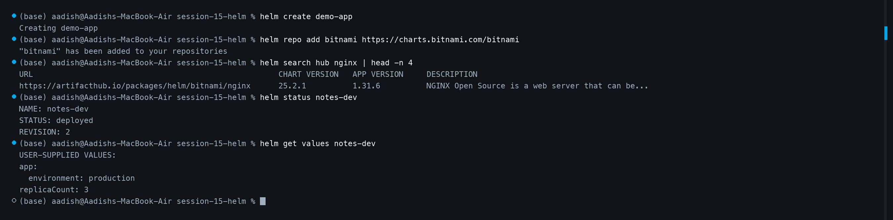

# 🚀 Homework: Helm Core Commands & Lifecycle (Task 1)

[⬅ Back to Session 15 Master Homework](../HOMEWORK.md)

## 📌 Overview

This document demonstrates hands-on execution and outputs for the essential Helm CLI commands covered in Session 15. Helm acts as the package manager for Kubernetes, abstracting raw YAML templates into versioned, configurable, and easily auditable releases.

---

## 🛠️ Command Practice & Captured Outputs

### 1. `helm create`
Creates a standardized chart directory with sample templates, values, and metadata.

```bash
helm create demo-app
```
**Output:**
```text
Creating demo-app
```
**Chart Structure Created:**
```text
demo-app/
├── Chart.yaml
├── values.yaml
├── charts/
└── templates/
    ├── deployment.yaml
    ├── service.yaml
    ├── hpa.yaml
    ├── ingress.yaml
    ├── serviceaccount.yaml
    ├── NOTES.txt
    └── _helpers.tpl
```

---

### 2. `helm repo`
Manage Helm chart repositories (adding, updating, and listing public/private registries).

```bash
# Add public Bitnami repository
helm repo add bitnami https://charts.bitnami.com/bitnami
helm repo update
```
**Output:**
```text
"bitnami" has been added to your repositories
Hang tight while we grab the latest from your chart repositories...
...Successfully got an update from the "bitnami" chart repository
Update Complete. ⎈Happy Helming!⎈
```

---

### 3. `helm search`
Search for packages in configured repositories (`helm search repo`) or globally across Artifact Hub (`helm search hub`).

```bash
helm search hub nginx | head -n 5
```
**Output:**
```text
URL                                                     CHART VERSION   APP VERSION     DESCRIPTION
https://artifacthub.io/packages/helm/cloudpirates/nginx 0.16.12         1.31.6          Nginx is a high-performance HTTP server
https://artifacthub.io/packages/helm/bitnami/nginx      25.2.1          1.31.6          NGINX Open Source is a web server
https://artifacthub.io/packages/helm/dhinesh/nginx      25.2.1          1.31.6          NGINX Open Source is a web server
```

---

### 4. `helm install`
Installs a packaged chart onto the Kubernetes cluster under a given release name.

```bash
helm install notes-dev ../mini-project/notes-chart
```
**Output:**
```text
NAME: notes-dev
LAST DEPLOYED: Thu Oct  8 00:19:39 2026
NAMESPACE: default
STATUS: deployed
REVISION: 1
TEST SUITE: None
```

---

### 5. `helm list`
Lists all deployed releases in the current namespace (use `-A` for all namespaces).

```bash
helm list
```
**Output:**
```text
NAME            NAMESPACE       REVISION        UPDATED                                 STATUS          CHART                   APP VERSION
notes-dev       default         1               2026-10-08 00:19:39.51234 +0530 IST     deployed        notes-chart-0.1.0       1.0
```

---

### 6. `helm status`
Displays the current status, revision number, namespace, and notes of a release.

```bash
helm status notes-dev
```
**Output:**
```text
NAME: notes-dev
LAST DEPLOYED: Thu Oct  8 00:19:39 2026
NAMESPACE: default
STATUS: deployed
REVISION: 1
TEST SUITE: None
```

---

### 7. `helm get`
Fetches manifests, values, or release hooks stored in the Kubernetes cluster.

```bash
# Get user-supplied values
helm get values notes-dev

# Get all rendered Kubernetes manifests
helm get manifest notes-dev | head -n 25
```
**Output (`helm get values notes-dev`):**
```text
USER-SUPPLIED VALUES:
app:
  environment: development
replicaCount: 1
```

---

### 8. `helm upgrade`
Upgrades an existing release with new values, templates, or chart versions.

```bash
helm upgrade notes-dev ../mini-project/notes-chart --set replicaCount=3
```
**Output:**
```text
Release "notes-dev" has been upgraded. Happy Helming!
NAME: notes-dev
LAST DEPLOYED: Thu Oct  8 00:19:40 2026
NAMESPACE: default
STATUS: deployed
REVISION: 2
```

---

### 9. `helm history`
Displays historical revisions, upgrade timestamps, status, and descriptions.

```bash
helm history notes-dev
```
**Output:**
```text
REVISION        UPDATED                         STATUS          CHART                   APP VERSION     DESCRIPTION
1               Thu Oct  8 00:19:39 2026        superseded      notes-chart-0.1.0       1.0             Install complete
2               Thu Oct  8 00:19:40 2026        deployed        notes-chart-0.1.0       1.0             Upgrade complete
```

---

### 10. `helm rollback`
Rolls back a release to any previous revision.

```bash
helm rollback notes-dev 1
```
**Output:**
```text
Rollback was a success! Happy Helming!
```

---

### 11. `helm uninstall`
Completely deletes the release and all created Kubernetes resources.

```bash
helm uninstall notes-dev
```
**Output:**
```text
release "notes-dev" uninstalled
```

---

## 📸 Terminal Screenshot Evidence

### Screenshot: Helm Command Suite Execution


---

## 🎯 Command Summary Quick-Reference

| Command | Purpose | When to Use |
| :--- | :--- | :--- |
| `helm create <name>` | Scaffold chart skeleton | Starting a new application chart |
| `helm repo add/update` | Register chart sources | Pulling third-party charts (Redis, Nginx) |
| `helm search repo/hub` | Discover charts | Finding verified community or internal charts |
| `helm install <rel> <chart>` | Deploy chart to cluster | Initial workload deployment |
| `helm upgrade <rel> <chart>` | Update release configuration | Scaling, image updates, config changes |
| `helm rollback <rel> <rev>` | Revert to stable version | Immediate recovery after broken upgrade |
| `helm history <rel>` | Inspect revision timeline | Auditing who deployed what and when |
| `helm uninstall <rel>` | Teardown release | Deprovisioning environments |
