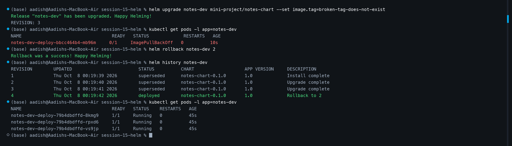

# 🚀 Homework: Helm Rollback Workflow (Task 2)

[⬅ Back to Session 15 Master Homework](../HOMEWORK.md)

## 📌 Objective

Demonstrate and document an end-to-end release lifecycle with deliberate failure injection and immediate revision rollback:

```text
Install (v1)  ──►  Upgrade (v2)  ──►  Verify  ──►  Upgrade Broken (v3)  ──►  Verify  ──►  Rollback (v4 -> v2)  ──►  Verify
```

---

## 🔄 Step-by-Step Rollback Workflow

### Step 1: Initial Installation (Revision 1)
Deploy the base chart with default values:

```bash
helm install rollback-demo ./app-chart
kubectl get pods -l app=rollback-demo
```
- **Revision:** `1`
- **Configuration:** `replicaCount=1`, `image=nginx:1.24`
- **Pod Status:** `1/1 Running`

---

### Step 2: First Upgrade to Production Scale (Revision 2)
Scale application replicas to 3:

```bash
helm upgrade rollback-demo ./app-chart --set replicaCount=3
helm list
kubectl get pods -l app=rollback-demo
```
- **Revision:** `2`
- **Configuration:** `replicaCount=3`, `image=nginx:1.24`
- **Pod Status:** 3 Pods `1/1 Running`
- **Release Status:** `deployed`

---

### Step 3: Bad Upgrade with Failure Injection (Revision 3)
Simulate a deployment failure by setting a non-existent container image tag:

```bash
helm upgrade rollback-demo ./app-chart --set image.tag=broken-tag-does-not-exist
kubectl get pods -l app=rollback-demo
```
- **Revision:** `3`
- **Pod Status:** Transitions into `0/1 ImagePullBackOff` / `ErrImagePull`
- **Incident:** New pods fail to pull the image while previous pods may be terminating.

---

### Step 4: Rapid Rollback to Healthy Revision (Revision 4)
Restore stability by rolling back to revision 2:

```bash
helm rollback rollback-demo 2
```
**Output:**
```text
Rollback was a success! Happy Helming!
```

Verify release history:
```bash
helm history rollback-demo
```
```text
REVISION    UPDATED                     STATUS          CHART               APP VERSION    DESCRIPTION
1           Thu Oct  8 00:19:39 2026    superseded      app-chart-0.1.0     1.0            Install complete
2           Thu Oct  8 00:19:40 2026    superseded      app-chart-0.1.0     1.0            Upgrade complete
3           Thu Oct  8 00:19:41 2026    superseded      app-chart-0.1.0     1.0            Upgrade complete
4           Thu Oct  8 00:19:42 2026    deployed        app-chart-0.1.0     1.0            Rollback to 2
```

> **Key Learning:** Helm treats rollbacks as **new revisions** (Revision 4). This guarantees a strictly linear, append-only deployment audit trail.

---

### Step 5: Post-Rollback Verification
Confirm that all Pods are restored and healthy:

```bash
kubectl get pods -l app=rollback-demo
```
- **Active Pods:** 3 replicas running `nginx:1.24` with zero restarts.

---

## 📸 Terminal Screenshot Evidence

### Screenshot: Complete Rollback Execution & Verification


---

## 🛡️ Proactive Reliability: Using `--atomic`

To prevent bad releases from lingering in the cluster in CI/CD pipelines:

```bash
helm upgrade rollback-demo ./app-chart \
  --set image.tag=broken-tag-does-not-exist \
  --atomic \
  --timeout 90s
```

If readiness probes fail or images cannot be pulled before the timeout expires, Helm automatically executes a rollback to the prior revision without manual human intervention.
