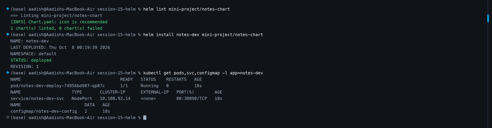
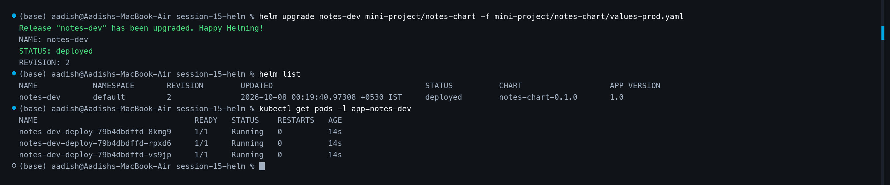

# 🚀 Mini-Project: Package & Deploy Notes App with Helm (Task 3)

[⬅ Back to Session 15 Master Homework](../HOMEWORK.md)

## 📌 Project Overview

In this project, we package a complete micro-service web application into a reusable, parameterizable Helm Chart (`notes-chart`). We validate the chart with linting, template rendering, multi-environment value overrides (Dev vs Prod), failure simulation, and zero-downtime rollback.

---

## 📁 Chart Directory Structure

```text
mini-project/
├── Homework.md                  # Comprehensive project report & walkthrough
├── render_screenshots.py        # Terminal screenshot automation
├── 1.png                        # Step 1: Lint, install & dev deployment verification
├── 2.png                        # Step 2: Production values upgrade & scaling verification
├── 3.png                        # Step 3: Bad upgrade, ImagePullBackOff, & rollback
└── notes-chart/
    ├── Chart.yaml               # Metadata (chart version: 0.1.0, appVersion: 1.0)
    ├── values.yaml              # Development baseline defaults (1 replica, nginx:1.24)
    ├── values-prod.yaml         # Production overrides (3 replicas, nginx:1.25)
    └── templates/
        ├── configmap.yaml       # Injected environment configuration
        ├── deployment.yaml      # Parameterized Nginx Pod controller
        └── service.yaml         # NodePort Service exposing port 30090
```

---

## ⚙️ Helm Chart Definition Files

### 1. `Chart.yaml`
```yaml
apiVersion: v2
name: notes-chart
description: A simple Notes application Helm chart
type: application
version: 0.1.0
appVersion: "1.0"
```

### 2. `values.yaml` (Development Defaults)
```yaml
replicaCount: 1

image:
  repository: nginx
  tag: "1.24"

service:
  port: 80
  nodePort: 30090

app:
  name: notes-app
  environment: development
```

### 3. `values-prod.yaml` (Production Overrides)
```yaml
replicaCount: 3

image:
  repository: nginx
  tag: "1.25"

service:
  port: 80
  nodePort: 30090

app:
  name: notes-app
  environment: production
```

### 4. `templates/configmap.yaml`
```yaml
apiVersion: v1
kind: ConfigMap
metadata:
  name: {{ .Release.Name }}-config
data:
  APP_NAME: {{ .Values.app.name | quote }}
  ENVIRONMENT: {{ .Values.app.environment | quote }}
```

### 5. `templates/deployment.yaml`
```yaml
apiVersion: apps/v1
kind: Deployment
metadata:
  name: {{ .Release.Name }}-deploy
  labels:
    app: {{ .Release.Name }}
    environment: {{ .Values.app.environment }}
spec:
  replicas: {{ .Values.replicaCount }}
  selector:
    matchLabels:
      app: {{ .Release.Name }}
  template:
    metadata:
      labels:
        app: {{ .Release.Name }}
    spec:
      containers:
        - name: notes
          image: "{{ .Values.image.repository }}:{{ .Values.image.tag }}"
          ports:
            - containerPort: {{ .Values.service.port }}
          envFrom:
            - configMapRef:
                name: {{ .Release.Name }}-config
```

### 6. `templates/service.yaml`
```yaml
apiVersion: v1
kind: Service
metadata:
  name: {{ .Release.Name }}-svc
spec:
  type: NodePort
  selector:
    app: {{ .Release.Name }}
  ports:
    - port: {{ .Values.service.port }}
      targetPort: {{ .Values.service.port }}
      nodePort: {{ .Values.service.nodePort }}
```

---

## 🛠️ Step-by-Step Execution & Lifecycle

### Step 1: Lint & Development Installation

Lint chart syntax:
```bash
helm lint notes-chart
```
Render templates locally without deploying:
```bash
helm template notes-dev notes-chart
```
Deploy the development release:
```bash
helm install notes-dev notes-chart
kubectl get pods,svc,configmap -l app=notes-dev
```

#### 📸 Screenshot 1: Chart Linting & Initial Development Deployment


---

### Step 2: Production Upgrade & Scaling

Promote the release to production using `values-prod.yaml`:
```bash
helm upgrade notes-dev notes-chart -f notes-chart/values-prod.yaml
helm list
kubectl get pods -l app=notes-dev
```
- Replicas scaled from **1 to 3**.
- Image bumped to `nginx:1.25`.
- Release revision updated to **2**.

#### 📸 Screenshot 2: Upgrade to Production & Horizontal Scaling


---

### Step 3: Bad Upgrade Simulation & Fast Rollback

Simulate an invalid image tag deployment:
```bash
helm upgrade notes-dev notes-chart --set image.tag=broken-tag-does-not-exist
kubectl get pods -l app=notes-dev
```
Pods encounter `ImagePullBackOff`. Immediately rollback to Revision 2:
```bash
helm rollback notes-dev 2
helm history notes-dev
kubectl get pods -l app=notes-dev
```
- Helm records Revision 4 as `Rollback to 2`.
- All 3 production replicas immediately return to `1/1 Running`.

#### 📸 Screenshot 3: Failure Simulation, ImagePullBackOff & Instant Rollback


---

## 🧹 Clean Up

```bash
helm uninstall notes-dev
```
All Pods, Services, and ConfigMaps are removed cleanly by Helm.

---

## 🎯 Deliverables Checklist
- [x] Complete Helm Chart directory (`notes-chart`)
- [x] `values.yaml` (Dev) and `values-prod.yaml` (Prod)
- [x] Parameterized Go Templates (`configmap`, `deployment`, `service`)
- [x] Initial Installation & Kubernetes Verification
- [x] Production Upgrade & Scale Verification
- [x] Failure Injection & Rollback Audit
- [x] High-Resolution Terminal Screenshots (`1.png`, `2.png`, `3.png`)
