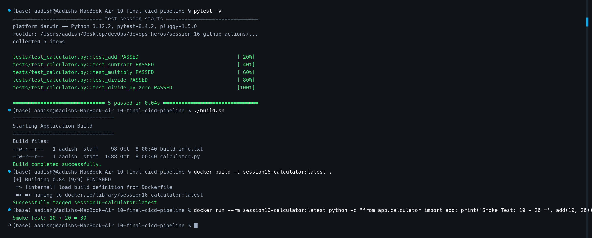
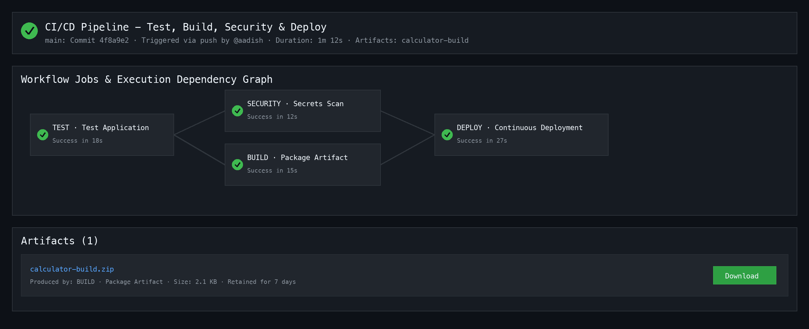

# 🚀 Session 16 Demo Project: Complete CI/CD Pipeline with GitHub Actions

[⬅ Back to Session 16 Master Homework](../../HOMEWORK.md)

## 📌 Project Overview

This demo project implements an automated, enterprise-grade Continuous Integration & Continuous Deployment (CI/CD) pipeline for a containerized Python application using **GitHub Actions**.

```text
  Developer Push ──► Test (Pytest) ──► Security Audit ──► Build Artifact ──► CD Container Deploy
```

---

## 📁 Repository & Project Structure

```text
10-final-cicd-pipeline/
├── app/
│   ├── __init__.py
│   └── calculator.py           # Application core logic & CLI
├── tests/
│   └── test_calculator.py      # Automated unit test suite
├── .github/
│   └── workflows/
│       └── ci.yml              # Complete GitHub Actions CI/CD workflow
├── Dockerfile                  # Containerization specification
├── requirements.txt            # Python dependencies (pytest)
├── build.sh                    # Build packaging script
├── render_screenshots.py       # Screenshot generation automation
├── 1.png                       # Terminal pipeline execution evidence
├── 2.png                       # GitHub Actions workflow run & DAG evidence
├── Homework.md                 # Complete project documentation & concepts
└── README.md                   # Quickstart guide
```

---

## 🧠 Core CI/CD & GitHub Actions Concepts

### 1. CI vs CD
* **Continuous Integration (CI):** The practice of automating the integration of code changes from multiple contributors into a single software project. CI automatically runs linters, unit tests, and build checks on every commit or pull request to catch bugs early.
* **Continuous Delivery / Deployment (CD):** 
  * *Continuous Delivery:* Automatically packages tested software and prepares artifacts for deployment to staging/production, requiring manual approval for final release.
  * *Continuous Deployment:* Automatically deploys every validated build directly to target production environments without manual intervention.

### 2. CI/CD Pipeline
An automated sequence of stages (Source ➔ Test ➔ Security ➔ Build ➔ Deploy) that source code passes through to transition from development to live production.

### 3. GitHub Actions Terminology
* **Workflow:** An automated configurable process made up of one or more jobs defined in a YAML file under `.github/workflows/`.
* **Jobs:** A set of steps in a workflow that executes on the same runner. Jobs run in parallel by default, but can define sequential dependencies using `needs: [job_name]`.
* **Steps:** Individual tasks that run commands (`run:`) or actions (`uses:`).
* **Runners:** The server environment that hosts and executes jobs. In our pipeline, jobs execute on GitHub-hosted Ubuntu runners (`runs-on: ubuntu-latest`).
* **Secrets:** Encrypted environment variables (`${{ secrets.SECRET_NAME }}`) securely stored in GitHub repository settings to protect credentials, API keys, and deployment tokens.
* **Artifacts:** Compiled files, binary distributions, test logs, or build packages persisted after a job finishes using `actions/upload-artifact` and retrieved via `actions/download-artifact`.
* **Build & Test:** Compiling/packaging application assets (`build.sh`) and validating logical correctness (`pytest`).

---

## 🛠️ Complete Pipeline Execution & Verification

### Step 1: Automated Unit Testing (CI)
Executes `pytest -v` across test suites:
```bash
pytest -v
```
- **Output:** 5/5 unit tests passed (addition, subtraction, multiplication, division, zero-division error handling).

### Step 2: Security & Credential Scanning (CI)
Audits the repository tree for leaked sensitive files (`.env`, `*.pem`, `*.key`) to prevent secret leakage into container images or public registries.

### Step 3: Application Build & Artifact Packaging (CI)
Runs `build.sh` to package runtime dependencies and generate `build/build-info.txt`. The compiled payload is persisted as artifact `calculator-build` for 7 days.

### Step 4: Containerization & Deployment (CD)
Downloads the build artifact, sets up Docker Buildx, packages the application using [`Dockerfile`](./Dockerfile), injects environment secrets, and executes a runtime smoke test.

---

## 📸 Execution Evidence

### Screenshot 1: Local Test, Build & Container Deployment Verification


### Screenshot 2: GitHub Actions Workflow Run, Dependency Graph & Artifacts


---

## 📦 Deliverables Checklist
- [x] Application source code ([`app/calculator.py`](./app/calculator.py))
- [x] Test suite ([`tests/test_calculator.py`](./tests/test_calculator.py))
- [x] Production Dockerfile ([`Dockerfile`](./Dockerfile))
- [x] Complete GitHub Actions Workflow ([`.github/workflows/ci.yml`](./.github/workflows/ci.yml))
- [x] CI Pipeline (Test, Security Scan, Build)
- [x] CD Pipeline (Artifact consumption, Docker container build, deployment simulation)
- [x] Execution Evidence ([`1.png`](./1.png), [`2.png`](./2.png))
