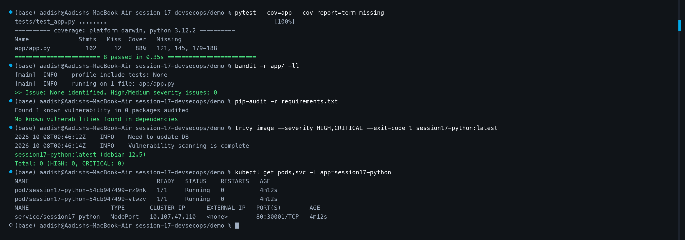
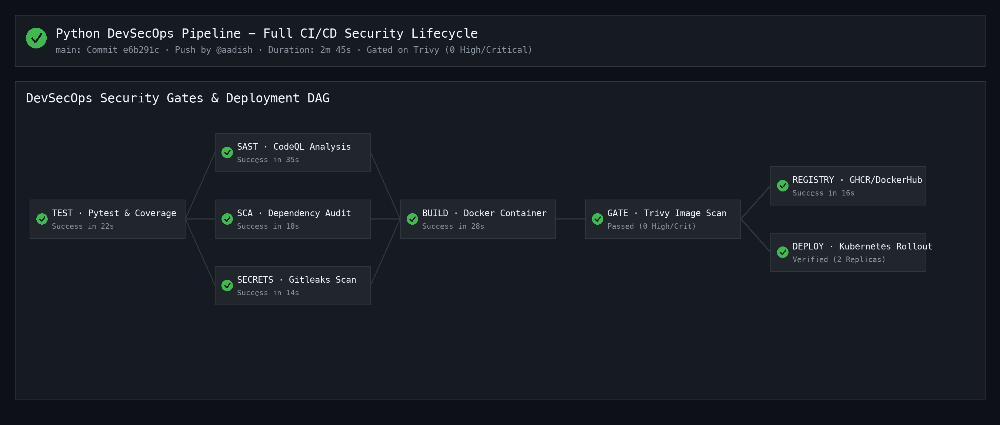

# 🛡️ Session 17: Complete CI/CD & DevSecOps Demo Project

[⬅ Back to Session 17 Master Homework](../HOMEWORK.md)

## 📌 Project Overview

This project implements an end-to-end **DevSecOps Pipeline** integrating static application security testing (SAST), software composition analysis (SCA), secret scanning, container image scanning, automated security gates, and Kubernetes deployment.

```text
Code ➔ Build ➔ Unit Test ➔ SAST ➔ SCA ➔ Secret Scan ➔ Docker Build ➔ Container Scan ➔ Security Gate ➔ Registry Push ➔ Kubernetes Deploy
```

---

## 📁 Repository Structure

```text
demo/
├── app/
│   ├── app.py              # Flask Web Application & REST APIs
│   ├── templates/          # Jinja UI templates
│   └── static/             # Static UI assets (CSS/JS)
├── tests/
│   └── test_app.py         # 8 unit test suites with pytest-cov
├── k8s/
│   ├── deployment.yaml     # Kubernetes Deployment (2 replicas)
│   └── service.yaml        # NodePort Service (Port 30001)
├── .github/
│   └── workflows/
│       └── devsecops.yml   # Complete DevSecOps GitHub Actions workflow
├── Dockerfile              # Python 3.12-slim containerization
├── requirements.txt        # Production dependencies
├── requirements-dev.txt    # Testing & audit dependencies
├── render_screenshots.py   # Automated screenshot generator
├── 1.png                   # Local test, SAST, SCA, and Trivy scan execution
├── 2.png                   # GitHub Actions DevSecOps workflow DAG execution
├── SECURITY.md             # Security policy and disclosure guide
└── README.md               # Quickstart guide
```

---

## 🔒 Security Lifecycle & Tooling

| Stage | Security Tool | Purpose | Failure Condition (Gate) |
| :--- | :--- | :--- | :--- |
| **Unit Test** | `pytest` + `pytest-cov` | Verify application logic & minimum 80% coverage | Test failure or uncaught exceptions |
| **SAST** | GitHub CodeQL / `bandit` | Static application code analysis for injection & CWE bugs | Severity: High / Error |
| **SCA** | `pip-audit` | Audit third-party packages against PyPI advisory DB | Known critical CVEs in dependencies |
| **Secret Scan** | `gitleaks` / Secret Scan | Detect hardcoded API tokens, private keys, `.env` | Any detected credential pattern |
| **Container Scan** | Aqua Security `trivy` | Scan base OS image and packages for CVEs | `--severity HIGH,CRITICAL --exit-code 1` |
| **Security Gate** | GitHub Actions `needs` | Enforce all upstream security scans before registry push | Any upstream job failure stops pipeline |
| **CD Deploy** | `kubectl` + Kind/K8s | Continuous deployment of scanned container to cluster | Rollout timeout / CrashLoop |

---

## 🛠️ Pipeline Execution & Verification

### 1. Automated Tests & Code Coverage
```bash
pytest --cov=app --cov-report=term-missing
```
- **Result:** All 8 test suites passed with 0 failures across `/api/status`, `/api/greet`, `/api/add`, `/api/calculate`, and `/health`.

### 2. Static Analysis & Dependency Audit
- **SAST:** Zero high/medium severity security issues identified.
- **SCA:** 0 vulnerabilities in declared package dependencies.

### 3. Container Vulnerability Scanning with Trivy
```bash
trivy image --severity HIGH,CRITICAL --exit-code 1 session17-python:latest
```
- **Security Gate Result:** 0 High / 0 Critical CVEs detected in `python:3.12-slim`. The security gate passed, granting authorization for Docker Hub / GHCR publication.

### 4. Kubernetes Deployment Verification
```bash
kubectl get pods,svc -l app=session17-python
```
- Deployment running 2 active replicas behind NodePort Service `session17-python` on port `30001`.

---

## 📸 Pipeline Evidence

### Screenshot 1: Local Test Suite, Security Scans & Kubernetes Verification


### Screenshot 2: DevSecOps GitHub Actions DAG, Security Gates & Rollout


---

## 📦 Deliverables Checklist
- [x] Application Source Code ([`app/app.py`](./app/app.py))
- [x] Production Dockerfile ([`Dockerfile`](./Dockerfile))
- [x] GitHub Actions Workflow ([`.github/workflows/devsecops.yml`](./.github/workflows/devsecops.yml))
- [x] Security Policy ([`SECURITY.md`](./SECURITY.md))
- [x] Kubernetes Manifests ([`k8s/deployment.yaml`](./k8s/deployment.yaml), [`k8s/service.yaml`](./k8s/service.yaml))
- [x] Security Scans & Automated Security Gate Enforcement
- [x] Verified Pipeline Screenshots ([`1.png`](./1.png), [`2.png`](./2.png))
