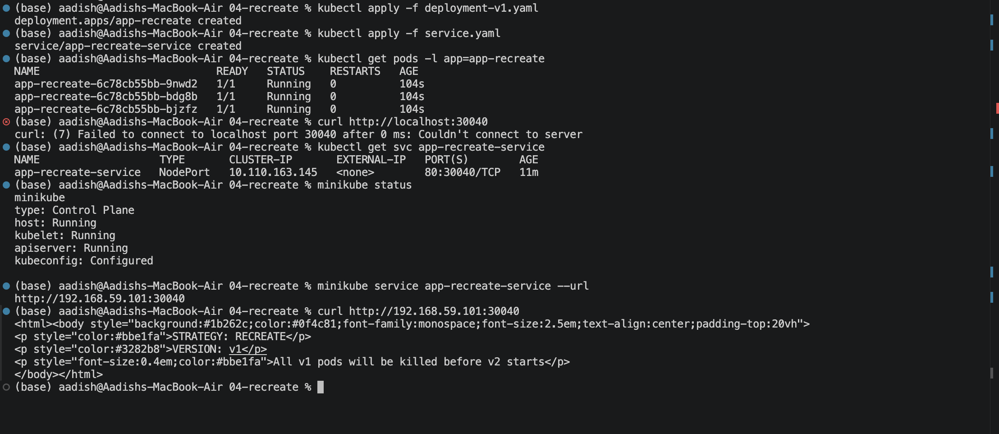
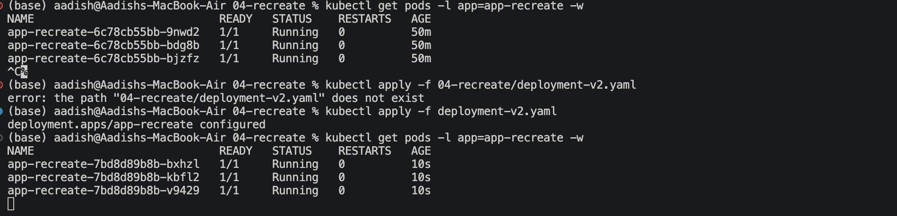
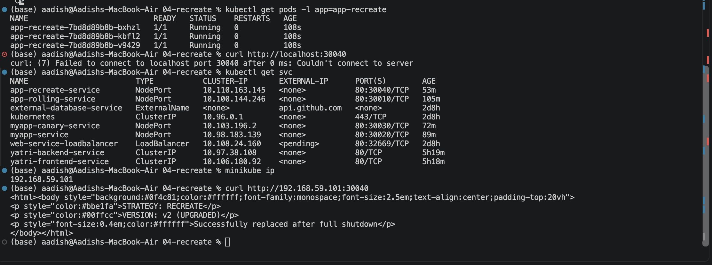

# Recreate Deployment Strategy

## Objective

Implemented a Kubernetes **Recreate Deployment Strategy**, where all existing pods are terminated before the new version is deployed.

The deployment demonstrates:

**v1 Running → All Pods Terminated → Downtime → v2 Running**

---

## 1. Deploy Version 1

Deploy the initial version:

```bash
kubectl apply -f deployment-v1.yaml
kubectl apply -f service.yaml
```

Verify the pods:

```bash
kubectl get pods -l app=app-recreate
```

Three replicas of **v1** were successfully deployed and verified.



---

## 2. Deploy Version 2

Watch the pods while applying the new version:

```bash
kubectl get pods -l app=app-recreate -w
```

In another terminal:

```bash
kubectl apply -f deployment-v2.yaml
```

With the **Recreate** strategy, Kubernetes first terminates all v1 pods before creating the v2 pods.

During this transition, there is a short **downtime window** where no application pods are running.



---

## 3. Verify Version 2

After the new pods become ready:

```bash
kubectl get pods -l app=app-recreate
```

Verify the application:

```bash
curl http://<service-url>
```

The application now responds with **Version 2**.



---

## Result

- Successfully deployed 3 replicas of v1
- Triggered a Recreate deployment
- All v1 pods were terminated before v2 started
- Observed the deployment downtime window
- Successfully deployed and verified v2

---

## Key Concept

The **Recreate** strategy is useful when two application versions cannot safely run at the same time.

```text
        v1 Running
             ↓
     Terminate ALL v1
             ↓
       No Pods Running
        (DOWNTIME)
             ↓
       Create ALL v2
             ↓
        v2 Running
```

Unlike a RollingUpdate, **Recreate does not maintain availability during the update**.

---

## Cleanup

```bash
kubectl delete -f service.yaml
kubectl delete -f deployment-v2.yaml
```
