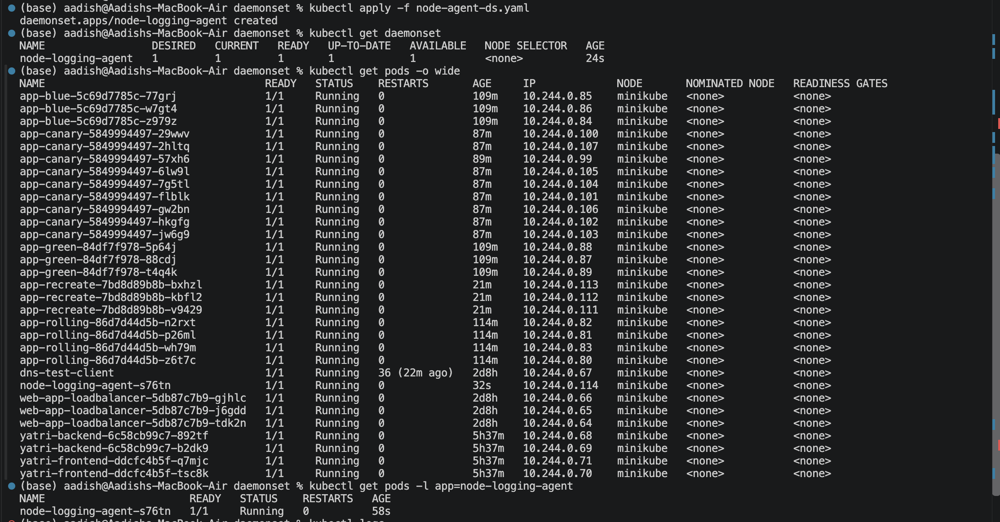
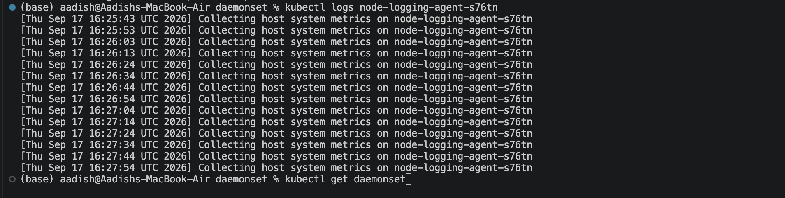

# DaemonSet — Node Logging Agent

## Objective

Implemented a Kubernetes **DaemonSet** that runs a logging agent on every eligible node in the cluster.

The logging agent uses a lightweight BusyBox container to periodically print host metrics messages.

---

## 1. Deploy the DaemonSet

Apply the configuration:

```bash
kubectl apply -f daemonset.yaml
```

Verify the DaemonSet and its pods:

```bash
kubectl get daemonset
kubectl get pods -l app=node-logging-agent -o wide
```

The DaemonSet successfully created a logging-agent pod on the available node.

### Screenshot 1 — DaemonSet and Pods



---

## 2. Verify Container Logs

Get the logging-agent pod:

```bash
kubectl get pods -l app=node-logging-agent
```

Check its logs:

```bash
kubectl logs <pod-name>
```

The container continuously outputs messages showing that it is collecting host system metrics.

Example:

```text
[Thu Sep 17 ...] Collecting host system metrics on minikube
[Thu Sep 17 ...] Collecting host system metrics on minikube
[Thu Sep 17 ...] Collecting host system metrics on minikube
```

### Screenshot 2 — Logging Agent Output



---

## Result

- Created a Kubernetes DaemonSet.
- Successfully deployed the logging agent.
- Verified the pod is running on the node.
- Verified that the container is continuously producing logs.
- Demonstrated the core behavior of a DaemonSet.

---

## Key Concept

A **DaemonSet** ensures that a copy of a pod runs on every eligible node.

```text
Kubernetes Cluster
       │
       ├── Node 1 → Logging Agent
       ├── Node 2 → Logging Agent
       └── Node 3 → Logging Agent
```

If a new node is added to the cluster, Kubernetes automatically schedules the DaemonSet pod on that node.

---

## Cleanup

```bash
kubectl delete -f daemonset.yaml
```
