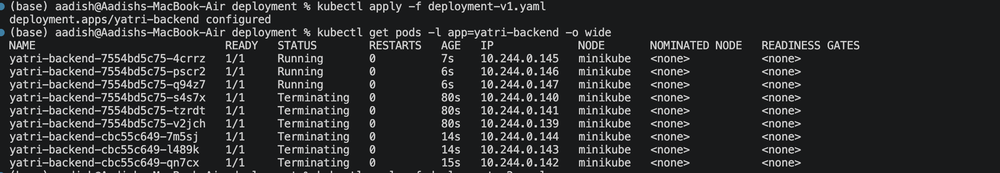
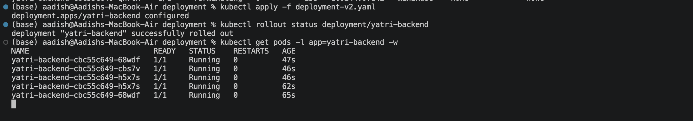
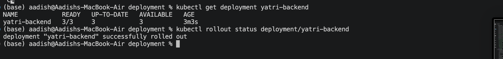

# Rolling Update — Yatri Backend

## Objective

Implemented a Kubernetes **Rolling Update Deployment** for the Yatri backend, allowing the application to be upgraded from **v1.0.0 to v2.0.0** without downtime.

The deployment uses:

- **3 replicas**
- `maxSurge: 1`
- `maxUnavailable: 0`

This ensures that at least 3 pods remain available while the update is performed.

---

## 1. Deploy Backend v1.0.0

Apply the initial deployment:

```bash
kubectl apply -f deployment-v1.yaml
```

Verify the deployment and pods:

```bash
kubectl get deployment yatri-backend
kubectl get pods -l app=yatri-backend -o wide
```

The initial deployment starts **3 replicas running version 1.0.0**.

### Screenshot 1 — Version 1.0.0 Running



---

## 2. Perform Rolling Update to v2.0.0

Apply the updated deployment:

```bash
kubectl apply -f deployment-v2.yaml
```

Monitor the rollout:

```bash
kubectl rollout status deployment/yatri-backend
```

Watch the pods during the update:

```bash
kubectl get pods -l app=yatri-backend -w
```

With:

```yaml
maxSurge: 1
maxUnavailable: 0
```

Kubernetes creates a new v2 pod before terminating an old v1 pod, maintaining application availability throughout the update.

### Screenshot 2 — Rolling Update in Progress



---

## 3. Verify Version 2.0.0

After the rollout completes:

```bash
kubectl get deployment yatri-backend
kubectl get pods -l app=yatri-backend --show-labels
```

Verify the rollout:

```bash
kubectl rollout status deployment/yatri-backend
```

Expected result:

```text
deployment "yatri-backend" successfully rolled out
```

All replicas should now be running **version 2.0.0**.

### Screenshot 3 — Version 2.0.0 Running



---

## Result

- Deployed Yatri backend with 3 replicas.
- Successfully upgraded from **v1.0.0 → v2.0.0**.
- Used Kubernetes `RollingUpdate` strategy.
- Configured `maxSurge: 1`.
- Configured `maxUnavailable: 0`.
- Maintained application availability during the rollout.
- Successfully verified the new version.

---

## Key Concept

A **Rolling Update** gradually replaces old pods with new pods instead of stopping the entire application.

```text
v1 v1 v1
 ↓
v1 v1 v2
 ↓
v1 v2 v2
 ↓
v2 v2 v2
```

Because `maxUnavailable` is set to `0`, Kubernetes ensures that existing available pods are not intentionally taken below the required availability during the rollout.

---

## Rollback

If version 2.0.0 has an issue, the deployment can be rolled back:

```bash
kubectl rollout undo deployment/yatri-backend
```

Verify the rollback:

```bash
kubectl rollout status deployment/yatri-backend
```

---

## Cleanup

```bash
kubectl delete deployment yatri-backend
```

---