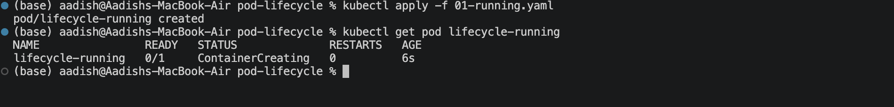
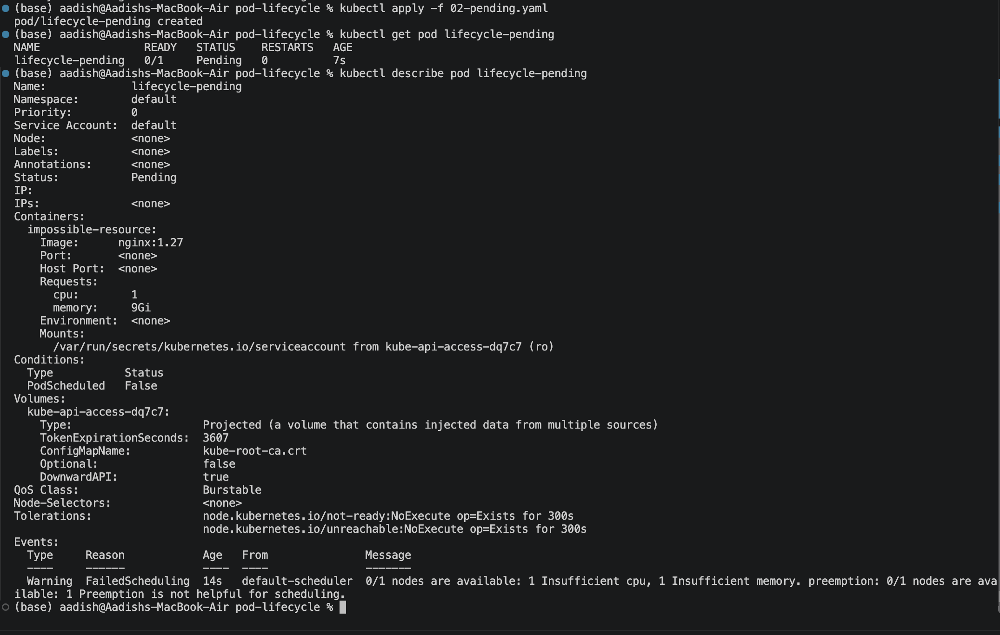
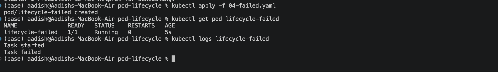
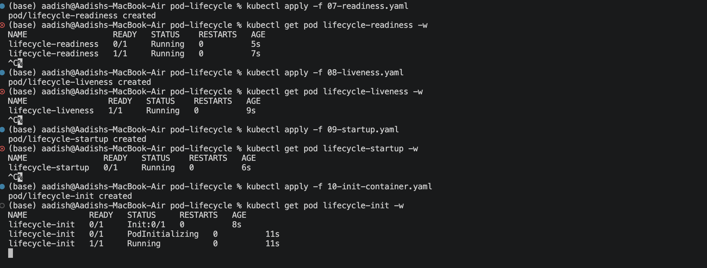
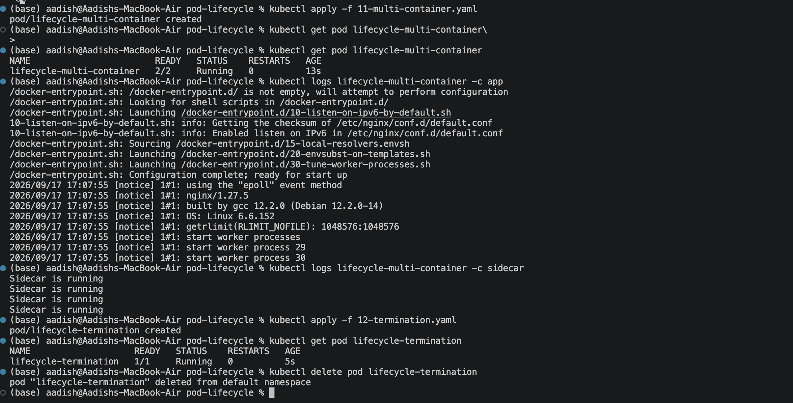

# Kubernetes Pod Lifecycle Lab

## Objective

Demonstrated the major **Kubernetes Pod lifecycle states, container states, health probes, and multi-container behavior** using independent YAML configurations.

The lab covers:

- Running
- Pending
- Succeeded
- Failed
- CrashLoopBackOff
- ImagePullBackOff
- Readiness Probe
- Liveness Probe
- Startup Probe
- Init Container
- Multi-container Pod
- Graceful Termination

---

## 1. Running Pod

Create the basic running Pod:

```bash
kubectl apply -f 01-running.yaml
kubectl get pod lifecycle-running
```

Expected:

```text
NAME                READY   STATUS    RESTARTS
lifecycle-running   1/1     Running   0
```

### Screenshot 1 — Running Pod



---

## 2. Pending, Failed and CrashLoopBackOff

The lab demonstrates different failure and scheduling situations.

### Pending

```bash
kubectl apply -f 02-pending.yaml
kubectl get pod lifecycle-pending
kubectl describe pod lifecycle-pending
```

The Pod remains **Pending** because the requested resources cannot be scheduled on the cluster.

### Failed

```bash
kubectl apply -f 04-failed.yaml
kubectl get pod lifecycle-failed
kubectl logs lifecycle-failed
```

The container exits unsuccessfully, resulting in a **Failed** Pod.

### CrashLoopBackOff

```bash
kubectl apply -f 05-crashloopbackoff.yaml
kubectl get pod lifecycle-crashloop -w
```

The container repeatedly starts, crashes, and gets restarted.

### Screenshot 2 — Pod Failure States



---

## 3. Health Probes and Init Container

The lab also demonstrates Kubernetes health management.

### Readiness Probe

```bash
kubectl apply -f 07-readiness.yaml
kubectl get pod lifecycle-readiness -w
```

A Pod can be **Running but not Ready**.

```text
Running != Ready
```

Readiness determines whether a Pod should receive traffic.

### Liveness Probe

```bash
kubectl apply -f 08-liveness.yaml
kubectl get pod lifecycle-liveness -w
```

When the liveness probe fails, Kubernetes restarts the container.

### Startup Probe

```bash
kubectl apply -f 09-startup.yaml
kubectl get pod lifecycle-startup -w
```

The startup probe allows a slow-starting application to initialize before normal health checks take effect.

### Init Container

```bash
kubectl apply -f 10-init-container.yaml
kubectl get pod lifecycle-init -w
```

The init container must complete before the main application container starts.

```text
Init Container
      ↓
  Completes
      ↓
Main Container
```

### Screenshot 3 — Probes and Init Container



---

## 4. Multi-Container and Graceful Termination

### Multi-Container Pod

```bash
kubectl apply -f 11-multi-container.yaml
kubectl get pod lifecycle-multi-container
```

Expected:

```text
2/2
```

The Pod contains:

```text
One Pod
 ├── app container
 └── sidecar container
```

View individual logs:

```bash
kubectl logs lifecycle-multi-container -c app
kubectl logs lifecycle-multi-container -c sidecar
```

### Graceful Termination

```bash
kubectl apply -f 12-termination.yaml
kubectl get pod lifecycle-termination
```

Delete the Pod:

```bash
kubectl delete pod lifecycle-termination
```

The application handles **SIGTERM**, performs cleanup, and exits gracefully.

### Screenshot 4 — Multi-Container / Termination



---

## Pod Lifecycle Concepts

### Official Pod Phases

Kubernetes defines five official Pod phases:

```text
Pending
Running
Succeeded
Failed
Unknown
```

### Container States

Containers can have:

```text
Waiting
Running
Terminated
```

Values such as `CrashLoopBackOff`, `ImagePullBackOff`, `Completed`, and `Error` shown by `kubectl get pods` are status/reason information rather than additional official Pod phases.

---

## Debugging Commands

The three most useful commands used throughout the lab are:

```bash
kubectl get pod <pod>
kubectl describe pod <pod>
kubectl logs <pod>
```

For container-specific logs:

```bash
kubectl logs <pod> -c <container>
```

For previous crashed container logs:

```bash
kubectl logs <pod> --previous
```

---

## Result

- Demonstrated different Kubernetes Pod lifecycle states.
- Observed successful and failed container execution.
- Demonstrated CrashLoopBackOff and ImagePullBackOff.
- Tested readiness, liveness, and startup probes.
- Demonstrated init container execution order.
- Created a multi-container Pod.
- Demonstrated graceful Pod termination.
- Practiced Kubernetes Pod debugging commands.

---

## Cleanup

Remove all lab resources:

```bash
kubectl delete -f .
```

---

