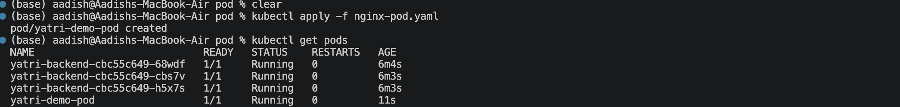
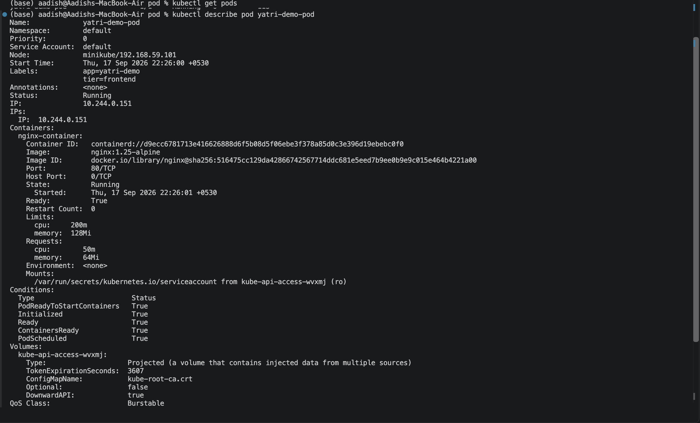
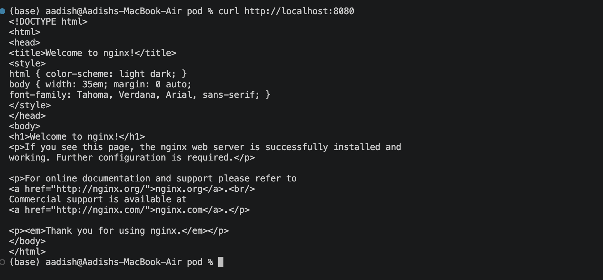

# Kubernetes Pod — Yatri Demo

## Objective

Created and deployed a basic Kubernetes **Pod** running an Nginx web server.

The Pod uses:

- Nginx `1.25-alpine`
- CPU and memory requests
- CPU and memory limits
- Application labels

---

## 1. Create the Pod

Apply the Pod configuration:

```bash
kubectl apply -f pod.yaml
```

Verify the Pod:

```bash
kubectl get pods
```

The `yatri-demo-pod` should be in the **Running** state.

### Screenshot 1 — Pod Running



---

## 2. Inspect the Pod

Check the Pod details:

```bash
kubectl describe pod yatri-demo-pod
```

This shows the container image, ports, resource requests/limits, labels, and Pod status.

### Screenshot 2 — Pod Details



---

## 3. Verify Nginx

Forward the Pod's port to the local machine:

```bash
kubectl port-forward pod/yatri-demo-pod 8080:80
```

In another terminal, test the Nginx server:

```bash
curl http://localhost:8080
```

The default Nginx HTML response should be returned.

### Screenshot 3 — Nginx Response



---

## Result

- Successfully created a Kubernetes Pod.
- Deployed Nginx `1.25-alpine`.
- Verified the Pod is running.
- Verified CPU and memory resource configuration.
- Successfully accessed the Nginx web server using port forwarding.

---

## Key Concepts

### Pod

A **Pod** is the smallest deployable unit in Kubernetes and can contain one or more containers.

### Resource Requests

Requests define the minimum resources Kubernetes reserves for the container.

```yaml
requests:
  cpu: "50m"
  memory: "64Mi"
```

### Resource Limits

Limits define the maximum resources the container can use.

```yaml
limits:
  cpu: "200m"
  memory: "128Mi"
```

---

## Cleanup

```bash
kubectl delete pod yatri-demo-pod
```

---

