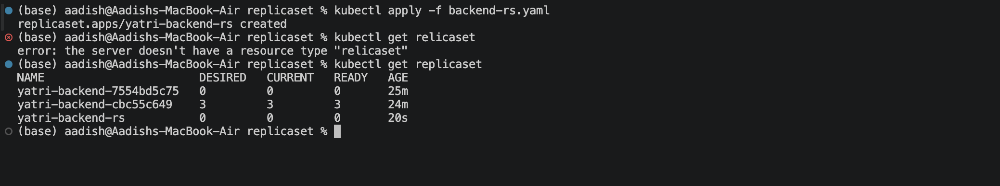
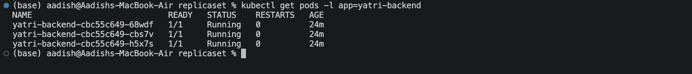
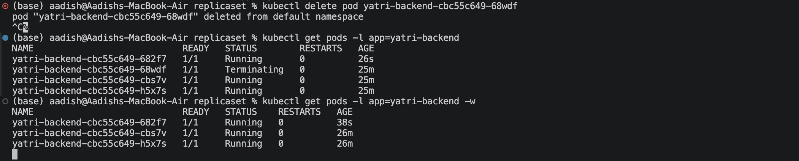

# Kubernetes ReplicaSet — Yatri Backend

## Objective

Implemented a Kubernetes **ReplicaSet** to maintain a desired number of backend Pod replicas.

The ReplicaSet is configured to maintain **3 replicas** of the Yatri backend application.

---

## 1. Create the ReplicaSet

Apply the configuration:

```bash
kubectl apply -f replicaset.yaml
```

Verify the ReplicaSet:

```bash
kubectl get replicaset
```

Expected:

```text
NAME               DESIRED   CURRENT   READY
yatri-backend-rs   3         3         3
```

### Screenshot 1 — ReplicaSet Running



---

## 2. Verify the Pods

Check the Pods managed by the ReplicaSet:

```bash
kubectl get pods -l app=yatri-backend
```

Three backend Pods should be running:

```text
NAME                     READY   STATUS    RESTARTS
yatri-backend-rs-xxxxx   1/1     Running   0
yatri-backend-rs-xxxxx   1/1     Running   0
yatri-backend-rs-xxxxx   1/1     Running   0
```

### Screenshot 2 — Three Replica Pods



---

## 3. Demonstrate Self-Healing

Delete one of the Pods:

```bash
kubectl delete pod <pod-name>
```

Immediately check the Pods:

```bash
kubectl get pods -l app=yatri-backend
```

The ReplicaSet automatically creates a replacement Pod to maintain the desired replica count of **3**.

Watch the process in real time:

```bash
kubectl get pods -l app=yatri-backend -w
```

Expected behavior:

```text
3 Pods Running
      ↓
Delete 1 Pod
      ↓
2 Pods Running
      ↓
ReplicaSet detects missing Pod
      ↓
New Pod Created
      ↓
3 Pods Running
```

### Screenshot 3 — ReplicaSet Self-Healing



---

## Result

- Created a Kubernetes ReplicaSet.
- Configured the desired replica count to **3**.
- Verified three backend Pods are running.
- Deleted a Pod manually.
- Verified that the ReplicaSet automatically recreated the missing Pod.
- Demonstrated the self-healing behavior of Kubernetes ReplicaSets.

---

## Key Concept

A **ReplicaSet** ensures that the specified number of Pod replicas are running at all times.

```text
ReplicaSet
    │
    ├── Pod 1
    ├── Pod 2
    └── Pod 3
```

If one Pod fails or is deleted:

```text
ReplicaSet
    │
    ├── Pod 1
    ├── Pod 2
    └── New Pod ← Automatically created
```

### ReplicaSet vs Deployment

A **ReplicaSet** primarily maintains the desired number of Pods.

A **Deployment** manages ReplicaSets and additionally provides features such as:

- Rolling updates
- Rollbacks
- Version management
- Deployment history

---

## Cleanup

```bash
kubectl delete -f replicaset.yaml
```

---

