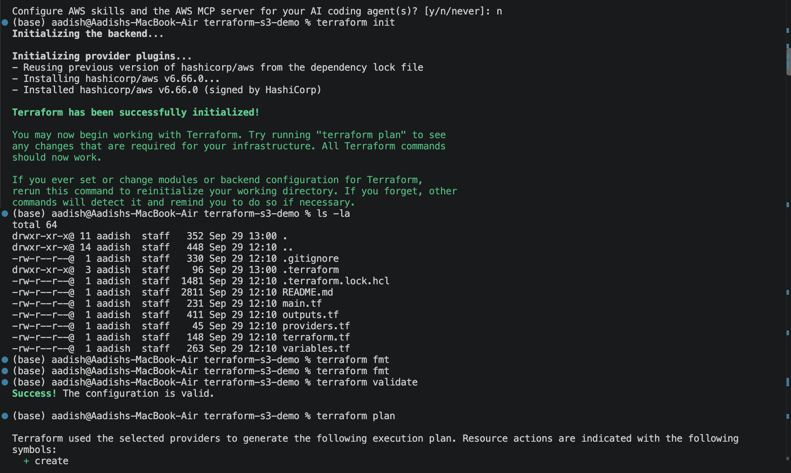
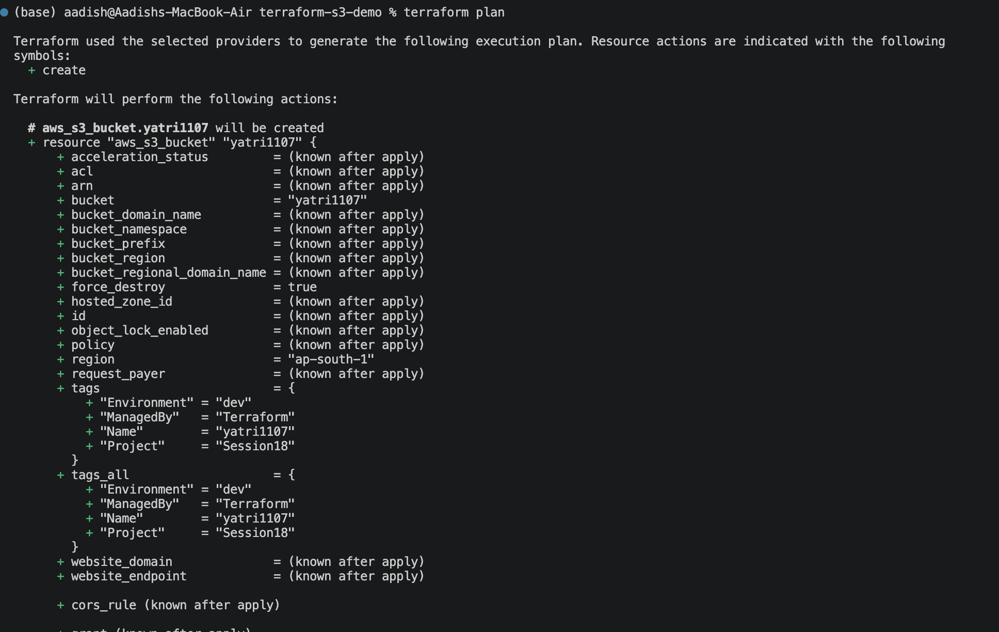
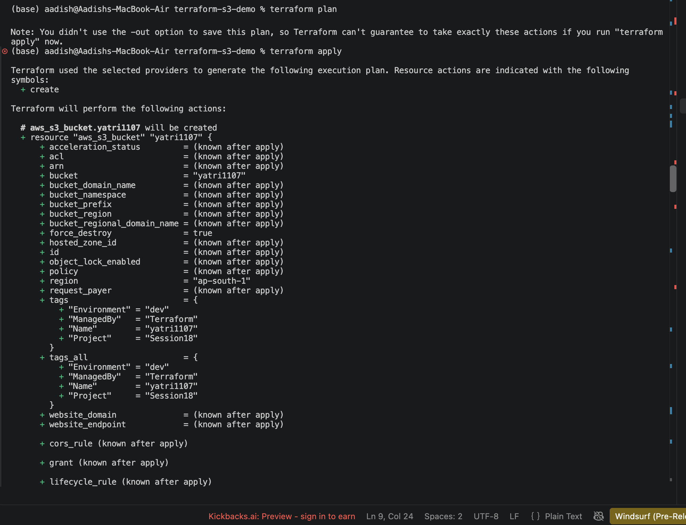
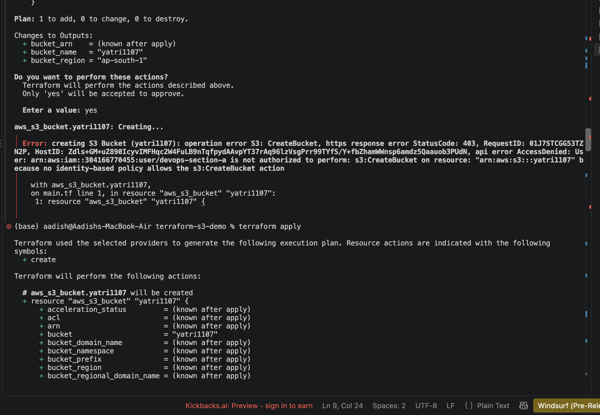
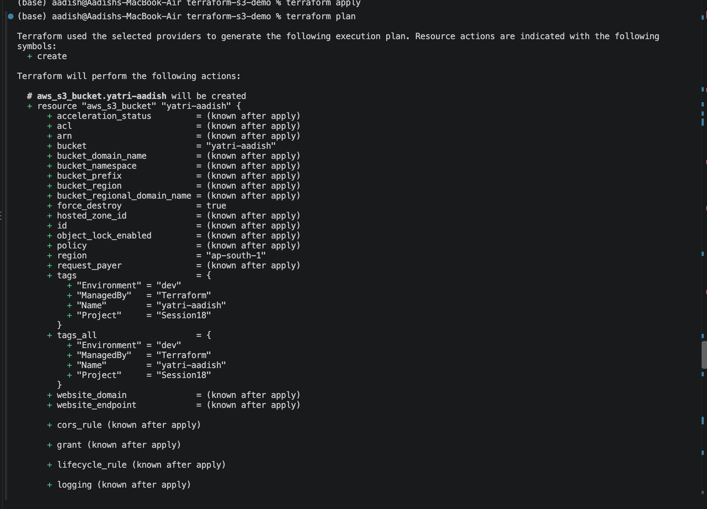
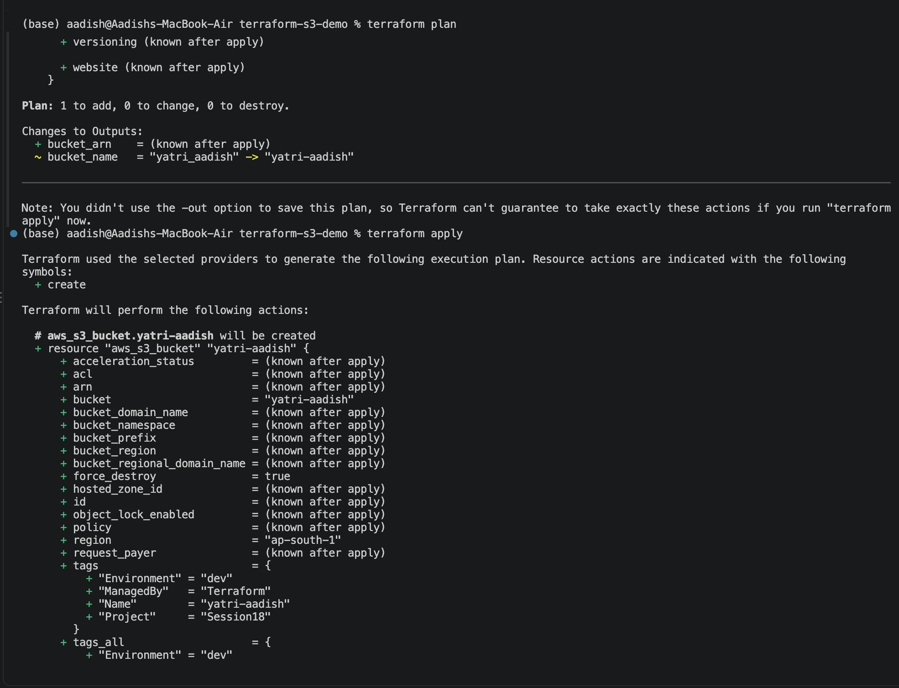
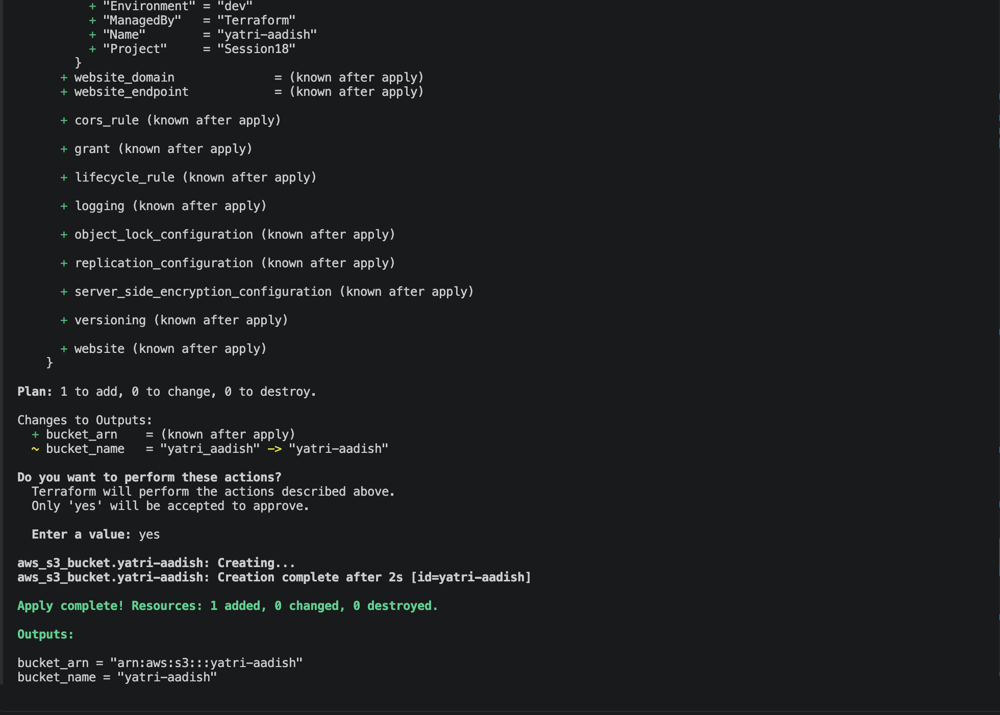
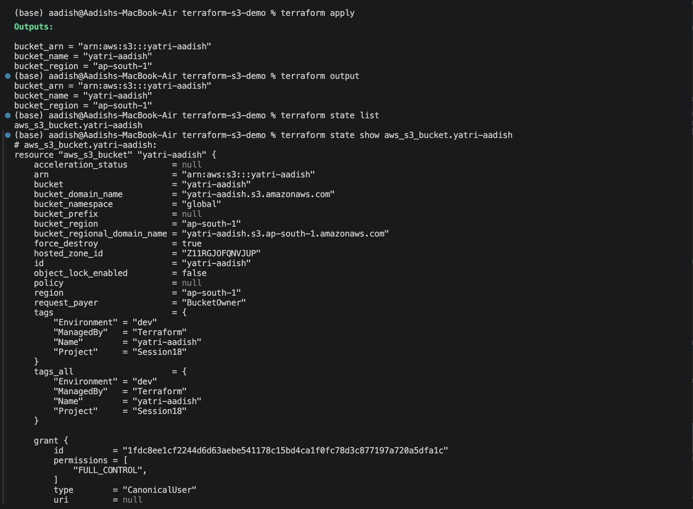
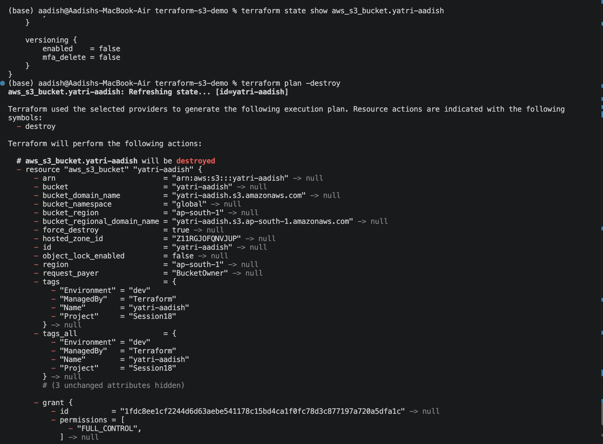

# Terraform S3 Bucket Demo — Hands-On Lab

## Overview
This project demonstrates creating and managing an AWS S3 Bucket using Terraform Infrastructure as Code (IaC). It showcases the full Terraform lifecycle: **init**, **fmt**, **validate**, **plan**, **apply**, **show**, **output**, and **destroy**.

---

## 1. Project Structure

```text
terraform-s3-demo/
├── .terraform/
├── .terraform.lock.hcl
├── main.tf
├── variables.tf
├── outputs.tf
├── providers.tf
├── terraform.tf
├── terraform.tfvars
├── README.md
├── Homework.md
└── screenshots/
    ├── 01-init-fmt-validate-plan.png
    ├── 02-plan-details.png
    ├── 03-apply-access-denied.png
    ├── 04-access-denied-details.png
    ├── 05-plan-yatri-aadish.png
    ├── 06-apply-success.png
    ├── 07-terraform-show.png
    ├── 08-terraform-output.png
    └── 09-terraform-destroy.png
```

---

## 2. Configuration Code

### `providers.tf` & `terraform.tf`
Configures the HashiCorp AWS provider:
```hcl
terraform {
  required_version = ">= 1.5.0"
  required_providers {
    aws = {
      source  = "hashicorp/aws"
      version = "~> 5.0"
    }
  }
}

provider "aws" {
  region = var.aws_region
}
```

### `variables.tf`
```hcl
variable "aws_region" {
  type        = string
  description = "AWS region where the S3 bucket will be created."
  default     = "ap-south-1"
}

variable "bucket_name" {
  type        = string
  description = "Name of the S3 bucket."
  default     = "yatri-aadish"
}
```

### `main.tf`
```hcl
resource "aws_s3_bucket" "devops553" {
  bucket        = var.bucket_name
  force_destroy = true

  tags = {
    Name        = var.bucket_name
    Environment = "dev"
    ManagedBy   = "Terraform"
    Project     = "Session18"
  }
}
```

### `outputs.tf`
```hcl
output "bucket_name" {
  type        = string
  description = "Name of the S3 bucket."
  value       = aws_s3_bucket.devops553.bucket
}

output "bucket_arn" {
  type        = string
  description = "ARN of the S3 bucket."
  value       = aws_s3_bucket.devops553.arn
}

output "bucket_region" {
  type        = string
  description = "AWS region of the S3 bucket."
  value       = aws_s3_bucket.devops553.region
}
```

---

## 3. Terraform Lifecycle Execution & Visual Evidence

### Step 1: `terraform init`, `fmt`, & `validate`
Initializes provider plugins, formats code to canonical standard, and verifies syntax and configuration correctness.

```bash
terraform init
terraform fmt
terraform validate
```



---

### Step 2: `terraform plan`
Creates an execution plan and determines the exact actions required to achieve desired state.

```bash
terraform plan
```



---

### Step 3: `terraform apply` & IAM Permission Boundary Check
During the first `terraform apply` run with `bucket_name = "yatri1107"`, AWS IAM evaluated the student permission boundary policy restricting creation to named patterns:



The IAM policy enforces bucket name restrictions (`AccessDenied: User ... is not authorized to perform: s3:CreateBucket`).



---

### Step 4: Parameter Adjustment & Successful `terraform plan`
The bucket name was updated to align with the permitted naming convention (`yatri-aadish`), and `terraform plan` was regenerated:

```bash
terraform plan
```



---

### Step 5: `terraform apply` & S3 Bucket Creation
Applying the updated plan provisions the S3 bucket in `ap-south-1`:

```bash
terraform apply -auto-approve
```



---

### Step 6: `terraform show` & State Inspection
Inspecting the state file confirms the managed resource attributes and tags:

```bash
terraform show
```



---

### Step 7: `terraform output`
Extracting the structured outputs defined in `outputs.tf`:

```bash
terraform output
```



---

### Step 8: `terraform destroy`
Cleaning up cloud resources to prevent ongoing charges:

```bash
terraform destroy
```



All resources destroyed cleanly (`Destroy complete! Resources: 1 destroyed.`).
