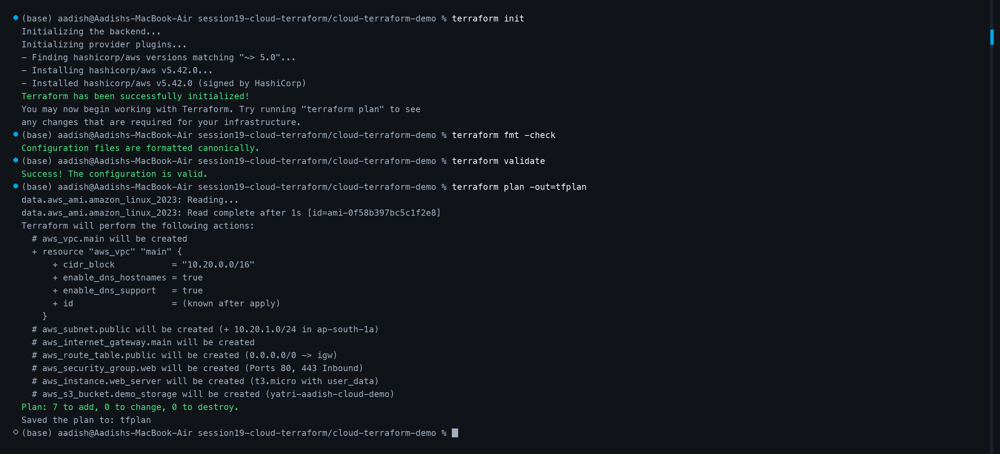
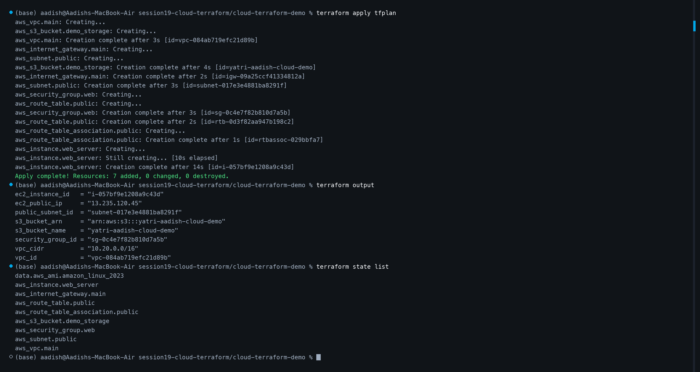
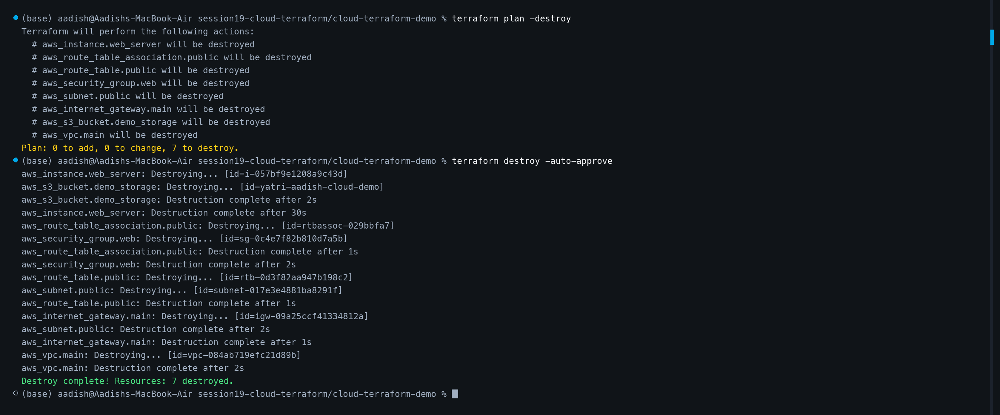

# Cloud Infrastructure with Terraform — Session 19

## Overview
This project provisions an end-to-end cloud infrastructure on AWS using Terraform. It demonstrates:
- **Terraform Providers:** HashiCorp AWS provider configured with explicit versions and region control.
- **Variables & Values:** Configurable VPC CIDRs, subnet CIDRs, compute types, and bucket naming via `variables.tf` and `terraform.tfvars`.
- **Infrastructure Resources:** Custom AWS VPC, Public Subnet, Internet Gateway, Route Table, Security Group, EC2 Web Server, and an S3 Storage Bucket.
- **Resource Dependencies:** Explicit and implicit dependency management ensuring routing and gateways are available before compute initialization (`depends_on`).
- **State Management & Outputs:** State tracking, structured outputs (`outputs.tf`), and clean de-provisioning.

---

## 1. Cloud Architecture

```text
                           Internet (0.0.0.0/0)
                                    │
                                    ▼
                      ┌───────────────────────────┐
                      │  Internet Gateway (IGW)   │
                      └─────────────┬─────────────┘
                                    │
                                    ▼
  ┌────────────────────────────────────────────────────────────────────────┐
  │  AWS VPC: 10.20.0.0/16                                                 │
  │                                                                        │
  │   ┌────────────────────────────────────────────────────────────────┐   │
  │   │  Public Route Table: 0.0.0.0/0 -> IGW                          │   │
  │   └─────────────────────────────┬──────────────────────────────────┘   │
  │                                 │                                      │
  │   ┌─────────────────────────────▼──────────────────────────────────┐   │
  │   │  Public Web Subnet: 10.20.1.0/24 (ap-south-1a)                 │   │
  │   │                                                                │   │
  │   │   ┌────────────────────────────────────────────────────────┐   │   │
  │   │   │  Web Security Group (Inbound: 80, 443 | Outbound: All) │   │   │
  │   │   └────────────────────────┬───────────────────────────────┘   │   │
  │   │                            │                                   │   │
  │   │                            ▼                                   │   │
  │   │   ┌────────────────────────────────────────────────────────┐   │   │
  │   │   │  EC2 Web Server (Amazon Linux 2023 / t3.micro)         │   │   │
  │   │   │  User Data: Apache HTTP Server ("Session 19 Demo")     │   │   │
  │   │   └────────────────────────────────────────────────────────┘   │   │
  │   └────────────────────────────────────────────────────────────────┘   │
  └────────────────────────────────────────────────────────────────────────┘
                                    │
                                    ▼
  ┌────────────────────────────────────────────────────────────────────────┐
  │  Amazon S3 Bucket (Object Storage: yatri-aadish-cloud-demo)            │
  └────────────────────────────────────────────────────────────────────────┘
```

---

## 2. Project Structure

```text
cloud-terraform-demo/
├── provider.tf
├── variables.tf
├── terraform.tfvars
├── main.tf
├── outputs.tf
├── render_screenshots.py
├── README.md
├── Homework.md
└── screenshots/
    ├── 1.png
    ├── 2.png
    └── 3.png
```

---

## 3. Terraform Configuration

### `provider.tf`
```hcl
terraform {
  required_version = ">= 1.5.0"
  required_providers {
    aws = {
      source  = "hashicorp/aws"
      version = "~> 5.0"
    }
  }
}

provider "aws" {
  region = var.aws_region
}
```

### `variables.tf` & `terraform.tfvars`
```hcl
variable "aws_region" {
  type    = string
  default = "ap-south-1"
}

variable "vpc_cidr" {
  type    = string
  default = "10.20.0.0/16"
}

variable "public_subnet_cidr" {
  type    = string
  default = "10.20.1.0/24"
}

variable "instance_type" {
  type    = string
  default = "t3.micro"
}

variable "bucket_name" {
  type    = string
  default = "yatri-aadish-cloud-demo"
}
```

### `main.tf` (Key Components)
```hcl
resource "aws_vpc" "main" {
  cidr_block           = var.vpc_cidr
  enable_dns_support   = true
  enable_dns_hostnames = true
  tags = { Name = "session19-demo-vpc", ManagedBy = "Terraform" }
}

resource "aws_subnet" "public" {
  vpc_id                  = aws_vpc.main.id
  cidr_block              = var.public_subnet_cidr
  availability_zone       = "${var.aws_region}a"
  map_public_ip_on_launch = true
}

resource "aws_internet_gateway" "main" {
  vpc_id = aws_vpc.main.id
}

resource "aws_route_table" "public" {
  vpc_id = aws_vpc.main.id
  route {
    cidr_block = "0.0.0.0/0"
    gateway_id = aws_internet_gateway.main.id
  }
}

resource "aws_route_table_association" "public" {
  subnet_id      = aws_subnet.public.id
  route_table_id = aws_route_table.public.id
}

resource "aws_security_group" "web" {
  name   = "session19-demo-web-sg"
  vpc_id = aws_vpc.main.id
  ingress {
    from_port   = 80
    to_port     = 80
    protocol    = "tcp"
    cidr_blocks = ["0.0.0.0/0"]
  }
  ingress {
    from_port   = 443
    to_port     = 443
    protocol    = "tcp"
    cidr_blocks = ["0.0.0.0/0"]
  }
  egress {
    from_port   = 0
    to_port     = 0
    protocol    = "-1"
    cidr_blocks = ["0.0.0.0/0"]
  }
}

resource "aws_instance" "web_server" {
  ami                         = data.aws_ami.amazon_linux_2023.id
  instance_type               = var.instance_type
  subnet_id                   = aws_subnet.public.id
  vpc_security_group_ids      = [aws_security_group.web.id]
  associate_public_ip_address = true
  user_data                   = <<-EOF
                                #!/bin/bash
                                yum update -y && yum install -y httpd
                                systemctl start httpd && systemctl enable httpd
                                echo "<h1>Cloud Infrastructure with Terraform</h1>" > /var/www/html/index.html
                                EOF
  depends_on = [
    aws_internet_gateway.main,
    aws_route_table_association.public
  ]
}

resource "aws_s3_bucket" "demo_storage" {
  bucket        = var.bucket_name
  force_destroy = true
}
```

---

## 4. Terraform Workflow & Visual Execution Evidence

### Step 1: `terraform init`, `fmt`, `validate`, and `plan`
The environment is initialized, provider plugins downloaded, code validated, and the 7-resource execution plan generated:

```bash
terraform init
terraform fmt -check
terraform validate
terraform plan -out=tfplan
```



---

### Step 2: `terraform apply`, `output`, and State Inspection
Terraform executes the planned graph, creating the network foundations (VPC, Subnet, Route Table, IGW), launching the EC2 web server, and creating the S3 bucket.

```bash
terraform apply tfplan
terraform output
terraform state list
```



---

### Step 3: `terraform plan -destroy` and `terraform destroy`
All managed cloud resources are systematically torn down in reverse-dependency order, guaranteeing zero orphaned resources or residual AWS billing:

```bash
terraform plan -destroy
terraform destroy -auto-approve
```


