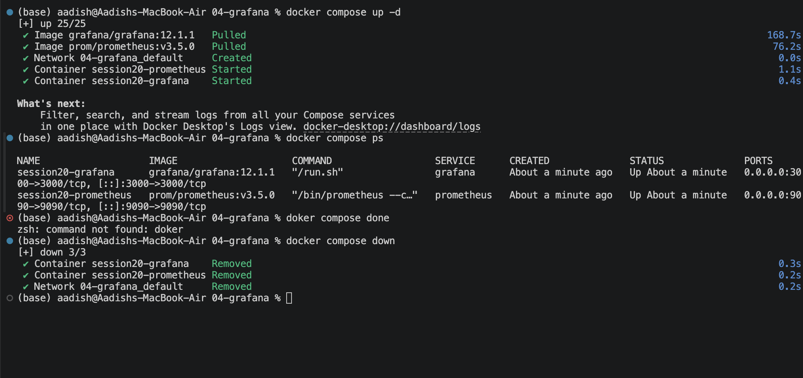
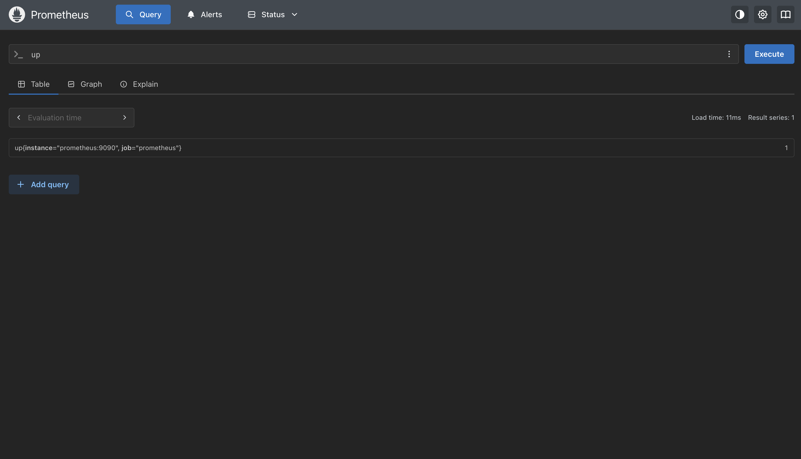
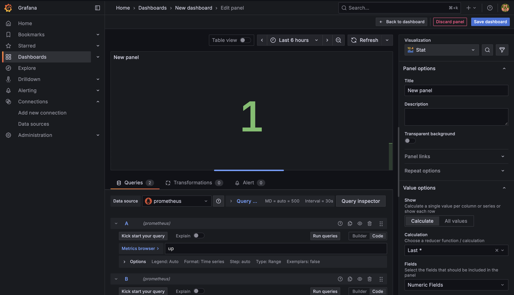
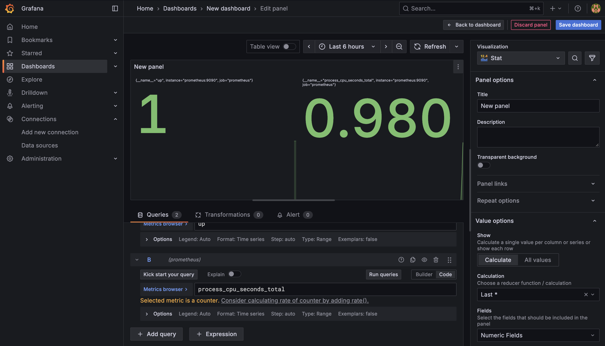
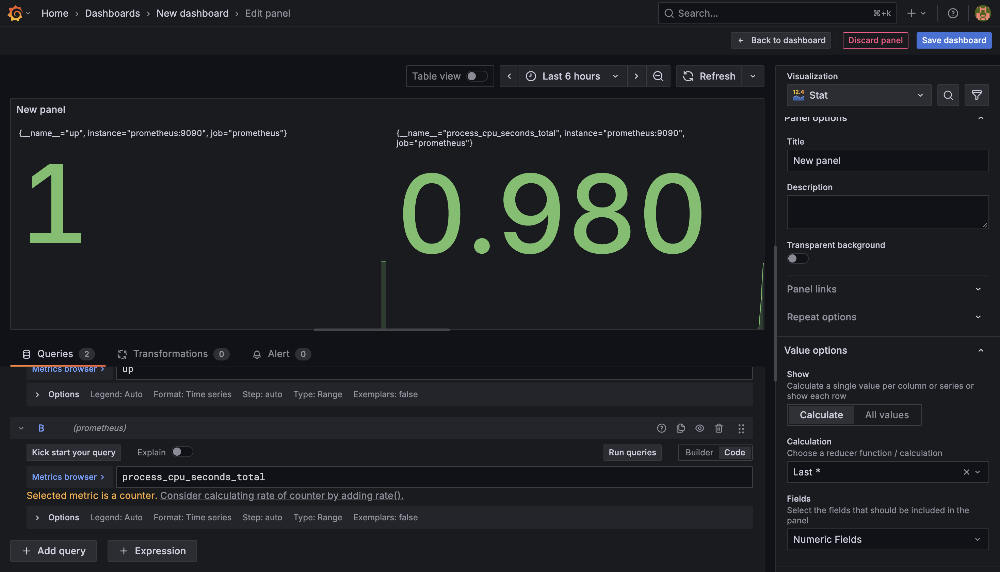

# Task 1: Monitoring — Infrastructure & Application Health

## Overview
Monitoring is the systematic collection, aggregation, and analysis of quantitative data regarding system health, capacity, and performance. It answers the fundamental question: **"Is the system working, and what parts are failing?"**

---

## 1. Core Monitoring Concepts

### 1.1 Metrics
Metrics are numeric measurements captured over time (time-series data) with timestamps and key-value labels:
- **Counter:** A cumulative metric that only increases or resets to zero upon restart (e.g., `http_requests_total`, `process_cpu_seconds_total`).
- **Gauge:** A value that can fluctuate up and down (e.g., `process_resident_memory_bytes`, `cpu_utilization_percent`, `active_db_connections`).
- **Histogram & Summary:** Measures duration and frequency distribution (e.g., HTTP request latency percentiles: p50, p95, p99).

### 1.2 Logs
Discrete, time-stamped text records of events generated by services, daemons, and kernels (e.g., error stack traces, security audits, database query timeouts).

### 1.3 Alerts
Automated notification triggers evaluated against metrics when thresholds are breached for a defined duration:
- **Warning Alerts:** Approaching saturation (e.g., disk usage > 80%).
- **Critical Alerts:** Direct impact on service availability (e.g., service `up == 0`, error rate > 5%).
- Routed via Prometheus Alertmanager to Slack, PagerDuty, or Opsgenie.

---

## 2. Resource Utilization & Application Health

| Dimension | Metric Example | Critical Threshold | Remediation Action |
| :--- | :--- | :--- | :--- |
| **Service Health** | `up{job="prometheus"}` | `up == 0` for 1m | Inspect process crash logs; restart container or investigate OOM. |
| **CPU Utilization** | `rate(process_cpu_seconds_total[5m])` | Sustained > 85% | Identify runaway query/threads; scale horizontally (HPA/ASG). |
| **Memory Utilization** | `process_resident_memory_bytes` | > 90% container limit | Prevent OOMKilled events; profile memory leaks and increase limit. |

---

## 3. Hands-On Monitoring Stack: Prometheus & Grafana

### Architecture
Prometheus scrapes metric endpoints (`/metrics`) over HTTP at defined scrape intervals (15s), storing them in a local TSDB. Grafana queries Prometheus via PromQL and visualizes them.

```text
    ┌─────────────────────────┐           Scrapes
    │ Target (Prometheus/App) │ <─────────────────────────┐
    │       port: 9090        │                           │
    └─────────────────────────┘                           │
                                                ┌─────────┴─────────┐
                                                │ Prometheus Server │
                                                │  (TSDB Storage)   │
                                                └─────────┬─────────┘
                                                          │ PromQL
                                                          ▼
                                                ┌───────────────────┐
                                                │ Grafana Dashboard │
                                                │    port: 3000     │
                                                └───────────────────┘
```

---

## 4. Execution Workflow & Visual Evidence

### Step 1: Deploy Prometheus and Grafana via Docker Compose
Prometheus (`prom/prometheus:v3.5.0`) and Grafana (`grafana/grafana:12.1.1`) are launched locally with mapped ports `9090` and `3000`.

```bash
docker compose up -d
docker compose ps
```



---

### Step 2: Querying Application Health (`up`) in Prometheus
Verifying the `up` metric in Prometheus UI (`http://localhost:9090`):
- `up == 1` indicates that the target endpoint is successfully reachable and healthy.

```promql
up
```



---

### Step 3: Building a Health Stat Panel in Grafana
Connecting Prometheus as a data source in Grafana (`http://localhost:3000`) and configuring a **Stat** panel evaluating the last known value of `up`:



---

### Step 4: Tracking CPU Utilization (`process_cpu_seconds_total`)
Adding CPU measurement to observe processor consumption alongside instance health:

```promql
process_cpu_seconds_total
```



---

### Step 5: Production Dashboard View
The final consolidated Grafana dashboard presents instance health (`1`) and cumulative process CPU execution (`0.980s`) with dynamic color thresholds:


