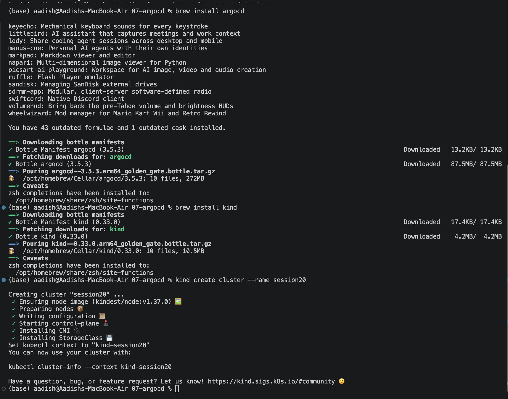
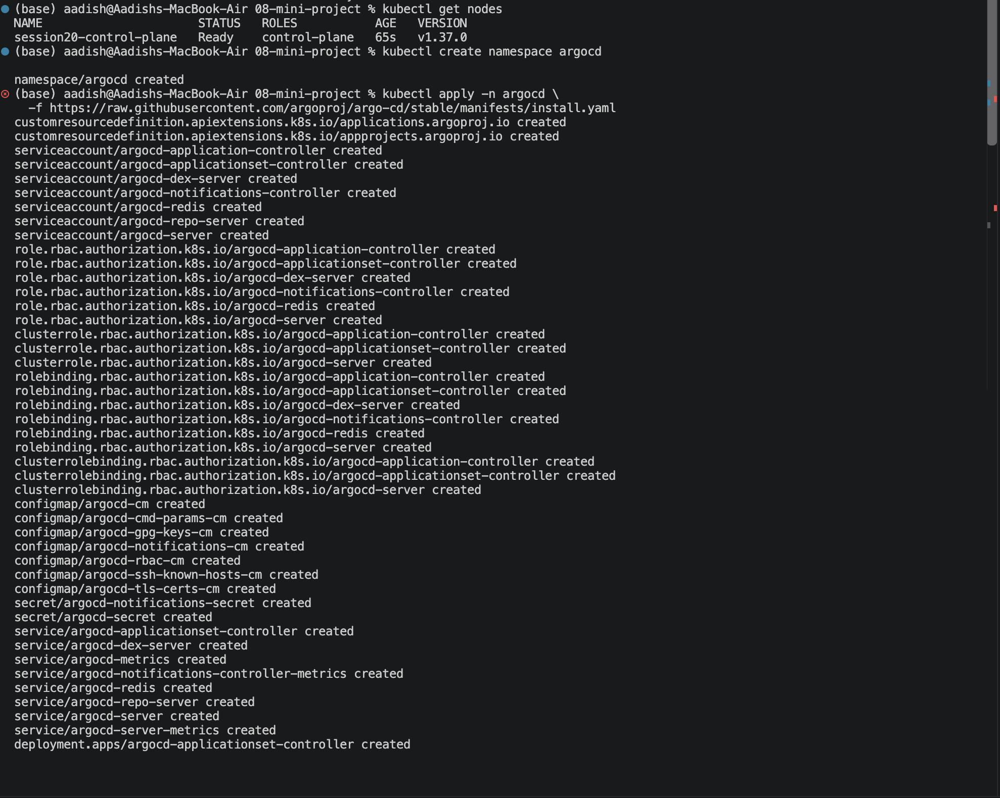
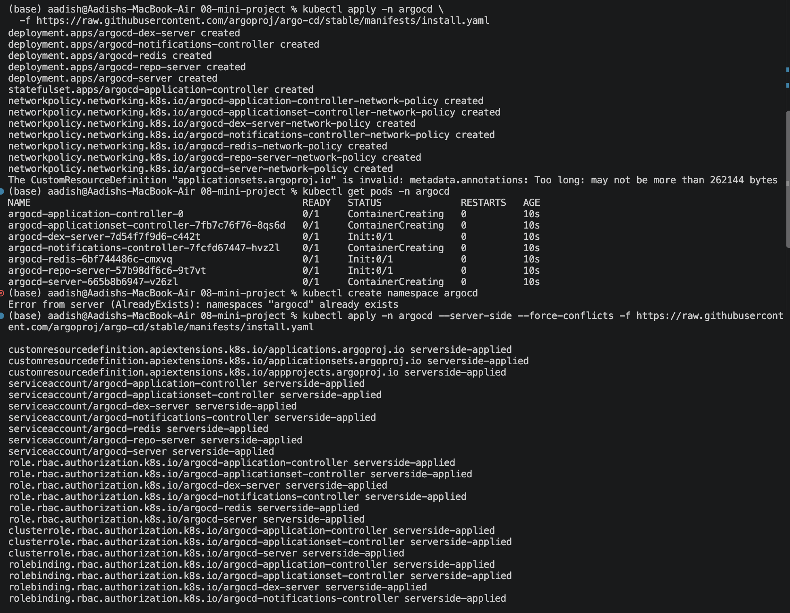
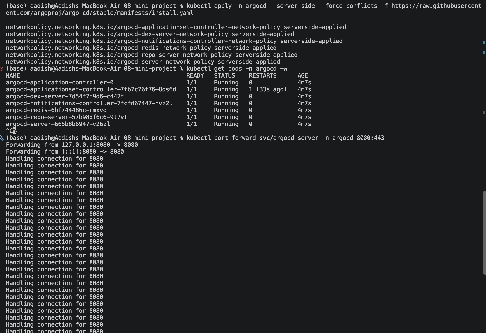
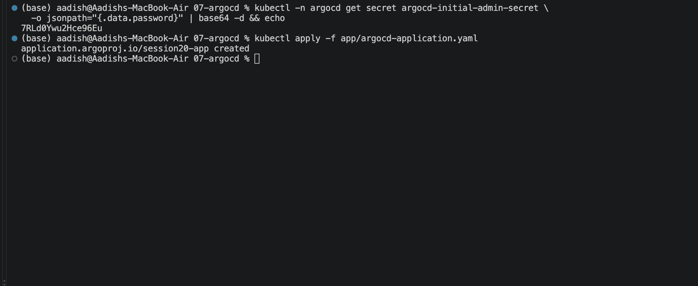

# Task 3: GitOps — Continuous Delivery & Kubernetes Automation

## Overview
GitOps is an operational framework that takes DevOps best practices used for application development—such as version control, collaboration, compliance, and CI/CD—and applies them to infrastructure automation.

---

## 1. What is GitOps?
GitOps uses **Git repositories as the single source of truth** for infrastructure and application definitions.
- **Core Principle:** Any change made to production must first be committed to a Git repository.
- Changes are applied automatically to the cluster through an automated pull-based reconciliation operator (e.g., **Argo CD** or **Flux**).

---

## 2. Core Tenets of GitOps

```
              ┌────────────────────────────────────────────────────────┐
              │                     Git Repository                     │
              │         Declared State (Desired State in YAML)         │
              └──────────────────────────┬─────────────────────────────┘
                                         │ Pull (Sync)
                                         ▼
              ┌────────────────────────────────────────────────────────┐
              │                    Argo CD Operator                    │
              │ Continuous Reconciliation Loop (Detects & Heals Drift) │
              └──────────────────────────┬─────────────────────────────┘
                                         │ Enforce State
                                         ▼
              ┌────────────────────────────────────────────────────────┐
              │                   Kubernetes Cluster                   │
              │             Actual State (Live Running Pods)           │
              └────────────────────────────────────────────────────────┘
```

1. **Declarative Descriptions:** Everything (Deployments, Services, ConfigMaps, RBAC) is described declaratively in YAML or Helm charts.
2. **Version Controlled & Immutable:** The Git commit history serves as an immutable, audited timeline of all state transitions.
3. **Pulled Automatically:** Software agents running directly inside the cluster pull desired state from Git, eliminating the need to expose cluster API credentials to external CI tools (Pull vs. Push security model).
4. **Continuously Reconciled:** The GitOps controller compares the desired state in Git against the live cluster state. If drift occurs (e.g., manual edits or crashed pods), it automatically reconciles the cluster back to the Git source of truth.

---

## 3. GitOps Workflow

```
Developer Push ──► PR Review & Merge ──► Git Repository (main branch)
                                                │
                                                ▼
                                         Argo CD detects commit
                                                │
                         ┌──────────────────────┴──────────────────────┐
                         ▼                                             ▼
                 Desired State (Git)                          Actual State (Cluster)
                         │                                             │
                         └──────────────────────┬──────────────────────┘
                                                │ Compare
                                                ▼
                                       State Drift Detected?
                                        ├── No  ──► Status: Synced & Healthy
                                        └── Yes ──► Auto-Sync / Self-Heal to match Git
```

---

## 4. Hands-On GitOps Demo: Argo CD on KinD Cluster

### Step 1: Provisioning KinD Cluster and Installing Argo CD CLI
A dedicated local Kubernetes cluster (`session20`) was provisioned using KinD (`kind create cluster --name session20`), and the `argocd` CLI installed via Homebrew:



---

### Step 2: Creating Namespace and Applying Argo CD Manifests
The `argocd` namespace was created and official installation manifests applied to the cluster:

```bash
kubectl create namespace argocd
kubectl apply -n argocd -f https://raw.githubusercontent.com/argoproj/argo-cd/stable/manifests/install.yaml
```



---

### Step 3: Server-Side Apply Resolution for CRDs
To resolve CRD annotation size limits on large Kubernetes objects (`applicationsets.argoproj.io`), Server-Side Apply was executed:

```bash
kubectl apply -n argocd --server-side --force-conflicts -f https://raw.githubusercontent.com/argoproj/argo-cd/stable/manifests/install.yaml
```



---

### Step 4: Verifying Argo CD Pods and Port-Forwarding
All Argo CD core services reached `1/1 Running` state (`argocd-server`, `argocd-repo-server`, `argocd-application-controller`), and port-forwarding to the UI was established on port `8080`:

```bash
kubectl get pods -n argocd -w
kubectl port-forward svc/argocd-server -n argocd 8080:443
```



---

### Step 5: Password Retrieval & Application Deployment
The auto-generated admin password was retrieved from `argocd-initial-admin-secret` and the GitOps `Application` custom resource applied to synchronize the application declaratively:

```bash
kubectl -n argocd get secret argocd-initial-admin-secret -o jsonpath="{.data.password}" | base64 -d && echo
kubectl apply -f app/argocd-application.yaml
```


