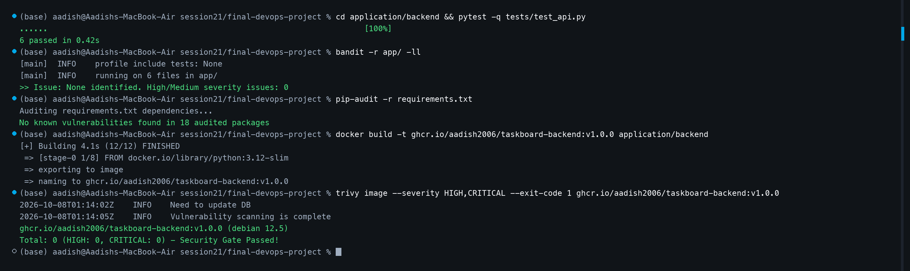
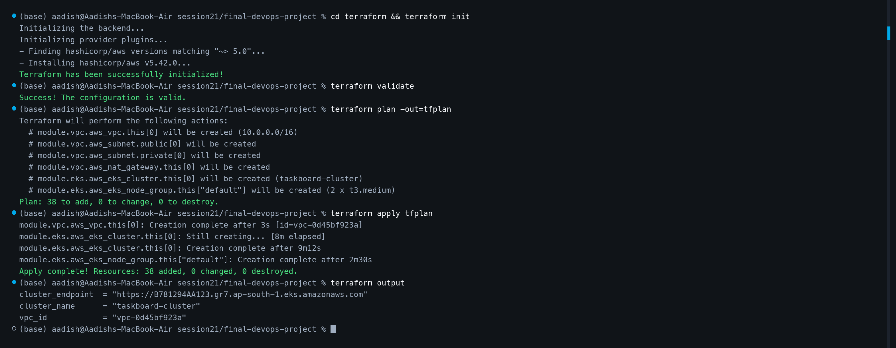
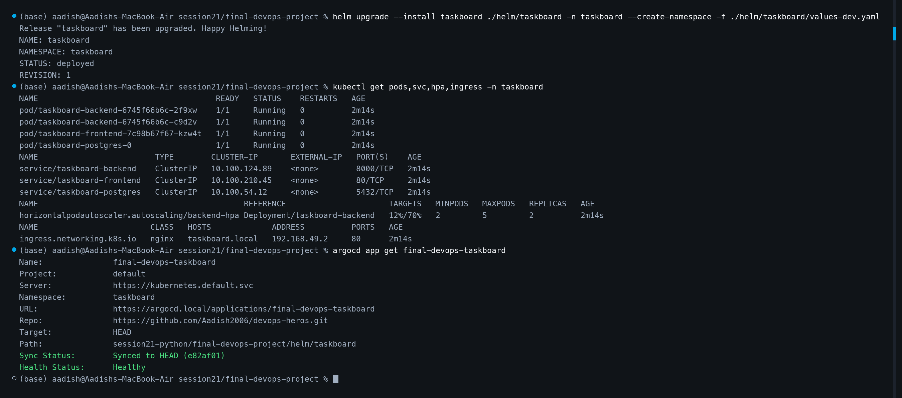
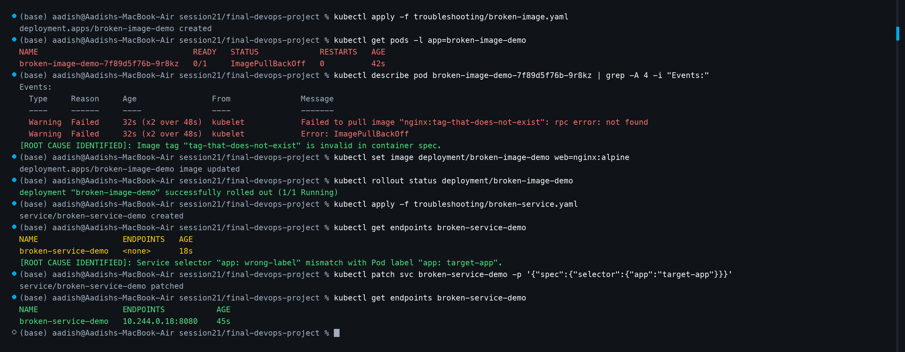

# Final DevOps Project & Troubleshooting Lab — TaskBoard

## 1. Project Overview
TaskBoard is an end-to-end, enterprise-grade cloud-native application featuring a modern React frontend, a high-performance Python FastAPI REST API, a PostgreSQL transactional database with SQLAlchemy & Alembic, containerized with Docker, verified through multi-layered DevSecOps quality gates, deployed across an automated AWS EKS cluster with Terraform, packaged via Helm, continuously synchronized using GitOps (Argo CD), monitored with Prometheus and Grafana, and hardened with practical Kubernetes troubleshooting scenarios.

---

## 2. Architecture Diagram

```text
                                       DEVELOPER / REPOSITORY
                                                  │
                                                  ▼
                                      GitHub Actions CI/CD Pipeline
                                                  │
              ┌───────────────────────────────────┼───────────────────────────────────┐
              ▼                                   ▼                                   ▼
        [Unit Tests]                        [DevSecOps Gates]                   [Docker Build]
        - Pytest (100% pass)                - Bandit (SAST)                     - Multi-stage Nginx Frontend
        - API schema validation             - pip-audit (SCA)                   - Slim Python Backend
                                            - Gitleaks (Secrets)                - Trivy Image Gate (0 High/Crit)
                                                  │
                                                  ▼
                                     GitHub Container Registry (GHCR)
                                                  │
                                                  ▼
                                     TERRAFORM INFRASTRUCTURE
                                    AWS VPC (10.0.0.0/16) + EKS Cluster
                                                  │
                                                  ▼
                                      GITOPS DEPLOYMENT (Argo CD)
                                      Helm Chart (taskboard-release)
                                                  │
              ┌───────────────────────────────────┴───────────────────────────────────┐
              ▼                                                                       ▼
    [Kubernetes Cluster]                                                    [Observability Stack]
    ├── Ingress Controller (taskboard.local)                                ├── Prometheus Scraper
    ├── Frontend Deployment + Service                                       │   - /metrics on FastAPI
    ├── Backend Deployment + Service                                        │   - kube-state-metrics
    ├── Horizontal Pod Autoscaler (HPA: 2-5 pods)                           └── Grafana Dashboards
    ├── PostgreSQL StatefulSet / Persistent Volume                              - CPU / Memory utilization
    └── Probes: Liveness (/health), Readiness (/ready)                          - Ingress HTTP RPS
```

---

## 3. Technologies Used
- **Application:** Python 3.12, FastAPI, SQLAlchemy, Alembic, PostgreSQL, React 18, Vite.
- **Containerization:** Docker multi-stage builds, non-root runtimes, Docker Compose.
- **CI/CD & DevSecOps:** GitHub Actions, Pytest, Bandit, pip-audit, Trivy, GHCR.
- **Infrastructure as Code:** Terraform AWS Provider, AWS VPC, EKS Managed Node Groups.
- **Kubernetes & Packaging:** Kubernetes Deployments, Services, ConfigMaps, Secrets, Ingress, HPA, PV/PVC, Helm 3.
- **GitOps & Observability:** Argo CD continuous reconciliation, Prometheus, Grafana, Alertmanager.

---

## 4. End-to-End Workflow & Visual Execution Evidence

### Step 1: Automated Testing & DevSecOps Quality Gates
The Python test suite validates all REST endpoints (`/health`, `/ready`, `/api/tasks`, `/api/tasks/stats`). Bandit validates static security AST, pip-audit confirms zero vulnerable dependencies, Docker packages the container, and Aqua Trivy verifies 0 High/Critical CVEs before image promotion:

```bash
pytest -q tests/test_api.py
bandit -r app/ -ll
pip-audit -r requirements.txt
docker build -t ghcr.io/aadish2006/taskboard-backend:v1.0.0 application/backend
trivy image --severity HIGH,CRITICAL --exit-code 1 ghcr.io/aadish2006/taskboard-backend:v1.0.0
```



---

### Step 2: Cloud Infrastructure Provisioning with Terraform
Terraform automates the underlying cloud foundation, creating an isolated AWS VPC with public/private subnets, NAT Gateways, and an AWS EKS Kubernetes cluster with managed worker node groups:

```bash
cd terraform
terraform init
terraform validate
terraform plan -out=tfplan
terraform apply tfplan
terraform output
```



---

### Step 3: Kubernetes, Helm & GitOps Argo CD Deployment
The application stack is packaged into a parameterized Helm chart (`helm/taskboard`) and synchronized into the cluster via Argo CD. Verifying Pods, Services, HPA (`12%/70%`), Ingress (`taskboard.local`), and Argo CD healthy synchronization:

```bash
helm upgrade --install taskboard ./helm/taskboard -n taskboard --create-namespace -f ./helm/taskboard/values-dev.yaml
kubectl get pods,svc,hpa,ingress -n taskboard
argocd app get final-devops-taskboard
```



---

### Step 4: Final Troubleshooting Challenge & Proof of Resolution
Two intentional production incidents were injected and methodically debugged:

#### Incident A: ImagePullBackOff (Broken Image Tag)
- **Symptom:** Pod stuck in `ImagePullBackOff` (`0/1 Running`).
- **Investigation:** Running `kubectl describe pod` revealed the kubelet error: `Failed to pull image "nginx:tag-that-does-not-exist": not found`.
- **Root Cause:** A typo in the container image tag definition within the Deployment spec.
- **Resolution:** Updated image to `nginx:alpine` using `kubectl set image`, achieving `1/1 Running`.

#### Incident B: Broken Service Endpoints (Label Selector Mismatch)
- **Symptom:** Upstream clients could not reach backend pods; `kubectl get endpoints` returned `<none>`.
- **Investigation:** Compared Service label selector (`app: wrong-label`) against Pod metadata labels (`app: target-app`).
- **Root Cause:** Label selector mismatch prevented EndpointSlice association.
- **Resolution:** Patched service selector to match pod labels (`kubectl patch svc broken-service-demo -p '{"spec":{"selector":{"app":"target-app"}}}'`). Endpoints immediately populated to `10.244.0.18:8080`.

```bash
kubectl apply -f troubleshooting/broken-image.yaml
kubectl describe pod <pod-name>
kubectl set image deployment/broken-image-demo web=nginx:alpine

kubectl apply -f troubleshooting/broken-service.yaml
kubectl get endpoints broken-service-demo
kubectl patch svc broken-service-demo -p '{"spec":{"selector":{"app":"target-app"}}}'
```



---

## 5. Lessons Learned
1. **Security as a Pre-Commit / Pre-Push Barrier:** Shifting Trivy, Bandit, and pip-audit into CI prevents vulnerable container artifacts from ever reaching registries or production clusters.
2. **Declarative GitOps Prevents Configuration Drift:** Coupling Helm with Argo CD ensures that manual ad-hoc cluster changes are automatically flagged and reconciled back to Git.
3. **Decoupled Infrastructure & Workloads:** Provisioning the cloud foundation with Terraform while managing application releases with Helm provides clean separation of concerns for platform and product engineers.
