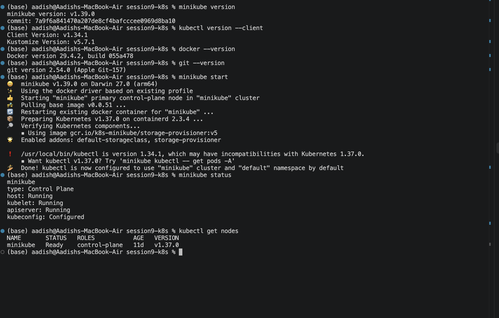
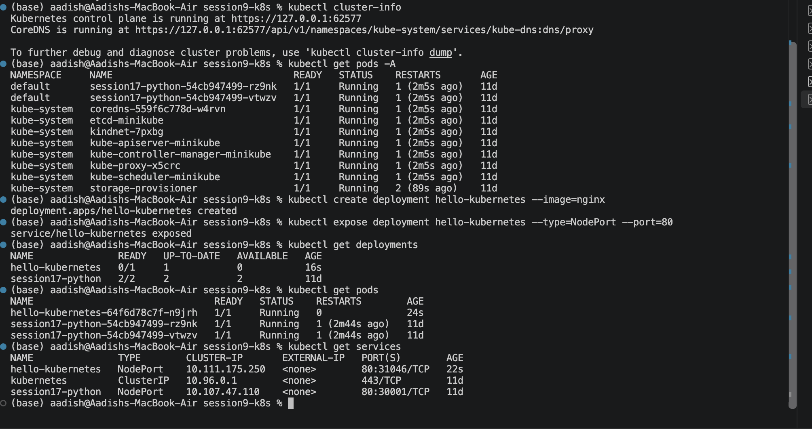
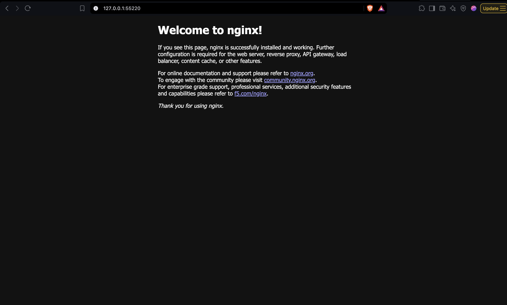
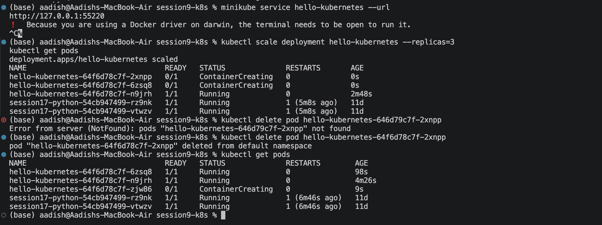

# ☸️ Kubernetes Fundamentals homework

## 1. 🚀 Minikube Setup

Minikube was started using Docker as the container driver.

```bash
minikube start --driver=docker
minikube status
kubectl get nodes
```

### Screenshot 1 — Cluster Status



---

## 2. 🏗️ Kubernetes Architecture

Kubernetes uses a **Control Plane** to manage the cluster and **Worker Nodes** to run applications.

### Control Plane
- API Server
- Scheduler
- Controller Manager
- etcd

### Worker Node
- Kubelet
- Container Runtime
- kube-proxy
- Pods

The cluster was explored using:

```bash
kubectl cluster-info
kubectl get pods -A
```

---

## 3. 📦 Deployment & Service

An NGINX application was deployed:

```bash
kubectl create deployment hello-kubernetes --image=nginx
kubectl expose deployment hello-kubernetes --type=NodePort --port=80
```

The resources were verified using:

```bash
kubectl get deployments
kubectl get pods
kubectl get services
```

### Screenshot 2 — Deployment & Service



---

## 4. 🌐 Application Access

The application was accessed through the Minikube Service:

```bash
minikube service hello-kubernetes --url
```

The NGINX page was successfully opened in the browser.

### Screenshot 3 — Running Application



---

## 5. 📈 Scaling & Self-Healing

The Deployment was scaled to three replicas:

```bash
kubectl scale deployment hello-kubernetes --replicas=3
kubectl get pods
```

A Pod was then deleted to demonstrate Kubernetes self-healing:

```bash
kubectl delete pod <POD_NAME>
kubectl get pods
```

Kubernetes automatically created a replacement Pod to maintain the desired state.

### Screenshot 4 — Scaling & Self-Healing



---

## 📚 Basic Kubernetes Objects

| Object | Purpose |
|---|---|
| **Pod** | Runs application containers |
| **Deployment** | Manages replicated Pods |
| **Service** | Provides network access to Pods |
| **Namespace** | Provides logical resource isolation |
| **Node** | Machine that runs Pods |

---

## 🎯 Conclusion

Through this assignment, I gained practical experience with:

- Minikube cluster setup
- Kubernetes architecture
- Pods and Deployments
- Services
- Scaling
- Self-healing
- Basic `kubectl` commands


